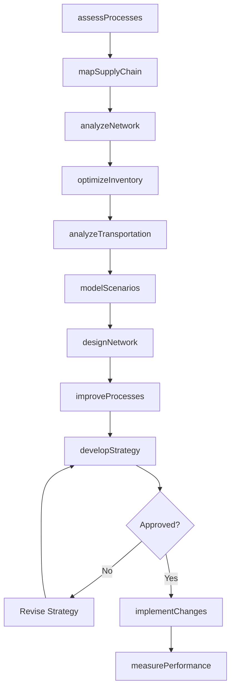
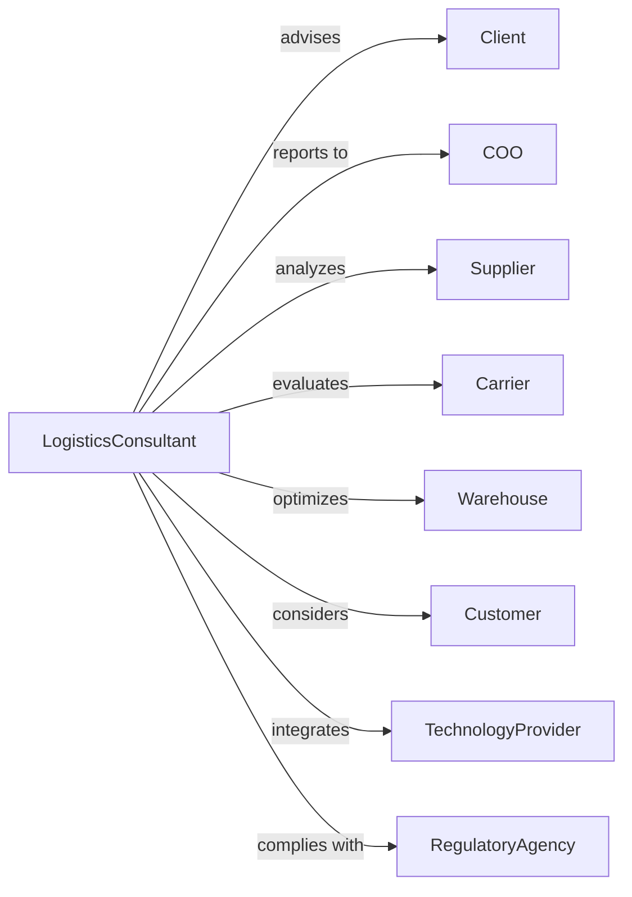

# Process, Physical Distribution, and Logistics Consulting Services

> Business-as-Code definition for supply chain consulting operations. Models the complete engagement lifecycle from assessment through implementation support.

## Overview

Logistics consulting services provide advice on manufacturing operations, distribution networks, inventory management, transportation, and supply chain optimization. This definition exposes actions for process analysis, network design, and operational improvement, with events for engagement tracking and performance measurement.

## Actors

| Actor | Description |
|-------|-------------|
| Client | Organization commissioning supply chain consulting |
| COO | Chief Operating Officer sponsoring engagement |
| Supplier | Vendor providing materials and components |
| Carrier | Transportation provider moving goods |
| Warehouse | Facility storing inventory |
| Customer | End recipient of products and services |
| TechnologyProvider | Vendor of supply chain systems |
| RegulatoryAgency | Authority governing logistics operations |

## Roles

| Role | Description |
|------|-------------|
| EngagementPartner | Senior consultant leading client relationship |
| SupplyChainConsultant | Specialist developing logistics recommendations |
| ProcessEngineer | Expert in manufacturing and operations |
| NetworkDesigner | Analyst optimizing distribution networks |
| InventoryAnalyst | Specialist in stock optimization |
| TransportationConsultant | Expert in freight and logistics |

## Entities

| Entity | Description |
|--------|-------------|
| Engagement | Consulting project with scope and deliverables |
| ProcessAssessment | Analysis of manufacturing and operational workflows |
| NetworkAnalysis | Study of distribution facilities and flows |
| InventoryAnalysis | Assessment of stock levels and policies |
| TransportationStudy | Analysis of freight costs and service |
| SupplyChainStrategy | Recommended approach to logistics improvement |
| ProcessMap | Documentation of operational workflows |
| NetworkModel | Optimization of facility locations and capacity |
| ImplementationPlan | Roadmap for executing improvements |
| KPI | Key performance indicator for measuring success |

## Actions

| Action | Description |
|--------|-------------|
| assessProcesses | Analyze manufacturing and operational workflows |
| mapSupplyChain | Document end-to-end product flows |
| analyzeNetwork | Evaluate distribution facility locations and capacity |
| optimizeInventory | Develop stock level and policy recommendations |
| analyzeTransportation | Study freight costs and carrier performance |
| designNetwork | Create optimal distribution network configuration |
| improveProcesses | Develop operational efficiency recommendations |
| modelScenarios | Simulate options for network and inventory changes |
| developStrategy | Create comprehensive supply chain approach |
| implementChanges | Support execution of improvement initiatives |
| measurePerformance | Track operational metrics and outcomes |
| transferKnowledge | Train client team on methodologies |

## Events

| Event | Description |
|-------|-------------|
| processesAssessed | Operational analysis completed |
| supplyChainMapped | End-to-end flows documented |
| networkAnalyzed | Distribution study completed |
| inventoryOptimized | Stock recommendations developed |
| transportationAnalyzed | Freight study completed |
| networkDesigned | Optimal configuration created |
| processesImproved | Efficiency recommendations developed |
| scenariosModeled | Options simulated and compared |
| strategyDeveloped | Supply chain approach created |
| changesImplemented | Improvements executed |
| performanceMeasured | Metrics tracked and analyzed |
| engagementClosed | Project completed |

## Searches

| Search | Description |
|--------|-------------|
| findEngagements | List projects by status, client, or type |
| getProcessMaps | Retrieve workflow documentation |
| searchNetworkModels | Find distribution configurations |
| getInventoryData | Access stock analysis |
| findTransportationStudies | Retrieve freight analysis |
| getPerformanceMetrics | Access operational KPIs |
| getScenarioComparisons | Retrieve option analysis |

## Workflow



## Actor Relationships



## Usage

### Calling Actions

```typescript
import { consultLogistics } from '@headlessly/consult-logistics'

const logistics = consultLogistics()

// Review active logistics engagements
const engagements = await logistics.findEngagements({ status: 'active', serviceType: 'supply-chain' })

// Pull existing process maps for the client
const maps = await logistics.getProcessMaps({ clientId: 'client-123', area: 'distribution' })

// Assess current supply chain processes
const assessment = await logistics.assessProcesses({
  clientId: 'client-123',
  scope: ['procurement', 'manufacturing', 'distribution', 'fulfillment'],
  facilities: 12,
  annualRevenue: 500000000
})

// Analyze distribution network
const network = await logistics.analyzeNetwork({
  engagementId: assessment.engagementId,
  currentFacilities: assessment.facilities,
  demandData: 'historical-3-years',
  costFactors: ['transportation', 'labor', 'real-estate', 'inventory'],
  serviceTargets: { sameDay: 0.10, nextDay: 0.60, twoDay: 0.30 }
})

// Design optimal network configuration
await logistics.designNetwork({
  engagementId: assessment.engagementId,
  analysis: network.id,
  scenarios: ['status-quo', 'consolidation', 'expansion', 'hybrid'],
  constraints: ['capital-budget', 'service-levels', 'labor-availability'],
  optimizationGoal: 'total-cost-minimization'
})
```

### Event-Driven Automation

```typescript
// Alert on significant improvement opportunities
logistics.networkAnalyzed(async ({ engagementId, savings, serviceImpact }) => {
  if (savings > 5000000) {
    await logistics.highlightOpportunity({
      engagementId,
      category: 'network-optimization',
      savings,
      serviceImpact,
      presentToExecutive: true
    })
  }
})

// Schedule post-implementation review
logistics.changesImplemented(async ({ engagementId, changes, goLiveDate }) => {
  await logistics.scheduleReview({
    engagementId,
    changes,
    reviewDate: addMonths(goLiveDate, 6),
    metrics: ['cost', 'service', 'inventory', 'productivity']
  })
})
```
