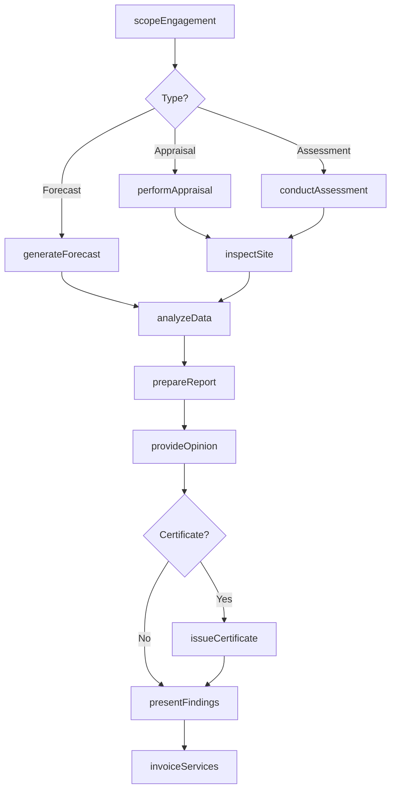
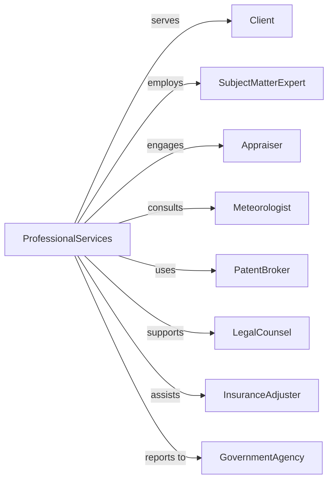

# All Other Professional, Scientific, and Technical Services

> Business-as-Code definition for miscellaneous professional services. Models specialized consulting and expert services not classified elsewhere.

## Overview

Other professional services include weather forecasting, appraisal services, handwriting analysis, patent brokerage, and other specialized professional activities. This definition exposes actions for expert consultation, analysis delivery, and report generation, with events for engagement tracking and deliverable management.

## Actors

| Actor | Description |
|-------|-------------|
| Client | Organization requiring specialized expertise |
| SubjectMatterExpert | Specialist providing professional opinion |
| Appraiser | Professional valuing assets or property |
| Meteorologist | Expert providing weather analysis |
| PatentBroker | Agent facilitating intellectual property transactions |
| LegalCounsel | Attorney requiring expert opinion |
| InsuranceAdjuster | Professional assessing claims |
| GovernmentAgency | Public entity commissioning studies |

## Roles

| Role | Description |
|------|-------------|
| PrincipalConsultant | Senior expert leading engagements |
| Analyst | Performs research and prepares reports |
| FieldInvestigator | Conducts on-site assessments |
| ReportWriter | Documents findings and opinions |
| ProjectCoordinator | Manages engagement logistics |
| QualityReviewer | Validates accuracy of deliverables |
| ForensicExpert | Provides specialized analysis and expert testimony for legal proceedings |

## Entities

| Entity | Description |
|--------|-------------|
| Engagement | Professional services project |
| Assessment | Evaluation of subject matter |
| Appraisal | Valuation of assets or property |
| Forecast | Prediction based on analysis |
| Report | Documentation of findings |
| Opinion | Expert professional judgment |
| Patent | Intellectual property being brokered |
| Inspection | On-site examination |
| Certificate | Official validation document |
| Invoice | Billing for services |

## Actions

| Action | Description |
|--------|-------------|
| scopeEngagement | Define project objectives and deliverables |
| conductAssessment | Evaluate subject matter |
| performAppraisal | Determine value of assets |
| generateForecast | Create prediction based on analysis |
| inspectSite | Conduct on-location examination |
| analyzeData | Process information and derive insights |
| prepareReport | Document findings and conclusions |
| provideOpinion | Deliver expert professional judgment |
| brokerTransaction | Facilitate asset or IP transfer |
| issueCertificate | Provide official validation |
| presentFindings | Share results with client |
| invoiceServices | Bill for professional services |

## Events

| Event | Description |
|-------|-------------|
| engagementScoped | Project defined |
| assessmentConducted | Evaluation completed |
| appraisalPerformed | Valuation completed |
| forecastGenerated | Prediction created |
| siteInspected | Location examined |
| dataAnalyzed | Information processed |
| reportPrepared | Findings documented |
| opinionProvided | Expert judgment delivered |
| transactionBrokered | Transfer facilitated |
| certificateIssued | Validation provided |
| findingsPresented | Results shared |
| servicesInvoiced | Billing sent |

## Searches

| Search | Description |
|--------|-------------|
| findEngagements | List projects by client or status |
| getAssessments | Retrieve evaluations by type |
| searchAppraisals | Find valuations by asset class |
| getForecasts | Access predictions by date |
| findReports | List deliverables by client |
| getCertificates | Retrieve validations |
| getExperts | Search specialists by expertise |

## Workflow



## Actor Relationships



## Usage

### Calling Actions

```typescript
import { adviseProjects } from '@headlessly/advise-projects'

const professional = adviseProjects()

// Scope appraisal engagement
const engagement = await professional.scopeEngagement({
  clientId: 'client-123',
  projectName: 'Equipment Appraisal',
  type: 'machinery-equipment-appraisal',
  purpose: 'insurance-coverage',
  scope: ['manufacturing-equipment', 'vehicles', 'tooling'],
  location: '1234 Industrial Blvd',
  deadline: '2024-04-30'
})

// Perform appraisal with inspection
const appraisal = await professional.performAppraisal({
  engagementId: engagement.id,
  methodology: 'fair-market-value',
  approach: ['cost', 'market', 'income'],
  assetCount: 150,
  inspectionRequired: true,
  certificationLevel: 'uspap-compliant'
})

// Prepare and deliver report
await professional.prepareReport({
  engagementId: engagement.id,
  appraisalId: appraisal.id,
  sections: ['executive-summary', 'methodology', 'valuations', 'limiting-conditions'],
  format: 'formal-narrative',
  includePhotos: true,
  signedCertification: true
})
```

### Event-Driven Automation

```typescript
// Schedule site inspection
professional.engagementScoped(async ({ engagementId, inspectionRequired }) => {
  if (inspectionRequired) {
    await professional.scheduleInspection({
      engagementId,
      notifyClient: true,
      confirmAccess: true
    })
  }
})

// Notify on appraisal completion
professional.appraisalPerformed(async ({ engagementId, clientId, totalValue }) => {
  await professional.notifyClient({
    engagementId,
    clientId,
    message: `Appraisal complete. Total value: $${totalValue.toLocaleString()}`,
    reportReady: true
  })
})
```
