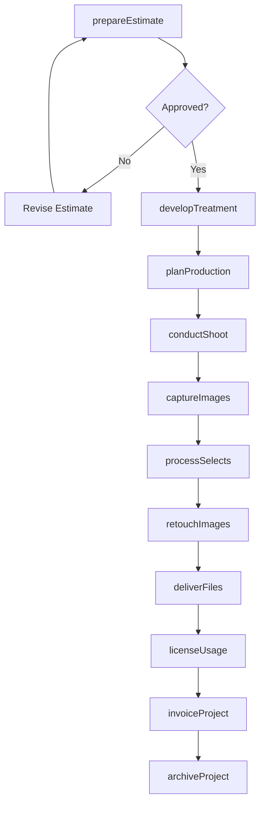
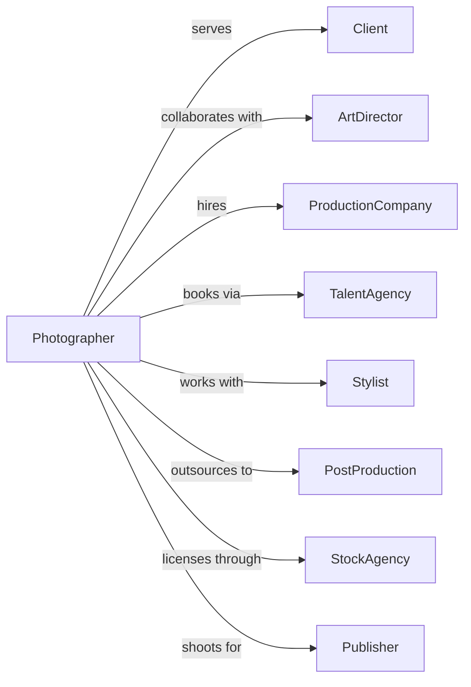

# Commercial Photography

> Business-as-Code definition for commercial photography operations. Models advertising, editorial, and product photography services.

## Overview

Commercial photography provides professional photography services for advertising, publishing, and business applications including product shots, corporate portraits, and editorial content. This definition exposes actions for project management, production, and image delivery, with events for creative approval and rights licensing.

## Actors

| Actor | Description |
|-------|-------------|
| Client | Agency or company commissioning photography |
| ArtDirector | Creative lead guiding visual direction |
| ProductionCompany | Firm providing sets, props, and crews |
| TalentAgency | Provider of models and actors |
| Stylist | Professional preparing subjects and products |
| PostProduction | Service providing advanced retouching |
| StockAgency | Marketplace licensing images |
| Publisher | Magazine or media using editorial content |

## Roles

| Role | Description |
|------|-------------|
| Photographer | Captures commercial images |
| PhotoAssistant | Supports photographer with equipment and lighting |
| DigitalTech | Manages capture, backup, and on-set review |
| Producer | Coordinates production logistics and budgets |
| Retoucher | Performs detailed image editing |
| SalesRep | Manages client relationships and bidding |

## Entities

| Entity | Description |
|--------|-------------|
| Project | Commercial photography assignment |
| Estimate | Proposed pricing for project |
| ShootDay | Scheduled production date |
| Image | Captured photograph |
| License | Rights agreement for image use |
| Treatment | Creative approach and visual concept |
| CallSheet | Production schedule with details |
| Selects | Client-chosen images for delivery |
| Retouching | Image editing and enhancement |
| Invoice | Billing for services and expenses |

## Actions

| Action | Description |
|--------|-------------|
| prepareEstimate | Create pricing proposal for project |
| developTreatment | Define creative approach and visual concept |
| planProduction | Coordinate logistics, crew, and equipment |
| conductShoot | Execute photography production |
| captureImages | Create photographs during shoot |
| processSelects | Organize and prepare chosen images |
| retouchImages | Edit and enhance photographs |
| deliverFiles | Provide finished images to client |
| licenseUsage | Grant rights for image applications |
| invoiceProject | Bill for services and expenses |
| archiveProject | Store images and documentation |
| pitchAssignment | Pursue editorial or advertising work |

## Events

| Event | Description |
|-------|-------------|
| estimateApproved | Client accepted pricing |
| treatmentApproved | Creative concept confirmed |
| productionPlanned | Logistics coordinated |
| shootConducted | Photography production completed |
| imagesCaptured | Photographs created |
| selectionsChosen | Client selected final images |
| imagesRetouched | Editing completed |
| filesDelivered | Finished images provided |
| usageLicensed | Rights granted to client |
| projectInvoiced | Billing sent |
| projectArchived | Materials stored |
| assignmentWon | Editorial or ad work secured |

## Searches

| Search | Description |
|--------|-------------|
| findProjects | List assignments by client or status |
| getEstimates | Retrieve pricing proposals |
| searchImages | Find photographs by project or subject |
| getLicenses | Access usage agreements |
| findSelects | List client-chosen images |
| getInvoices | Retrieve billing by project |
| getPortfolio | Access representative work samples |

## Workflow



## Actor Relationships



## Usage

### Calling Actions

```typescript
import { photographCommercialImages } from '@headlessly/photograph-commercial-images'

const commercial = photographCommercialImages()

// Review active commercial photography projects
const projects = await commercial.findProjects({ status: 'active', type: 'product-photography' })

// Check outstanding estimates
const estimates = await commercial.getEstimates({ status: 'pending', clientId: 'client-abc' })

// Prepare estimate for project
const estimate = await commercial.prepareEstimate({
  clientId: 'agency-123',
  projectName: 'Spring Campaign Product Shots',
  deliverables: {
    products: 24,
    setups: 6,
    finalImages: 48
  },
  shootDays: 3,
  location: 'studio',
  crew: ['digital-tech', 'assistant', 'stylist'],
  usage: {
    media: ['print', 'digital', 'social'],
    territory: 'north-america',
    duration: '2-years'
  }
})

// Plan production details
const production = await commercial.planProduction({
  projectId: estimate.projectId,
  shootDates: ['2024-03-18', '2024-03-19', '2024-03-20'],
  studio: 'daylight-studio-a',
  equipment: ['phase-one', 'profoto-lighting', 'capture-one'],
  callTime: '07:00',
  wrapTime: '19:00'
})

// Deliver retouched files
await commercial.deliverFiles({
  projectId: estimate.projectId,
  selects: production.clientSelects,
  format: ['tiff-16bit', 'jpeg-srgb'],
  delivery: 'secure-download',
  colorProfile: 'adobergb'
})
```

### Event-Driven Automation

```typescript
// Update production schedule
commercial.treatmentApproved(async ({ projectId, shootDates }) => {
  await commercial.generateCallSheet({
    projectId,
    dates: shootDates,
    includeCrew: true,
    includeEquipment: true,
    sendToTeam: true
  })
})

// Track usage licensing
commercial.filesDelivered(async ({ projectId, clientId, images }) => {
  await commercial.createLicenseRecord({
    projectId,
    clientId,
    images: images.length,
    trackExpiration: true,
    alertBeforeExpiry: 60 // days
  })
})
```
