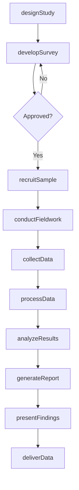
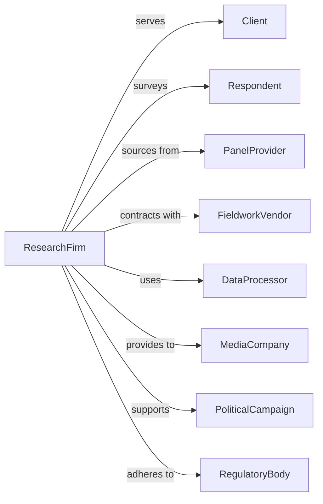

# Marketing Research and Public Opinion Polling

> Business-as-Code definition for market research and polling operations. Models survey design, data collection, and analysis services.

## Overview

Marketing research and public opinion polling systematically gather, record, and analyze consumer behavior, market trends, and public attitudes. This definition exposes actions for research design, data collection, and insight delivery, with events for study tracking and deliverable management.

## Actors

| Actor | Description |
|-------|-------------|
| Client | Organization commissioning research |
| Respondent | Individual participating in research |
| PanelProvider | Service maintaining survey participant databases |
| FieldworkVendor | Firm conducting in-person interviews |
| DataProcessor | Service handling data cleaning and tabulation |
| MediaCompany | Subscriber to ratings and audience data |
| PoliticalCampaign | Organization commissioning opinion polling |
| RegulatoryBody | Authority overseeing research standards |

## Roles

| Role | Description |
|------|-------------|
| ResearchDirector | Senior leader overseeing study design |
| ProjectManager | Coordinates research execution and timelines |
| Analyst | Designs surveys and analyzes data |
| FieldManager | Supervises data collection operations |
| Statistician | Applies quantitative methods and sampling |
| ReportWriter | Prepares findings for client presentation |

## Entities

| Entity | Description |
|--------|-------------|
| Study | Research project with objectives and methodology |
| Survey | Questionnaire for data collection |
| Sample | Selected respondents for research |
| Interview | Data collection session with respondent |
| Dataset | Collected responses for analysis |
| Crosstab | Tabulation of results by demographic or attribute |
| Report | Documentation of findings and insights |
| Panel | Recruited group available for ongoing research |
| Rating | Audience measurement for media |
| Weighting | Statistical adjustment for sample representation |

## Actions

| Action | Description |
|--------|-------------|
| designStudy | Create research methodology and objectives |
| developSurvey | Write questionnaire and program instrument |
| recruitSample | Select and engage respondents |
| conductFieldwork | Execute interviews or survey distribution |
| collectData | Gather responses from participants |
| processData | Clean, code, and tabulate responses |
| analyzeResults | Apply statistical methods and derive insights |
| generateReport | Document findings and recommendations |
| presentFindings | Share results with client |
| deliverData | Provide processed dataset to client |
| measureRatings | Calculate audience metrics for media |
| trackTrends | Monitor changes over time |

## Events

| Event | Description |
|-------|-------------|
| studyDesigned | Methodology and objectives defined |
| surveyDeveloped | Questionnaire completed |
| sampleRecruited | Respondents selected and engaged |
| fieldworkCompleted | Data collection finished |
| dataCollected | Responses gathered |
| dataProcessed | Results cleaned and tabulated |
| resultsAnalyzed | Insights derived from data |
| reportGenerated | Findings documented |
| findingsPresented | Results shared with client |
| dataDelivered | Dataset provided to client |
| ratingsPublished | Audience metrics released |
| trendsTracked | Longitudinal analysis updated |

## Searches

| Search | Description |
|--------|-------------|
| findStudies | List projects by client, status, or topic |
| getSurveys | Retrieve questionnaires by study |
| searchPanels | Find available respondent groups |
| getDatasets | Access collected response data |
| findReports | List deliverables by client |
| getRatings | Access audience measurement data |
| getTrends | Retrieve longitudinal analysis |

## Workflow



## Actor Relationships



## Usage

### Calling Actions

```typescript
import { pollMarkets } from '@headlessly/poll-markets'

const research = pollMarkets()

// Design market research study
const study = await research.designStudy({
  clientId: 'client-123',
  studyName: 'Brand Health Tracker Q4',
  objectives: ['awareness', 'consideration', 'preference', 'usage'],
  methodology: 'online-survey',
  targetAudience: 'adults-18-64-category-users',
  sampleSize: 1500,
  fieldDates: { start: '2024-10-01', end: '2024-10-15' }
})

// Develop survey instrument
const survey = await research.developSurvey({
  studyId: study.id,
  sections: ['screening', 'awareness', 'attitudes', 'usage', 'demographics'],
  questionCount: 35,
  estimatedLength: 12, // minutes
  programming: 'qualtrics'
})

// Analyze and report
await research.analyzeResults({
  studyId: study.id,
  analyses: ['significance-testing', 'correlation', 'segmentation'],
  comparisons: ['vs-previous-wave', 'vs-competitors'],
  visualizations: ['charts', 'infographics']
})
```

### Event-Driven Automation

```typescript
// Monitor fieldwork progress
research.dataCollected(async ({ studyId, completes, target }) => {
  const completionRate = completes / target
  if (completionRate >= 0.50 && completionRate < 0.51) {
    await research.runInterimAnalysis({
      studyId,
      checkQuotas: true,
      flagDataQuality: true
    })
  }
})

// Trigger trend update
research.fieldworkCompleted(async ({ studyId, wave }) => {
  await research.updateTrendAnalysis({
    studyId,
    currentWave: wave,
    metrics: ['awareness', 'consideration', 'nps'],
    alertOnSignificantChange: true
  })
})
```
