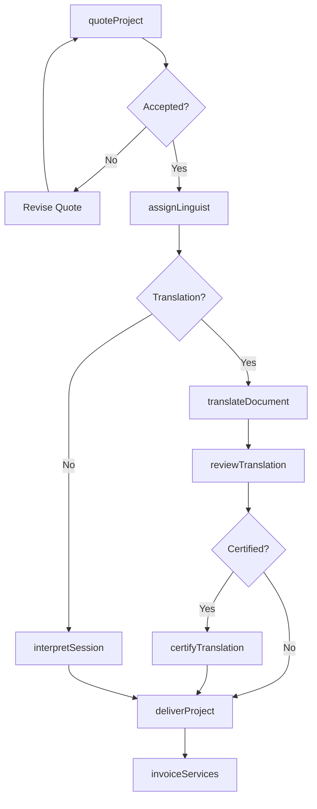
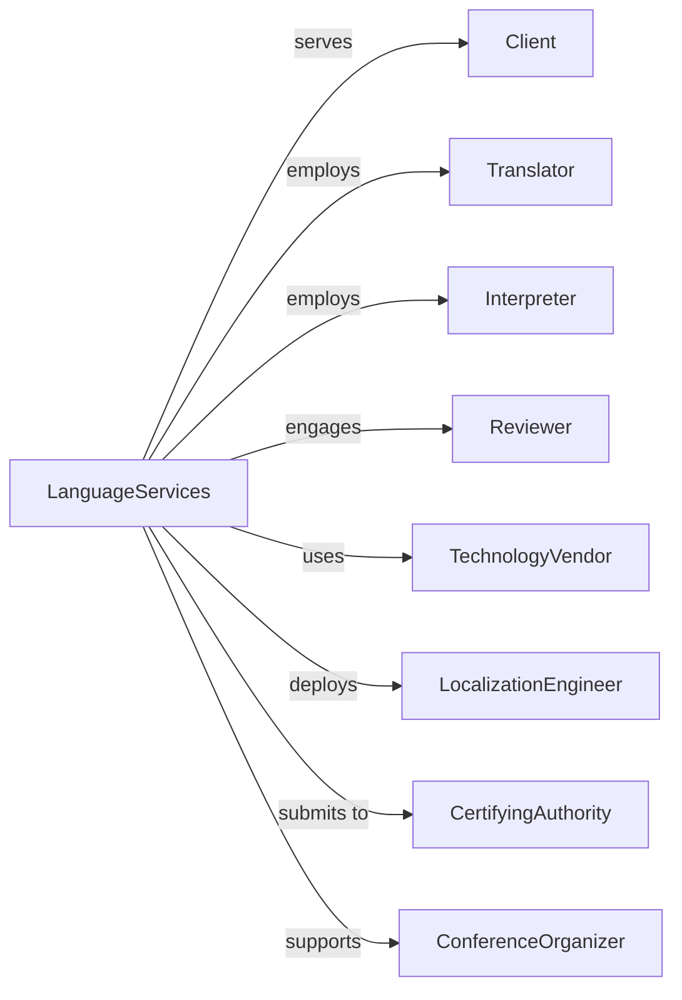

# Translation and Interpretation Services

> Business-as-Code definition for language services operations. Models translation, interpretation, and localization services.

## Overview

Translation and interpretation services convert written materials and spoken communication between languages, including document translation, conference interpretation, and sign language services. This definition exposes actions for project management, linguist assignment, and quality assurance, with events for delivery tracking and client approval.

## Actors

| Actor | Description |
|-------|-------------|
| Client | Organization requiring language services |
| Translator | Linguist converting written materials |
| Interpreter | Linguist converting spoken communication |
| Reviewer | Linguist checking translation quality |
| TechnologyVendor | Provider of translation management systems |
| LocalizationEngineer | Specialist adapting software and content |
| CertifyingAuthority | Agency validating certified translations |
| ConferenceOrganizer | Planner of multilingual events |

## Roles

| Role | Description |
|------|-------------|
| ProjectManager | Coordinates language projects and timelines |
| AccountManager | Maintains client relationships |
| QualityManager | Oversees linguistic accuracy and consistency |
| TerminologySpecialist | Manages glossaries and style guides |
| VendorManager | Recruits and manages linguist network |
| LocalizationSpecialist | Adapts content for cultural contexts |
| ConferenceInterpreter | Provides simultaneous interpretation at multilingual events |

## Entities

| Entity | Description |
|--------|-------------|
| Project | Language services engagement |
| Document | Written material for translation |
| Translation | Converted written content |
| Interpretation | Converted spoken communication |
| Glossary | Terminology reference for consistency |
| Quote | Pricing proposal for services |
| Assignment | Task allocated to linguist |
| Review | Quality check of translated content |
| Certification | Official validation of translation |
| Event | Conference or meeting requiring interpretation |

## Actions

| Action | Description |
|--------|-------------|
| quoteProject | Provide pricing for language services |
| assignLinguist | Allocate translator or interpreter to project |
| translateDocument | Convert written content between languages |
| interpretSession | Provide real-time spoken language conversion |
| reviewTranslation | Check accuracy and quality of translation |
| localizerContent | Adapt materials for cultural context |
| certifyTranslation | Provide official validation |
| manageTerminology | Maintain glossaries and style guides |
| deliverProject | Provide completed work to client |
| invoiceServices | Bill for language services |
| recruitLinguist | Add translator or interpreter to network |
| trainLinguist | Educate linguists on client requirements |

## Events

| Event | Description |
|-------|-------------|
| projectQuoted | Pricing provided to client |
| linguistAssigned | Translator or interpreter allocated |
| documentTranslated | Written content converted |
| sessionInterpreted | Spoken communication converted |
| translationReviewed | Quality check completed |
| contentLocalized | Cultural adaptation completed |
| translationCertified | Official validation provided |
| terminologyUpdated | Glossary refreshed |
| projectDelivered | Completed work provided |
| servicesInvoiced | Billing sent |
| linguistRecruited | New linguist added to network |
| linguistTrained | Education session completed |

## Searches

| Search | Description |
|--------|-------------|
| findProjects | List assignments by client, status, or language |
| searchLinguists | Find translators by language or specialty |
| getDocuments | Retrieve source and target materials |
| getGlossaries | Access terminology references |
| findEvents | List interpretation assignments |
| getQuotes | Retrieve pricing proposals |
| getCertifications | Access validated translations |

## Workflow



## Actor Relationships



## Usage

### Calling Actions

```typescript
import { translateLanguages } from '@headlessly/translate-languages'

const language = translateLanguages()

// Quote translation project
const quote = await language.quoteProject({
  clientId: 'client-123',
  projectName: 'Product Manual Localization',
  sourceLanguage: 'en-US',
  targetLanguages: ['es-ES', 'fr-FR', 'de-DE', 'ja-JP'],
  wordCount: 45000,
  contentType: 'technical-documentation',
  services: ['translation', 'review', 'desktop-publishing'],
  deadline: '2024-04-15'
})

// Assign linguists to project
const assignments = await language.assignLinguist({
  projectId: quote.projectId,
  assignments: [
    { language: 'es-ES', translator: 'ling-001', reviewer: 'ling-002' },
    { language: 'fr-FR', translator: 'ling-003', reviewer: 'ling-004' },
    { language: 'de-DE', translator: 'ling-005', reviewer: 'ling-006' },
    { language: 'ja-JP', translator: 'ling-007', reviewer: 'ling-008' }
  ],
  glossary: 'tech-terminology-v3',
  styleGuide: 'client-brand-guide'
})

// Deliver completed translations
await language.deliverProject({
  projectId: quote.projectId,
  deliverables: assignments.completedFiles,
  format: 'original-layout',
  qualityReport: true
})
```

### Event-Driven Automation

```typescript
// Schedule interpretation
language.projectQuoted(async ({ projectId, services }) => {
  if (services.includes('interpretation')) {
    await language.scheduleInterpreterBriefing({
      projectId,
      daysBefore: 3,
      includeMaterials: true
    })
  }
})

// Update terminology after project
language.projectDelivered(async ({ projectId, glossaryUpdates }) => {
  if (glossaryUpdates.length > 0) {
    await language.updateTerminology({
      glossaryId: projectId.glossary,
      newTerms: glossaryUpdates,
      notifyLinguists: true
    })
  }
})
```
