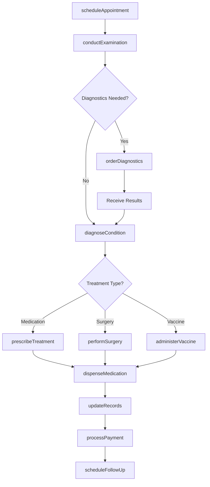
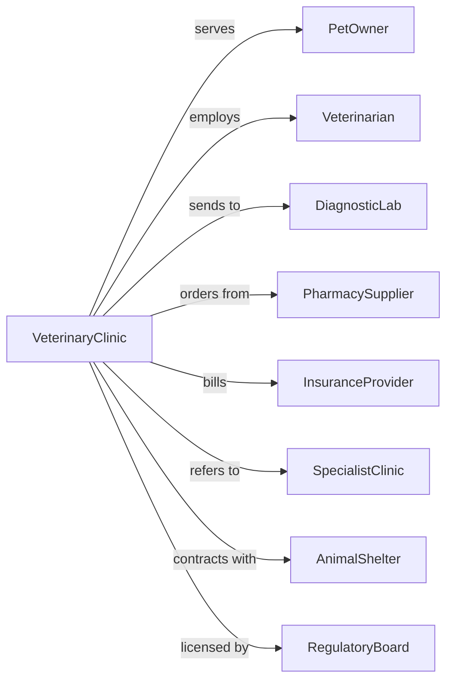

# Veterinary Services

> Business-as-Code definition for veterinary practice operations. Models patient care, diagnostics, and treatment services.

## Overview

Veterinary services provide medical, dental, and surgical care for animals through licensed practitioners, including routine wellness, emergency care, and diagnostic testing. This definition exposes actions for patient management, treatment delivery, and medical record keeping, with events for appointment tracking and health monitoring.

## Actors

| Actor | Description |
|-------|-------------|
| PetOwner | Client bringing animal for care |
| Veterinarian | Licensed practitioner providing treatment |
| DiagnosticLab | Facility performing specialized tests |
| PharmacySupplier | Provider of medications and supplies |
| InsuranceProvider | Carrier covering pet health expenses |
| SpecialistClinic | Referral facility for advanced care |
| AnimalShelter | Organization requiring veterinary services |
| RegulatoryBoard | Authority overseeing veterinary practice |

## Roles

| Role | Description |
|------|-------------|
| Veterinarian | Diagnoses and treats animals |
| VeterinaryTechnician | Assists with procedures and patient care |
| Receptionist | Manages appointments and client communication |
| PracticeManager | Oversees clinic operations and staff |
| VeterinaryAssistant | Provides basic animal handling and support |
| Pharmacist | Dispenses medications and advises on usage |

## Entities

| Entity | Description |
|--------|-------------|
| Patient | Animal receiving veterinary care |
| Appointment | Scheduled visit for examination or treatment |
| MedicalRecord | Documentation of patient health history |
| Diagnosis | Identified condition or illness |
| Treatment | Prescribed care plan or procedure |
| Prescription | Medication order for patient |
| LabTest | Diagnostic analysis ordered |
| Invoice | Bill for services rendered |
| Vaccination | Immunization administered |
| Surgery | Invasive procedure performed |

## Actions

| Action | Description |
|--------|-------------|
| scheduleAppointment | Book visit for examination or treatment |
| conductExamination | Perform physical assessment of patient |
| diagnoseCondition | Identify illness or health issue |
| orderDiagnostics | Request lab tests or imaging |
| prescribeTreatment | Create care plan and medications |
| administerVaccine | Provide immunization to patient |
| performSurgery | Execute invasive medical procedure |
| dispenseMedication | Provide prescribed drugs to owner |
| updateRecords | Document findings and treatments |
| processPayment | Handle client billing and insurance |
| scheduleFollowUp | Book return visit for monitoring |
| referSpecialist | Direct patient to advanced care facility |

## Events

| Event | Description |
|-------|-------------|
| appointmentScheduled | Visit booked |
| examinationConducted | Physical assessment completed |
| conditionDiagnosed | Illness identified |
| diagnosticsOrdered | Tests requested |
| diagnosticsReceived | Test results returned |
| treatmentPrescribed | Care plan created |
| vaccineAdministered | Immunization given |
| surgeryPerformed | Procedure completed |
| medicationDispensed | Drugs provided |
| recordsUpdated | Documentation completed |
| paymentProcessed | Bill settled |
| followUpScheduled | Return visit booked |

## Searches

| Search | Description |
|--------|-------------|
| findPatients | List animals by owner or condition |
| getAppointments | Retrieve scheduled visits by date |
| searchRecords | Find medical history by patient |
| getDiagnostics | Access test results |
| findPrescriptions | List medications by patient |
| getVaccinations | Retrieve immunization records |
| getRevenue | Access billing by period |

## Workflow



## Actor Relationships



## Usage

### Calling Actions

```typescript
import { consultAnimals } from '@headlessly/consult-animals'

const vet = consultAnimals()

// Schedule wellness appointment
const appointment = await vet.scheduleAppointment({
  patientId: 'patient-123',
  ownerId: 'owner-456',
  type: 'annual-wellness',
  date: '2024-03-15',
  time: '10:00',
  veterinarian: 'dr-smith',
  duration: 30 // minutes
})

// Conduct examination and diagnose
const exam = await vet.conductExamination({
  appointmentId: appointment.id,
  vitals: {
    weight: 12.5, // kg
    temperature: 38.5, // celsius
    heartRate: 120,
    respiratoryRate: 22
  },
  findings: ['dental-tartar', 'ear-debris'],
  vaccinesdue: ['rabies', 'dhpp']
})

// Prescribe treatment
await vet.prescribeTreatment({
  patientId: 'patient-123',
  diagnosis: exam.diagnosis,
  medications: [
    { drug: 'otic-cleanser', dosage: 'twice-daily', duration: 14 },
    { drug: 'dental-chews', dosage: 'daily', duration: 30 }
  ],
  procedures: ['dental-cleaning'],
  followUp: '6-months'
})
```

### Event-Driven Automation

```typescript
// Send vaccination reminders
vet.vaccineAdministered(async ({ patientId, vaccine, nextDue }) => {
  await vet.scheduleReminder({
    patientId,
    vaccine,
    reminderDate: addDays(nextDue, -30),
    sendTo: 'owner-email'
  })
})

// Alert on critical lab results
vet.diagnosticsReceived(async ({ patientId, results }) => {
  const critical = results.filter(r => r.flagged === 'critical')
  if (critical.length > 0) {
    await vet.alertVeterinarian({
      patientId,
      findings: critical,
      urgency: 'immediate',
      callOwner: true
    })
  }
})
```
