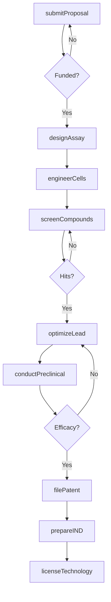
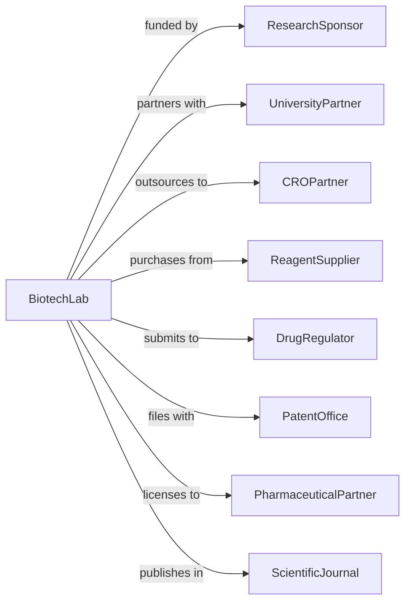

# Research and Development in Biotechnology (except Nanobiotechnology)

> Business-as-Code definition for biotechnology R&D operations. Models research programs from discovery through preclinical development.

## Overview

Biotechnology research and development uses microorganisms, cellular processes, and biomolecular techniques to develop new therapies, diagnostics, and bioproducts. This definition exposes actions for molecular biology research, preclinical studies, and technology licensing, with events for milestone tracking and regulatory filing.

## Actors

| Actor | Description |
|-------|-------------|
| ResearchSponsor | NIH, DARPA, or pharmaceutical company funding research |
| UniversityPartner | Academic institution collaborating on discovery |
| CROPartner | Contract research organization conducting studies |
| ReagentSupplier | Provider of biological materials and assay kits |
| DrugRegulator | Regulatory authority overseeing therapeutic development |
| PatentOffice | Authority granting intellectual property protection |
| PharmaceuticalPartner | Company licensing therapeutic candidates |
| ScientificJournal | Publisher of peer-reviewed research |

## Roles

| Role | Description |
|------|-------------|
| PrincipalInvestigator | Senior scientist leading research program |
| MolecularBiologist | Expert in genetic engineering and cell biology |
| BiochemistResearcher | Specialist in protein and enzyme studies |
| ComputationalBiologist | Expert in bioinformatics and data analysis |
| RegulatoryScientist | Manages regulatory submissions and compliance |
| LabManager | Oversees facility operations and biosafety |

## Entities

| Entity | Description |
|--------|-------------|
| ResearchProgram | Funded project targeting specific therapeutic or product |
| Grant | Financial award supporting research activities |
| Assay | Biological test measuring specific activity |
| CellLine | Cultured cells used for research |
| TherapeuticCandidate | Molecule or biologic advancing toward development |
| PreclinicalStudy | Animal or in vitro efficacy and safety testing |
| Patent | Intellectual property protection for inventions |
| Publication | Peer-reviewed documentation of findings |
| INDApplication | Investigational New Drug filing with regulator |
| Dataset | Collection of experimental observations |

## Actions

| Action | Description |
|--------|-------------|
| submitProposal | Apply for research funding |
| designAssay | Create biological test for target activity |
| engineerCells | Modify cell lines for desired properties |
| screenCompounds | Test libraries for biological activity |
| optimizeLead | Improve properties of promising candidates |
| conductPreclinical | Perform efficacy and safety studies |
| analyzeData | Interpret experimental results |
| filePatent | Apply for intellectual property protection |
| submitPublication | Prepare and submit peer-reviewed paper |
| prepareIND | Compile regulatory submission package |
| licenseTechnology | Transfer rights to development partner |
| reportProgress | Update sponsors on research milestones |

## Events

| Event | Description |
|-------|-------------|
| proposalSubmitted | Funding application completed |
| grantAwarded | Research funding secured |
| assayDeveloped | Biological test validated |
| cellsEngineered | Modified cell line established |
| hitsIdentified | Active compounds discovered from screening |
| leadOptimized | Candidate properties improved |
| preclinicalCompleted | Animal studies finished |
| dataAnalyzed | Results interpreted and validated |
| patentFiled | IP application submitted |
| publicationAccepted | Paper accepted for publication |
| indSubmitted | Regulatory filing completed |
| technologyLicensed | Development partnership executed |

## Searches

| Search | Description |
|--------|-------------|
| findPrograms | List research programs by status or therapeutic area |
| getGrants | Retrieve funding awards and terms |
| searchAssays | Find biological tests by target |
| getCandidates | List therapeutic leads by stage |
| findPreclinicalData | Retrieve efficacy and safety results |
| getPatents | Access intellectual property filings |
| getPublications | List papers by author or topic |

## Workflow



## Actor Relationships



## Usage

### Calling Actions

```typescript
import { researchBiotech } from '@headlessly/research-biotech'

const biolab = researchBiotech()

// Find active research programs
const programs = await biolab.findPrograms({ status: 'active', area: 'gene-therapy' })

// Check grant funding status
const grants = await biolab.getGrants({ status: 'awarded', agency: 'NIH' })

// Design screening assay for new target
const assay = await biolab.designAssay({
  programId: 'prog-123',
  targetGene: 'KRAS-G12C',
  assayType: 'biochemical-binding',
  readout: 'fluorescence-polarization',
  throughput: 'high-throughput',
  controls: ['positive', 'negative', 'vehicle']
})

// Screen compound library
const screening = await biolab.screenCompounds({
  assayId: assay.id,
  library: 'kinase-focused-library',
  compoundCount: 50000,
  concentrations: [10, 1, 0.1], // micromolar
  replicates: 3
})

// Optimize lead compound
await biolab.optimizeLead({
  programId: 'prog-123',
  hitCompound: screening.topHits[0].id,
  optimizationGoals: ['potency', 'selectivity', 'metabolic-stability'],
  iterations: 3,
  analogsPerIteration: 50
})
```

### Event-Driven Automation

```typescript
// Advance promising leads
biolab.hitsIdentified(async ({ programId, hits }) => {
  const potentHits = hits.filter(h => h.ic50 < 0.1) // submicromolar
  if (potentHits.length > 0) {
    await biolab.prioritizeLeads({
      programId,
      hits: potentHits,
      criteria: ['potency', 'novelty', 'druggability'],
      advanceTop: 3
    })
  }
})

// Prepare regulatory filing after preclinical
biolab.preclinicalCompleted(async ({ programId, results }) => {
  if (results.efficacy.passed && results.safety.passed) {
    await biolab.initiateINDPreparation({
      programId,
      preclinicalPackage: results,
      targetSubmissionDate: addMonths(new Date(), 6)
    })
  }
})
```
