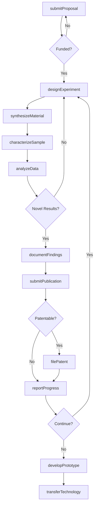
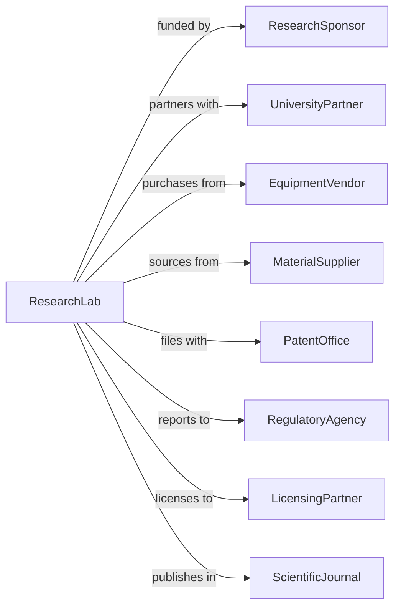

# Research and Development in Nanotechnology

> Business-as-Code definition for nanotechnology R&D operations. Models research programs from discovery through prototype development.

## Overview

Nanotechnology research and development involves the study of matter at the nanoscale (1-100 nanometers) to create new materials, devices, and processes. This definition exposes actions for research planning, experimentation, and technology transfer, with events for milestone tracking and intellectual property management.

## Actors

| Actor | Description |
|-------|-------------|
| ResearchSponsor | Government agency or corporation funding research |
| UniversityPartner | Academic institution collaborating on research |
| EquipmentVendor | Supplier of nanofabrication and characterization tools |
| MaterialSupplier | Provider of specialty chemicals and nanomaterials |
| PatentOffice | Authority granting intellectual property protection |
| RegulatoryAgency | Authority overseeing nanomaterial safety |
| LicensingPartner | Company commercializing research outcomes |
| ScientificJournal | Publisher of peer-reviewed research findings |

## Roles

| Role | Description |
|------|-------------|
| PrincipalInvestigator | Senior scientist leading research program |
| ResearchScientist | Expert conducting experiments and analysis |
| NanofabricationEngineer | Specialist operating nanoscale manufacturing equipment |
| CharacterizationSpecialist | Expert in nanoscale measurement and imaging |
| LabManager | Oversees facility operations and safety |
| PatentAgent | Manages intellectual property filings |

## Entities

| Entity | Description |
|--------|-------------|
| ResearchProgram | Funded project with objectives and timeline |
| Grant | Financial award supporting research activities |
| Experiment | Controlled scientific investigation |
| Nanomaterial | Engineered matter at the nanoscale |
| Characterization | Measurement and analysis of material properties |
| Publication | Peer-reviewed documentation of findings |
| Patent | Intellectual property protection for inventions |
| Prototype | Functional demonstration of technology |
| Dataset | Collection of experimental observations |
| Collaboration | Partnership with external research entities |

## Actions

| Action | Description |
|--------|-------------|
| submitProposal | Apply for research funding |
| designExperiment | Plan controlled scientific investigation |
| synthesizeMaterial | Create engineered nanomaterials |
| characterizeSample | Measure nanoscale properties and structure |
| analyzeData | Interpret experimental results |
| documentFindings | Record observations and conclusions |
| submitPublication | Prepare and submit peer-reviewed paper |
| filePatent | Apply for intellectual property protection |
| developPrototype | Create functional technology demonstration |
| transferTechnology | License or spin off commercial applications |
| collaborateExternal | Partner with universities or companies |
| reportProgress | Update sponsors on research milestones |

## Events

| Event | Description |
|-------|-------------|
| proposalSubmitted | Funding application completed |
| grantAwarded | Research funding secured |
| experimentDesigned | Investigation protocol created |
| materialSynthesized | Nanomaterial successfully created |
| sampleCharacterized | Properties measured and documented |
| dataAnalyzed | Results interpreted and validated |
| findingsDocumented | Observations recorded |
| publicationAccepted | Paper accepted for publication |
| patentFiled | IP application submitted |
| prototypeCompleted | Technology demonstration finished |
| technologyTransferred | Commercial licensing executed |
| progressReported | Sponsor update delivered |

## Searches

| Search | Description |
|--------|-------------|
| findPrograms | List research programs by status or focus area |
| getGrants | Retrieve funding awards and terms |
| searchExperiments | Find investigations by material or technique |
| getCharacterizations | Access measurement data |
| findPublications | List papers by author or topic |
| getPatents | Retrieve intellectual property filings |
| getCollaborations | Access partnership agreements |

## Workflow



## Actor Relationships



## Usage

### Calling Actions

```typescript
import { researchNanotech } from '@headlessly/research-nanotech'

const nanolab = researchNanotech()

// Find active nanotech research programs
const programs = await nanolab.findPrograms({ status: 'active', area: 'nanomaterials' })

// Design nanomaterial synthesis experiment
const experiment = await nanolab.designExperiment({
  programId: 'prog-123',
  objective: 'synthesize-quantum-dots',
  materials: ['cadmium-selenide', 'zinc-sulfide-shell'],
  technique: 'hot-injection',
  targetProperties: {
    diameter: { min: 3, max: 5, unit: 'nm' },
    emissionWavelength: { target: 520, tolerance: 10, unit: 'nm' }
  }
})

// Characterize synthesized material
const characterization = await nanolab.characterizeSample({
  experimentId: experiment.id,
  sampleId: 'sample-456',
  techniques: ['tem', 'xrd', 'photoluminescence', 'dls'],
  measurements: ['particle-size', 'crystal-structure', 'optical-properties']
})

// File patent on novel synthesis method
await nanolab.filePatent({
  programId: 'prog-123',
  title: 'Method for Size-Controlled Quantum Dot Synthesis',
  claims: ['synthesis-process', 'resulting-material', 'device-applications'],
  inventors: ['scientist-001', 'scientist-002'],
  priorityDate: new Date()
})
```

### Event-Driven Automation

```typescript
// Notify on breakthrough results
nanolab.dataAnalyzed(async ({ experimentId, results, benchmarks }) => {
  if (results.performance > benchmarks.stateOfArt * 1.2) {
    await nanolab.flagBreakthrough({
      experimentId,
      improvement: results.performance / benchmarks.stateOfArt,
      notifyPI: true,
      prioritizePatentReview: true
    })
  }
})

// Schedule progress reports
nanolab.grantAwarded(async ({ programId, sponsor, reportingSchedule }) => {
  for (const reportDate of reportingSchedule) {
    await nanolab.scheduleReport({
      programId,
      sponsor,
      dueDate: reportDate,
      type: 'progress-report'
    })
  }
})
```
