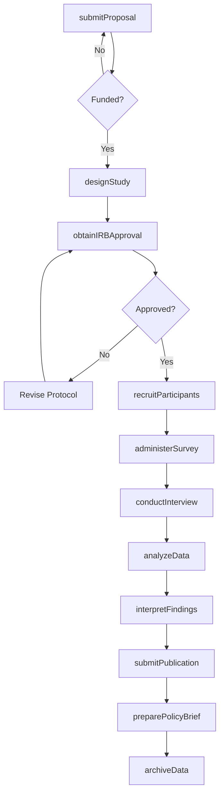
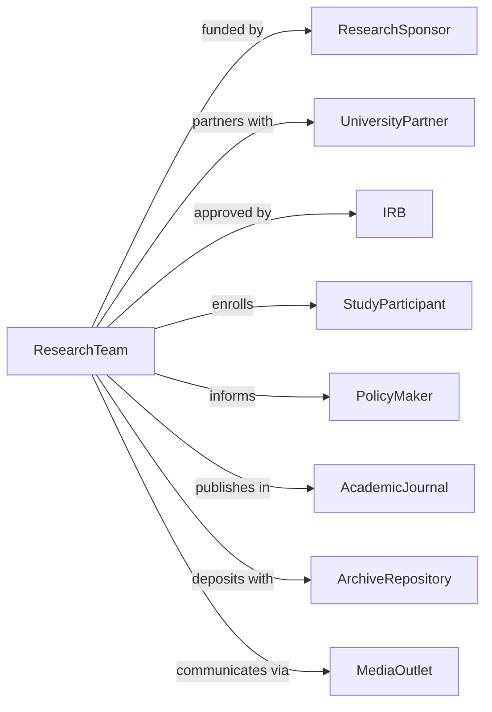

# Research and Development in the Social Sciences and Humanities

> Business-as-Code definition for social sciences and humanities R&D. Models research programs in psychology, sociology, economics, and behavioral sciences.

## Overview

Social sciences and humanities research conducts studies on human cognition, behavior, society, economics, language, and culture. This definition exposes actions for study design, data collection, and analysis, with events for IRB approval, publication, and policy impact tracking.

## Actors

| Actor | Description |
|-------|-------------|
| ResearchSponsor | Foundation, government agency, or institution funding research |
| UniversityPartner | Academic institution collaborating on studies |
| IRB | Institutional Review Board approving human subjects research |
| StudyParticipant | Individual providing data for research |
| PolicyMaker | Government official informed by research findings |
| AcademicJournal | Publisher of peer-reviewed research |
| ArchiveRepository | Institution preserving research data |
| MediaOutlet | Publisher disseminating research to public |

## Roles

| Role | Description |
|------|-------------|
| PrincipalInvestigator | Senior researcher leading study |
| ResearchAssociate | Supports study design and data collection |
| StatisticalAnalyst | Expert in quantitative methods and analysis |
| QualitativeResearcher | Specialist in interviews and ethnography |
| ResearchCoordinator | Manages participant recruitment and logistics |
| GrantWriter | Prepares funding proposals |

## Entities

| Entity | Description |
|--------|-------------|
| ResearchProgram | Funded project with research questions |
| Grant | Financial award supporting research |
| Study | Investigation with defined methodology |
| IRBProtocol | Human subjects research approval |
| Survey | Structured data collection instrument |
| Interview | Qualitative data collection session |
| Dataset | Collection of research observations |
| Publication | Peer-reviewed documentation of findings |
| PolicyBrief | Summary for decision-makers |
| Presentation | Conference or public sharing of results |

## Actions

| Action | Description |
|--------|-------------|
| submitProposal | Apply for research funding |
| designStudy | Create research methodology and protocols |
| obtainIRBApproval | Secure human subjects research authorization |
| recruitParticipants | Identify and enroll study subjects |
| administerSurvey | Collect structured quantitative data |
| conductInterview | Gather qualitative data from participants |
| analyzeData | Apply statistical or qualitative methods |
| interpretFindings | Draw conclusions from analysis |
| submitPublication | Prepare and submit peer-reviewed paper |
| preparePolicyBrief | Create summary for decision-makers |
| presentFindings | Share results at conferences or events |
| archiveData | Preserve datasets for future research |

## Events

| Event | Description |
|-------|-------------|
| proposalSubmitted | Funding application completed |
| grantAwarded | Research funding secured |
| studyDesigned | Methodology created |
| irbApproved | Human subjects authorization obtained |
| participantsRecruited | Study enrollment completed |
| surveyCompleted | Quantitative data collection finished |
| interviewsCompleted | Qualitative data collection finished |
| dataAnalyzed | Statistical or qualitative analysis finished |
| findingsInterpreted | Conclusions drawn from analysis |
| publicationAccepted | Paper accepted for publication |
| policyBriefDelivered | Decision-maker summary provided |
| dataArchived | Datasets preserved for replication |

## Searches

| Search | Description |
|--------|-------------|
| findStudies | List research projects by status or topic |
| getGrants | Retrieve funding awards and terms |
| searchParticipants | Find enrolled subjects by criteria |
| getDatasets | Access research data collections |
| findPublications | List papers by author or topic |
| getPolicyBriefs | Access decision-maker summaries |
| getIRBStatus | Check human subjects approval status |

## Workflow



## Actor Relationships



## Usage

### Calling Actions

```typescript
import { researchSocialScience } from '@headlessly/research-social-science'

const sociallab = researchSocialScience()

// Find active social science studies
const studies = await sociallab.findStudies({ status: 'active', discipline: 'economics' })

// Design behavioral economics study
const study = await sociallab.designStudy({
  programId: 'prog-123',
  title: 'Impact of Default Options on Retirement Savings',
  methodology: 'randomized-controlled-trial',
  population: 'new-employees-at-partner-firms',
  sampleSize: 2000,
  conditions: ['opt-in-default', 'opt-out-default', 'active-choice'],
  outcomes: ['enrollment-rate', 'contribution-rate', 'persistence'],
  duration: 24 // months
})

// Obtain IRB approval
const irb = await sociallab.obtainIRBApproval({
  studyId: study.id,
  riskLevel: 'minimal',
  consentProcess: 'written-informed-consent',
  dataProtection: ['de-identification', 'secure-storage'],
  vulnerablePopulations: false
})

// Analyze study results
await sociallab.analyzeData({
  studyId: study.id,
  methods: ['intention-to-treat', 'regression-analysis'],
  covariates: ['age', 'income', 'tenure'],
  significanceLevel: 0.05,
  multipleTestingCorrection: 'bonferroni'
})
```

### Event-Driven Automation

```typescript
// Notify on IRB approval
sociallab.irbApproved(async ({ studyId, approvalDate, expirationDate }) => {
  await sociallab.initiateRecruitment({
    studyId,
    startDate: addDays(approvalDate, 7),
    recruitmentGoal: study.sampleSize,
    reminderFrequency: 'weekly'
  })

  await sociallab.scheduleRenewal({
    studyId,
    renewalDate: addMonths(expirationDate, -2)
  })
})

// Prepare policy brief after publication
sociallab.publicationAccepted(async ({ studyId, journal, findings }) => {
  if (findings.policyRelevance === 'high') {
    await sociallab.preparePolicyBrief({
      studyId,
      targetAudience: 'retirement-policy-makers',
      keyFindings: findings.topThreeInsights,
      recommendations: generateRecommendations(findings)
    })
  }
})
```
