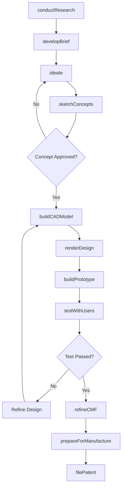
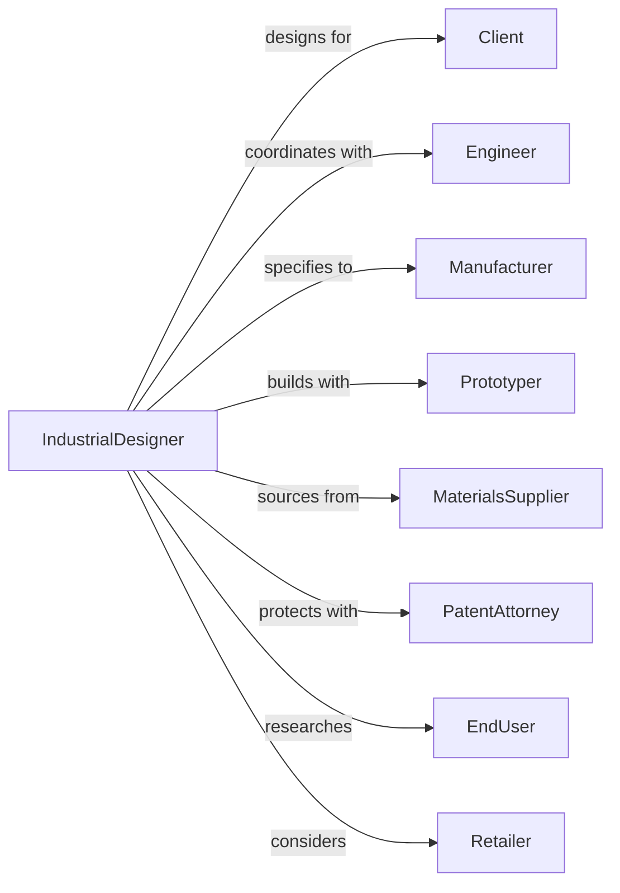

# Industrial Design Services

> Business-as-Code definition for industrial design operations. Models the complete product design lifecycle from research through production support.

## Overview

Industrial design services create and develop product designs optimizing use, value, and appearance. This definition exposes actions for user research, concept development, prototyping, and manufacturing support, with events for design milestone tracking and client approval workflows.

## Actors

| Actor | Description |
|-------|-------------|
| Client | Manufacturer or brand commissioning product design |
| Engineer | Technical specialist ensuring design feasibility |
| Manufacturer | Factory producing designed products |
| Prototyper | Service creating physical prototypes |
| MaterialsSupplier | Provider of production materials |
| PatentAttorney | Legal professional protecting design IP |
| EndUser | Consumer or operator using designed product |
| Retailer | Channel partner selling designed products |

## Roles

| Role | Description |
|------|-------------|
| DesignDirector | Senior designer leading creative vision and client relationships |
| IndustrialDesigner | Staff designer developing product concepts and details |
| DesignResearcher | Specialist conducting user and market research |
| CADModeler | Technical staff creating 3D models |
| PrototypeTechnician | Staff building and testing physical models |
| ProjectManager | Coordinates schedules, budgets, and communications |

## Entities

| Entity | Description |
|--------|-------------|
| Project | Product design engagement with scope and deliverables |
| Brief | Documentation of design requirements and constraints |
| Concept | Initial design idea with sketches and rationale |
| CADModel | Three-dimensional digital representation |
| Prototype | Physical model for testing and evaluation |
| Rendering | Photorealistic visualization of design |
| Specification | Technical documentation for manufacturing |
| CMF | Color, material, and finish definition |
| UserTest | Research evaluating design with target users |
| DesignPatent | Intellectual property protection for appearance |

## Actions

| Action | Description |
|--------|-------------|
| conductResearch | Study users, market, and competitive products |
| developBrief | Document design requirements and constraints |
| ideate | Generate multiple concept directions |
| sketchConcepts | Visualize ideas through hand and digital sketches |
| buildCADModel | Create detailed 3D digital model |
| renderDesign | Produce photorealistic visualizations |
| buildPrototype | Create physical model for testing |
| testWithUsers | Evaluate design with target consumers |
| refineCMF | Finalize colors, materials, and finishes |
| prepareForManufacture | Document specifications for production |
| supportTooling | Assist with manufacturing setup |
| filePatent | Protect design through intellectual property |

## Events

| Event | Description |
|-------|-------------|
| researchCompleted | User and market study finished |
| briefApproved | Design requirements confirmed |
| conceptsPresented | Initial ideas shown to client |
| conceptSelected | Direction chosen for development |
| cadModelCompleted | 3D digital model finished |
| prototypeBuilt | Physical model created |
| userTestConducted | Design evaluated with consumers |
| cmfFinalized | Colors, materials, finishes confirmed |
| specificationIssued | Manufacturing documentation released |
| toolingApproved | Production setup validated |
| patentFiled | Design IP protection submitted |
| productLaunched | Designed product released to market |

## Searches

| Search | Description |
|--------|-------------|
| findProjects | List projects by status, client, or category |
| getConcepts | Retrieve design concepts by project |
| searchMaterials | Find materials by properties or supplier |
| getPrototypes | List prototypes by project or test status |
| findUserTests | Retrieve user research by project or date |
| getSpecifications | Access manufacturing documentation |
| checkPatentStatus | Verify design IP protection status |

## Workflow



## Actor Relationships



## Usage

### Calling Actions

```typescript
import { designProducts } from '@headlessly/design-products'

const designer = designProducts()

// Find active design projects
const projects = await designer.findProjects({ status: 'in-progress', category: 'consumer-electronics' })

// Review concept iterations
const concepts = await designer.getConcepts({ projectId: 'project-headphones', stage: 'refinement' })

// Conduct user research
const research = await designer.conductResearch({
  projectId: 'project-123',
  productCategory: 'consumer-electronics',
  methods: ['interviews', 'observation', 'competitor-analysis'],
  targetUsers: { demographics: '25-45', techSavvy: 'medium-high' }
})

// Generate and present concepts
const concepts = await designer.ideate({
  projectId: 'project-123',
  brief: research.brief,
  directions: 3,
  criteria: ['innovation', 'manufacturability', 'brand-fit']
})

// Build and test prototype
const prototype = await designer.buildPrototype({
  projectId: 'project-123',
  conceptId: concepts.selected,
  method: '3d-print',
  material: 'SLA-resin',
  finish: 'painted'
})
```

### Event-Driven Automation

```typescript
// Schedule user testing when prototype ready
designer.prototypeBuilt(async ({ projectId, prototypeId }) => {
  await designer.testWithUsers({
    projectId,
    prototypeId,
    participants: 8,
    method: 'hands-on-evaluation',
    scheduleDays: 14
  })
})

// File patent when specs complete
designer.specificationIssued(async ({ projectId, designId }) => {
  await designer.filePatent({
    projectId,
    designId,
    type: 'design-patent',
    attorney: getPatentAttorney(projectId)
  })
})
```
