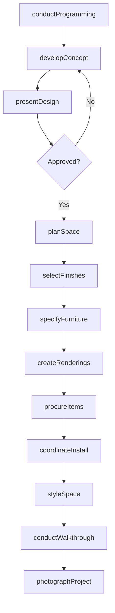
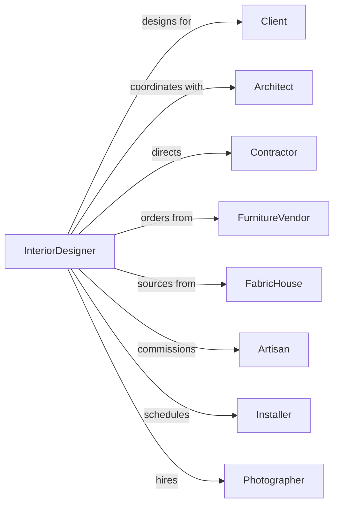

# Interior Design Services

> Business-as-Code definition for interior design operations. Models the complete design lifecycle from programming through installation.

## Overview

Interior design services plan and design interior spaces for residential, commercial, hospitality, and institutional clients. This definition exposes actions for space planning, material selection, furniture specification, and project coordination, with events for milestone tracking and client approval workflows.

## Actors

| Actor | Description |
|-------|-------------|
| Client | Property owner or tenant commissioning interior design |
| Architect | Building designer providing base plans and coordination |
| Contractor | Builder executing interior construction work |
| FurnitureVendor | Supplier of furniture and fixtures |
| FabricHouse | Provider of textiles and upholstery materials |
| Artisan | Custom craftsperson creating bespoke elements |
| Installer | Professional handling furniture delivery and setup |
| Photographer | Professional documenting completed projects |

## Roles

| Role | Description |
|------|-------------|
| PrincipalDesigner | Lead designer managing client relationships and design vision |
| ProjectDesigner | Staff designer developing design concepts and documentation |
| JuniorDesigner | Entry-level staff assisting with drawings and specifications |
| Procurement | Handles purchasing, tracking, and expediting |
| ProjectCoordinator | Manages schedules, budgets, and communications |
| CADTechnician | Produces technical drawings and 3D renderings |

## Entities

| Entity | Description |
|--------|-------------|
| Project | Interior design engagement with scope and deliverables |
| SpacePlan | Layout showing furniture arrangement and circulation |
| ConceptBoard | Visual presentation of design direction and materials |
| Specification | Detailed description of furniture and finish items |
| FinishSchedule | List of materials for floors, walls, and ceilings |
| PurchaseOrder | Order for furniture, fixtures, and equipment |
| Rendering | Visual representation of proposed design |
| FloorPlan | Scaled drawing showing room layouts |
| Budget | Financial plan for design and procurement |
| Punchlist | List of items requiring completion or correction |

## Actions

| Action | Description |
|--------|-------------|
| conductProgramming | Document client requirements, lifestyle, and preferences |
| developConcept | Create design direction with mood boards and references |
| presentDesign | Review concept with client for feedback and approval |
| planSpace | Develop furniture layouts and circulation patterns |
| selectFinishes | Choose materials for floors, walls, and surfaces |
| specifyFurniture | Select and document furniture and accessories |
| createRenderings | Produce visual representations of design |
| procureItems | Order furniture, fixtures, and materials |
| coordinateInstall | Manage delivery and installation schedule |
| styleSpace | Arrange accessories and finishing touches |
| conductWalkthrough | Review completed project with client |
| photographProject | Document finished design for portfolio |

## Events

| Event | Description |
|-------|-------------|
| programmingCompleted | Client requirements documented |
| conceptApproved | Design direction accepted by client |
| spacePlanApproved | Furniture layout confirmed |
| finishesSelected | Materials and colors chosen |
| furnitureSpecified | Items selected and specified |
| renderingsPresented | Visual representations shown to client |
| purchaseOrdersIssued | Items ordered from vendors |
| deliveryScheduled | Installation timeline confirmed |
| installationCompleted | Furniture and finishes installed |
| punchlistCreated | Final corrections identified |
| walkthroughCompleted | Client acceptance of completed work |
| projectPhotographed | Professional images captured |

## Searches

| Search | Description |
|--------|-------------|
| findProjects | List projects by status, client, or designer |
| getSpecifications | Retrieve furniture and finish specs by project |
| searchVendors | Find suppliers by product category or lead time |
| getPurchaseOrders | List orders by project, vendor, or status |
| findDeliveries | Track shipments and delivery schedules |
| getBudgetStatus | Get spend vs budget by project or category |
| getProjectTimeline | Retrieve milestones and deadlines |

## Workflow



## Actor Relationships



## Usage

### Calling Actions

```typescript
import { designInteriors } from '@headlessly/design-interiors'

const interior = designInteriors()

// Find active interior design projects
const projects = await interior.findProjects({ status: 'active', type: 'commercial-office' })

// Check specifications for materials procurement
const specs = await interior.getSpecifications({ projectId: 'project-lobby', category: 'finishes' })

// Conduct client programming
const program = await interior.conductProgramming({
  clientId: 'client-123',
  projectName: 'Downtown Penthouse',
  projectType: 'residential',
  rooms: ['living', 'dining', 'kitchen', 'master-bedroom', 'guest-bedroom'],
  style: ['contemporary', 'warm-minimalist'],
  budget: 250000
})

// Develop and present concept
const concept = await interior.developConcept({
  projectId: program.id,
  moodBoards: ['living-room', 'bedroom-suite'],
  colorPalette: ['warm-neutrals', 'accent-terracotta'],
  materialDirection: ['natural-wood', 'bouclé-fabric', 'brass-accents']
})

// Specify furniture selections
await interior.specifyFurniture({
  projectId: program.id,
  room: 'living',
  items: [
    { type: 'sofa', vendor: 'bddw', model: 'lake-sofa', fabric: 'oatmeal-boucle' },
    { type: 'coffeeTable', vendor: 'apparatus', model: 'segment-table', finish: 'brass' }
  ]
})
```

### Event-Driven Automation

```typescript
// Track purchase order status
interior.purchaseOrdersIssued(async ({ projectId, orders }) => {
  for (const order of orders) {
    await interior.trackDelivery({
      orderId: order.id,
      expectedDate: order.leadTime,
      notifyOnShip: true
    })
  }
})

// Schedule photography after walkthrough
interior.walkthroughCompleted(async ({ projectId, clientApproved }) => {
  if (clientApproved) {
    await interior.photographProject({
      projectId,
      photographer: getPreferredPhotographer(projectId),
      scheduleDays: 7
    })
  }
})
```
