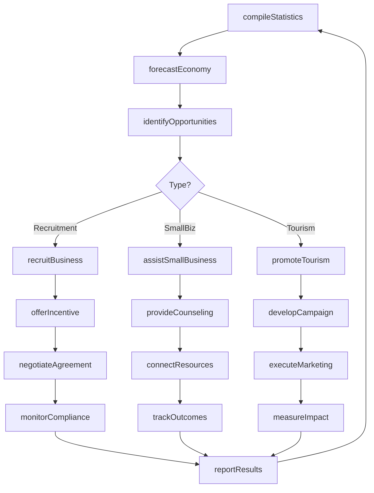
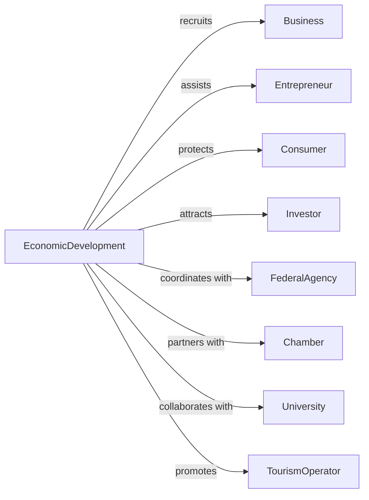

# Administration of General Economic Programs

> Business-as-Code definition for economic development program administration. Models business attraction, economic statistics, and commercial promotion from strategy through implementation.

## Overview

General economic program administration encompasses government promotion and development of business, industry, and tourism including small business assistance, economic statistics, and consumer protection. This definition exposes actions for business recruitment, economic analysis, small business development, and consumer protection, events for workflow automation, and searches for economic development data retrieval.

## Actors

| Actor | Description |
|-------|-------------|
| Business | Commercial entity receiving economic development services |
| Entrepreneur | Individual starting new business venture |
| Consumer | Individual protected from unfair practices |
| Investor | Entity providing capital for economic development |
| FederalAgency | Commerce or SBA providing programs |
| Chamber | Business association promoting commerce |
| University | Institution supporting research and development |
| TourismOperator | Business in visitor services industry |

## Roles

| Role | Description |
|------|-------------|
| EconomicDevelopmentDirector | Executive leading economic programs |
| BusinessRecruiter | Specialist attracting business investment |
| SmallBusinessAdvisor | Counselor assisting entrepreneurs |
| Economist | Analyst studying economic conditions |
| ConsumerProtectionOfficer | Investigator handling complaints |
| TourismDirector | Administrator promoting visitor industry |

## Entities

| Entity | Description |
|--------|-------------|
| EconomicDevelopmentIncentive | Financial inducement for business location |
| BusinessLicense | Authorization for commercial operation |
| EconomicStatistic | Data on commercial and employment conditions |
| SmallBusinessLoan | Financing for entrepreneur |
| ConsumerComplaint | Allegation of unfair business practice |
| TourismPromotion | Marketing campaign for visitor industry |
| TradeShow | Event showcasing economic offerings |
| ExportAssistance | Support for international sales |
| WorkforceDevelopment | Training program for employment |
| ForeignInvestment | Capital from international sources |
| EconomicForecast | Projection of future conditions |

## Actions

| Action | Description |
|--------|-------------|
| recruitBusiness | Attract commercial investment to area |
| offerIncentive | Provide financial inducement for location |
| licenseBusinesss | Authorize commercial operation |
| compileStatistics | Gather economic data |
| assistSmallBusiness | Counsel entrepreneur on development |
| investigateComplaint | Examine consumer allegation |
| promoteTourism | Market visitor industry |
| organizeTrade | Coordinate business showcasing event |
| assistExport | Support international sales efforts |
| developWorkforce | Train workers for employment |
| attractInvestment | Recruit foreign capital |
| forecastEconomy | Project future conditions |
| protectConsumer | Enforce fair business practices |
| administrGrant | Process economic development funding |

## Events

| Event | Description |
|-------|-------------|
| businessRecruited | Commercial investment secured |
| incentiveOffered | Financial inducement provided |
| businessLicensed | Commercial operation authorized |
| statisticsCompiled | Economic data gathered |
| smallBusinessAssisted | Entrepreneur counseled |
| complaintInvestigated | Consumer allegation examined |
| tourismPromoted | Visitor marketing completed |
| tradeOrganized | Business event coordinated |
| exportAssisted | International support provided |
| workforceDeveloped | Worker training completed |
| investmentAttracted | Foreign capital secured |
| economyForecast | Future conditions projected |
| consumerProtected | Fair practices enforced |
| grantAdministered | Development funding processed |

## Searches

| Search | Description |
|--------|-------------|
| findIncentives | Search business inducements by type or location |
| getStatistics | Retrieve economic data by indicator or period |
| listLicenses | Get commercial authorizations by type or status |
| findComplaints | Search consumer allegations by type or business |
| getTourismData | Retrieve visitor statistics by area or period |
| listGrants | Get development funding by program or recipient |
| findExports | Search international sales by product or market |

## Workflow



## Actor Relationships



## Usage

### Calling Actions

```typescript
import { administerCommerce } from '@headlessly/administer-commerce'

const economic = administerCommerce()

// Search business inducements by type or location
const findIncentivesResult = await economic.findIncentives({ status: 'active' })

// Retrieve economic data by indicator or period
const getStatisticsResult = await economic.getStatistics({ status: 'active' })

// Recruit business with incentive
const recruitment = await economic.recruitBusiness({
  prospect: {
    name: 'TechCorp Industries',
    industry: 'advancedManufacturing',
    investment: 50000000,
    jobs: 200
  },
  site: {
    location: 'industrial-park-south',
    acres: 25,
    infrastructure: ['water', 'sewer', 'electric', 'rail']
  }
})

const incentive = await economic.offerIncentive({
  recruitmentId: recruitment.id,
  package: [
    { type: 'propertyTaxAbatement', value: 2500000, term: 10 },
    { type: 'jobCreationCredit', value: 1000000, perJob: 5000 },
    { type: 'infrastructureGrant', value: 500000 }
  ],
  performance: {
    jobsRequired: 200,
    wageThreshold: 55000,
    investmentMinimum: 50000000
  }
})

// Assist small business
await economic.assistSmallBusiness({
  client: {
    name: 'Maria Rodriguez',
    businessType: 'restaurant',
    stage: 'startup'
  },
  services: [
    'businessPlanDevelopment',
    'financingNavigation',
    'regulatoryCompliance',
    'marketingStrategy'
  ],
  counselor: 'sbdc-advisor-johnson'
})
```

### Event-Driven Automation

```typescript
// Process business recruitment
economic.businessRecruited(async ({ recruitmentId, business, incentive }) => {
  await economic.licenseBusinesss({
    business: business.id,
    expedited: true
  })

  await scheduleMonitoring({
    incentiveId: incentive.id,
    milestones: incentive.performance,
    frequency: 'annual'
  })

  await notifyWorkforce({
    recruitment: recruitmentId,
    jobs: business.jobs,
    skills: business.requiredSkills
  })
})

// Monitor consumer complaints
economic.complaintInvestigated(async ({ complaintId, finding, business }) => {
  if (finding === 'violation') {
    await economic.protectConsumer({
      business,
      action: 'enforcement',
      remedy: determineRemedy(finding)
    })

    await updateConsumerAlerts({
      business: business.id,
      violation: complaintId
    })
  }
})
```
