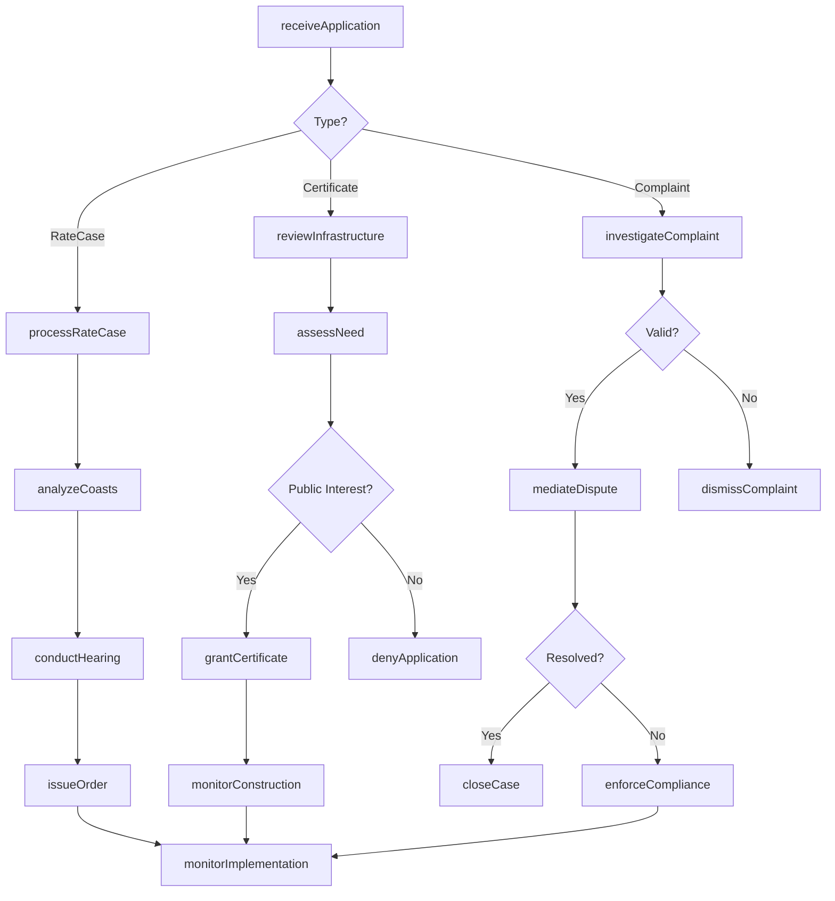
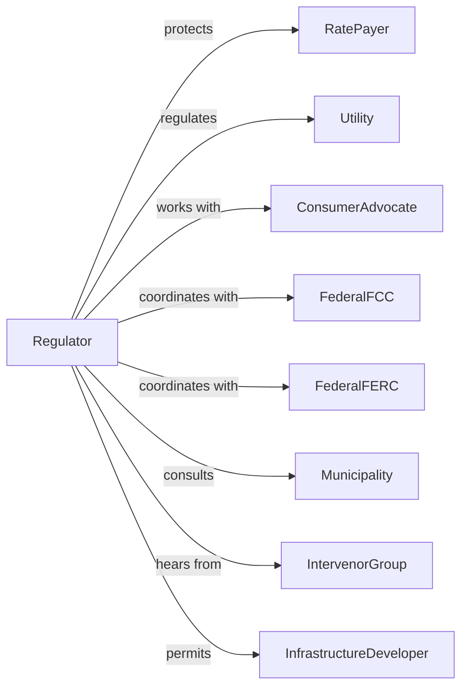

# Regulation and Administration of Communications, Electric, Gas, and Other Utilities

> Business-as-Code definition for utility regulation administration. Models rate setting, service quality oversight, and infrastructure approval from application through compliance monitoring.

## Overview

Utility regulation administration encompasses government oversight of communications, electric, gas, water, and sewerage services including rate setting, service quality monitoring, and infrastructure certification. This definition exposes actions for rate case processing, infrastructure approval, service quality enforcement, and consumer protection, events for workflow automation, and searches for utility regulatory data retrieval.

## Actors

| Actor | Description |
|-------|-------------|
| RatePayer | Customer of regulated utility |
| Utility | Company providing regulated service |
| ConsumerAdvocate | Organization representing ratepayer interests |
| FederalFCC | Communications commission providing oversight |
| FederalFERC | Energy commission regulating wholesale |
| Municipality | Local government with utility interests |
| IntervenorGroup | Organization participating in regulatory proceedings |
| InfrastructureDeveloper | Entity proposing utility facilities |

## Roles

| Role | Description |
|------|-------------|
| CommissionChair | Executive leading utility commission |
| Commissioner | Appointed decision-maker on utility matters |
| RateAnalyst | Specialist evaluating utility costs |
| EngineeringReviewer | Expert assessing infrastructure proposals |
| ConsumerAffairsOfficer | Staff handling customer complaints |
| HearingExaminer | Official presiding over regulatory proceedings |

## Entities

| Entity | Description |
|--------|-------------|
| RateCase | Proceeding to establish utility prices |
| Tariff | Schedule of utility rates and terms |
| CertificateOfNeed | Authorization for utility infrastructure |
| ServiceQualityStandard | Required performance level |
| ConsumerComplaint | Customer allegation against utility |
| IntegratedResourcePlan | Utility capacity planning document |
| InterconnectionAgreement | Terms for utility network connection |
| RenewablePortfolioStandard | Requirement for clean energy |
| RegulatoryOrder | Commission decision on utility matter |
| PublicHearing | Proceeding for stakeholder input |
| UtilityAudit | Examination of utility operations |

## Actions

| Action | Description |
|--------|-------------|
| processRateCase | Handle utility pricing request |
| approveTariff | Authorize rate schedule |
| grantCertificate | Approve infrastructure development |
| setServiceStandard | Establish performance requirement |
| investigateComplaint | Examine customer allegation |
| reviewResourcePlan | Evaluate utility capacity planning |
| approveInterconnection | Authorize network connection |
| establishRPS | Set renewable energy requirement |
| issueOrder | Publish commission decision |
| conductHearing | Hold stakeholder proceeding |
| auditUtility | Examine utility operations |
| enforceCompliance | Take action for standard violation |
| coordinateFederal | Manage federal regulatory relationship |
| mediateDispute | Resolve utility-customer conflict |

## Events

| Event | Description |
|-------|-------------|
| rateCaseProcessed | Pricing request handled |
| tariffApproved | Rate schedule authorized |
| certificateGranted | Infrastructure approved |
| serviceStandardSet | Performance requirement established |
| complaintInvestigated | Customer allegation examined |
| resourcePlanReviewed | Capacity planning evaluated |
| interconnectionApproved | Network connection authorized |
| rpsEstablished | Renewable requirement set |
| orderIssued | Commission decision published |
| hearingConducted | Stakeholder proceeding completed |
| utilityAudited | Operations examined |
| complianceEnforced | Violation action taken |
| federalCoordinated | Federal relationship managed |
| disputeMediated | Conflict resolved |
| rateCaseFiled | New utility rate case submitted for review |
| serviceReportReceived | Utility service quality report submitted |

## Searches

| Search | Description |
|--------|-------------|
| findRateCases | Search pricing proceedings by utility or status |
| getTariffs | Retrieve rate schedules by utility or service |
| listCertificates | Get infrastructure approvals by status or type |
| findComplaints | Search customer allegations by utility or issue |
| getOrders | Retrieve commission decisions by date or topic |
| listHearings | Get stakeholder proceedings by date or docket |
| findAudits | Search utility examinations by scope or finding |

## Workflow



## Actor Relationships



## Usage

### Calling Actions

```typescript
import { administerEnergy } from '@headlessly/administer-energy'

const regulator = administerEnergy()

// Process rate case
const rateCase = await regulator.processRateCase({
  utility: {
    name: 'Regional Power Company',
    type: 'electric',
    customers: 500000
  },
  request: {
    currentRevenue: 800000000,
    requestedIncrease: 120000000,
    percentageIncrease: 15,
    basis: ['infrastructureInvestment', 'operatingCosts', 'returnOnEquity']
  },
  filingDate: '2024-01-15',
  testYear: 2023
})

// Grant infrastructure certificate
const certificate = await regulator.grantCertificate({
  applicant: 'Solar Generation LLC',
  projectType: 'solarGeneration',
  capacity: 150,
  location: 'rural-county',
  investment: 175000000,
  findings: {
    need: 'demonstrated',
    alternatives: 'evaluated',
    environmental: 'mitigated',
    publicInterest: 'served'
  }
})

// Set service quality standard
await regulator.setServiceStandard({
  utility: 'regional-power-company',
  standards: [
    { metric: 'saidi', threshold: 120, unit: 'minutes' },
    { metric: 'saifi', threshold: 1.0, unit: 'interruptions' },
    { metric: 'customerSatisfaction', threshold: 80, unit: 'percent' }
  ],
  enforcement: {
    penaltyPerViolation: 50000,
    performanceReview: 'annual'
  }
})
```

### Event-Driven Automation

```typescript
// Process rate case filing
regulator.rateCaseFiled(async ({ docketId, utility, request }) => {
  await scheduleProceduralOrder({
    docketId,
    milestones: [
      { event: 'interventionDeadline', offset: 30 },
      { event: 'discoveryDeadline', offset: 90 },
      { event: 'hearings', offset: 150 },
      { event: 'briefsDeadline', offset: 180 },
      { event: 'decision', offset: 210 }
    ]
  })

  await notifyStakeholders({
    docketId,
    utility: utility.name,
    request: request.percentageIncrease
  })
})

// Monitor service quality
regulator.serviceReportReceived(async ({ utilityId, metrics, period }) => {
  const violations = identifyViolations(metrics)

  if (violations.length > 0) {
    await regulator.enforceCompliance({
      utilityId,
      violations,
      action: 'showCauseOrder',
      responseDeadline: addDays(new Date(), 30)
    })
  }

  await updatePerformanceDashboard({
    utilityId,
    metrics,
    period
  })
})
```
