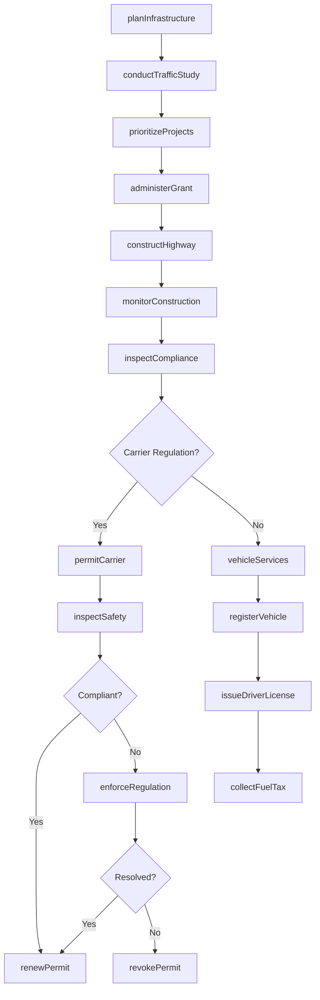
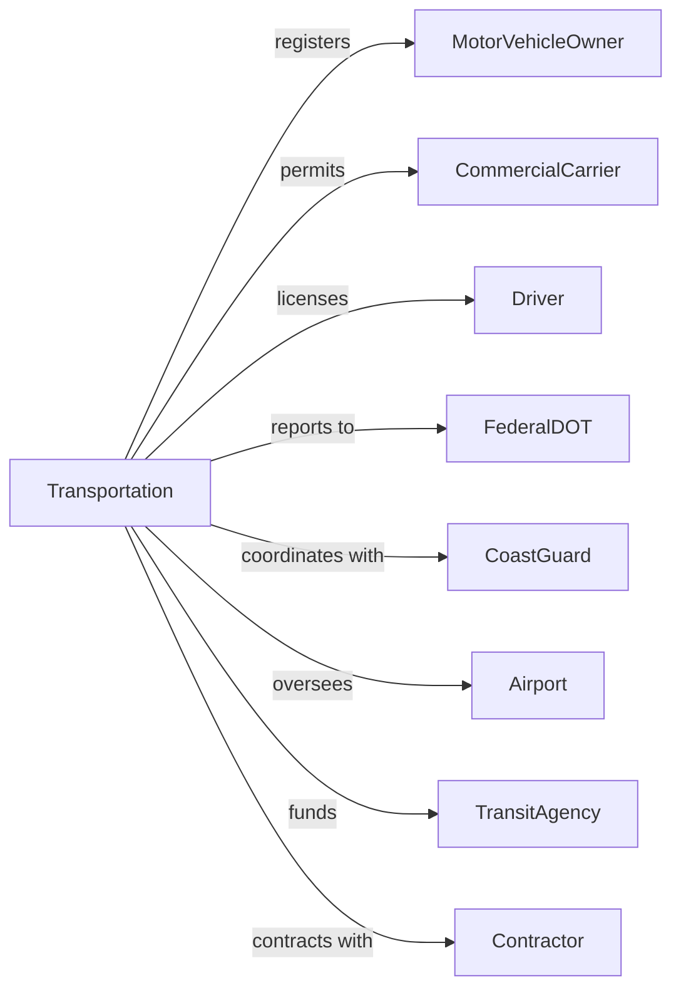

# Regulation and Administration of Transportation Programs

> Business-as-Code definition for transportation program administration. Models vehicle licensing, infrastructure planning, and carrier regulation from permitting through safety enforcement.

## Overview

Transportation program administration encompasses government regulation of transportation services including motor vehicle licensing, highway planning, carrier oversight, and safety inspection. This definition exposes actions for license issuance, infrastructure planning, carrier permitting, and transportation safety, events for workflow automation, and searches for transportation data retrieval.

## Actors

| Actor | Description |
|-------|-------------|
| MotorVehicleOwner | Individual or entity registering vehicle |
| CommercialCarrier | Business operating transportation services |
| Driver | Individual seeking operator license |
| FederalDOT | Department of Transportation providing oversight |
| CoastGuard | Maritime safety and security agency |
| Airport | Aviation facility under regulation |
| TransitAgency | Public transportation operator |
| Contractor | Firm constructing transportation infrastructure |

## Roles

| Role | Description |
|------|-------------|
| TransportationDirector | Executive leading transportation department |
| DMVAdministrator | Manager overseeing motor vehicle services |
| SafetyInspector | Official reviewing vehicles and carriers |
| TransportationPlanner | Professional developing infrastructure plans |
| LicensingExaminer | Specialist testing driver applicants |
| HighwayEngineer | Expert designing road infrastructure |

## Entities

| Entity | Description |
|--------|-------------|
| VehicleRegistration | Authorization for vehicle operation |
| DriverLicense | Credential for vehicle operator |
| CarrierPermit | Authorization for commercial transportation |
| TransportationPlan | Strategy for infrastructure development |
| SafetyInspection | Review of vehicle or carrier compliance |
| HighwayProject | Road construction or improvement |
| TrafficStudy | Analysis of vehicle movement patterns |
| ParkingAuthority | Entity managing public parking |
| AviationCertificate | Authorization for air operations |
| MaritimeLicense | Credential for waterway operation |
| FuelTax | Revenue from motor fuel sales |

## Actions

| Action | Description |
|--------|-------------|
| registerVehicle | Authorize vehicle for operation |
| issueDriverLicense | Grant operator credential |
| permitCarrier | Authorize commercial transportation |
| planInfrastructure | Develop transportation strategy |
| inspectSafety | Review vehicle or carrier compliance |
| constructHighway | Build or improve road |
| conductTrafficStudy | Analyze vehicle patterns |
| manageParking | Oversee public parking facilities |
| certifyAviation | Authorize air operations |
| licenseMartime | Grant waterway credential |
| collectFuelTax | Gather motor fuel revenue |
| enforceRegulation | Take action for transportation violation |
| coordinateFederal | Manage federal transportation relationship |
| administerGrant | Process transportation funding |

## Events

| Event | Description |
|-------|-------------|
| vehicleRegistered | Operation authorized |
| driverLicenseIssued | Operator credential granted |
| carrierPermitted | Commercial operation authorized |
| infrastructurePlanned | Development strategy created |
| safetyInspected | Compliance review completed |
| highwayConstructed | Road improvement completed |
| trafficStudied | Pattern analysis completed |
| parkingManaged | Facility oversight provided |
| aviationCertified | Air operation authorized |
| maratimeLicensed | Waterway credential granted |
| fuelTaxCollected | Motor fuel revenue gathered |
| regulationEnforced | Violation action taken |
| federalCoordinated | Federal relationship managed |
| grantAdministered | Transportation funding processed |
| registrationExpiring | Vehicle or carrier registration approaching expiration |

## Searches

| Search | Description |
|--------|-------------|
| findRegistrations | Search vehicle authorizations by owner or type |
| getDriverRecords | Retrieve operator credentials by name or status |
| listCarriers | Get commercial operators by type or authority |
| findProjects | Search infrastructure improvements by status |
| getInspections | Retrieve compliance reviews by result or date |
| listParkingFacilities | Get public parking by location or capacity |
| findViolations | Search enforcement actions by type or carrier |

## Workflow



## Actor Relationships



## Usage

### Calling Actions

```typescript
import { administerTransportation } from '@headlessly/administer-transportation'

const transportation = administerTransportation()

// Search vehicle authorizations by owner or type
const findRegistrationsResult = await transportation.findRegistrations({ status: 'active' })

// Retrieve operator credentials by name or status
const getDriverRecordsResult = await transportation.getDriverRecords({ status: 'active' })

// Register vehicle
const registration = await transportation.registerVehicle({
  owner: {
    name: 'John Smith',
    address: '123 Main Street',
    type: 'individual'
  },
  vehicle: {
    vin: '1HGBH41JXMN109186',
    make: 'Honda',
    model: 'Accord',
    year: 2024,
    type: 'passenger'
  },
  term: 'annual',
  plateType: 'standard'
})

// Permit commercial carrier
const permit = await transportation.permitCarrier({
  carrier: {
    name: 'ABC Trucking LLC',
    usdot: '123456',
    mcNumber: 'MC-789012'
  },
  authority: ['propertyCarrier', 'interstate'],
  fleet: {
    powerUnits: 25,
    drivers: 30
  },
  insurance: {
    liability: 1000000,
    cargo: 100000
  }
})

// Conduct safety inspection
await transportation.inspectSafety({
  carrierId: permit.carrierId,
  inspectionType: 'complianceReview',
  scope: [
    'driverQualifications',
    'hoursOfService',
    'vehicleMaintenance',
    'hazmatCompliance'
  ]
})
```

### Event-Driven Automation

```typescript
// Process registration renewal
transportation.registrationExpiring(async ({ registrationId, owner, vehicle }) => {
  await sendRenewalNotice({
    owner,
    registrationId,
    dueDate: expirationDate,
    amount: calculateFee(vehicle)
  })

  if (requiresEmissionsTest(vehicle)) {
    await scheduleInspection({
      vehicle: vehicle.vin,
      type: 'emissions',
      deadline: addDays(expirationDate, -30)
    })
  }
})

// Monitor carrier safety
transportation.safetyInspected(async ({ carrierId, results, score }) => {
  if (score < safetyThreshold) {
    await transportation.enforceRegulation({
      carrierId,
      action: 'conditionalRating',
      requirements: identifyDeficiencies(results),
      deadline: addDays(new Date(), 60)
    })

    await notifyFederalDOT({
      carrierId,
      safetyScore: score,
      status: 'unsatisfactory'
    })
  }
})
```
