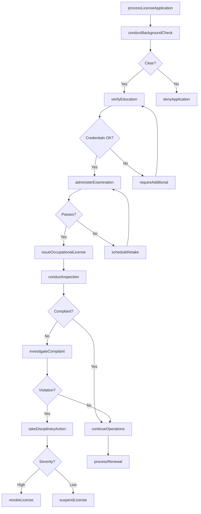
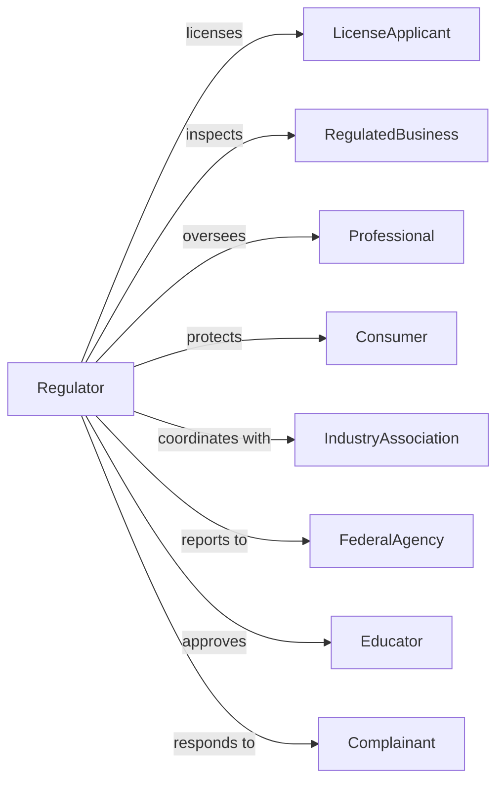

# Regulation, Licensing, and Inspection of Miscellaneous Commercial Sectors

> Business-as-Code definition for commercial licensing and inspection administration. Models professional licensing, business inspection, and regulatory enforcement across commercial sectors.

## Overview

Commercial sector regulation encompasses government licensing and inspection of diverse industries including professional occupations, retail establishments, manufacturing facilities, and specialized commercial operations. This definition exposes actions for professional licensing, business inspection, safety enforcement, and regulatory compliance, events for workflow automation, and searches for licensing and inspection data retrieval.

## Actors

| Actor | Description |
|-------|-------------|
| LicenseApplicant | Individual or business seeking authorization |
| RegulatedBusiness | Commercial operation subject to oversight |
| Professional | Licensed individual in regulated occupation |
| Consumer | Individual protected by commercial regulation |
| IndustryAssociation | Organization representing regulated sector |
| FederalAgency | National regulator with concurrent jurisdiction |
| Educator | Training provider for licensed occupations |
| Complainant | Individual alleging regulatory violation |

## Roles

| Role | Description |
|------|-------------|
| RegulatoryDirector | Executive leading licensing agency |
| LicensingSpecialist | Staff processing applications |
| ComplianceInspector | Official reviewing business operations |
| InvestigativeOfficer | Specialist examining complaints |
| BoardMember | Appointed professional overseeing licensure |
| HearingOfficer | Official presiding over disciplinary matters |

## Entities

| Entity | Description |
|--------|-------------|
| OccupationalLicense | Authorization for professional practice |
| BusinessLicense | Permission for commercial operation |
| InspectionRecord | Documentation of compliance review |
| DisciplinaryAction | Enforcement against licensee |
| ContinuingEducation | Required ongoing professional training |
| LicenseExamination | Assessment for initial licensure |
| Complaint | Allegation of regulatory violation |
| LicenseRenewal | Periodic authorization extension |
| AlcoholicBeveragePermit | Authorization for liquor sales |
| SafetyStandard | Required operational condition |
| BackgroundCheck | Criminal and professional history review |

## Actions

| Action | Description |
|--------|-------------|
| processLicenseApplication | Handle authorization request |
| administerExamination | Conduct licensing assessment |
| issueOccupationalLicense | Grant professional authorization |
| issueBusinessLicense | Authorize commercial operation |
| conductInspection | Review business compliance |
| investigateComplaint | Examine alleged violation |
| takeDisciplinaryAction | Enforce against non-compliant licensee |
| processRenewal | Handle periodic reauthorization |
| verifyEducation | Confirm continuing training |
| conductBackgroundCheck | Review criminal and professional history |
| suspendLicense | Temporarily revoke authorization |
| revokeLicense | Permanently cancel authorization |
| issueAlcoholPermit | Authorize liquor operations |
| enforceStandards | Take action for safety violations |

## Events

| Event | Description |
|-------|-------------|
| applicationProcessed | Authorization request handled |
| examinationAdministered | Licensing assessment completed |
| occupationalLicenseIssued | Professional authorization granted |
| businessLicenseIssued | Commercial operation authorized |
| inspectionConducted | Compliance review completed |
| complaintInvestigated | Alleged violation examined |
| disciplinaryActionTaken | Enforcement completed |
| renewalProcessed | Reauthorization completed |
| educationVerified | Training confirmed |
| backgroundCheckCompleted | History review finished |
| licenseSuspended | Authorization temporarily revoked |
| licenseRevoked | Authorization permanently canceled |
| alcoholPermitIssued | Liquor operation authorized |
| standardsEnforced | Safety violation addressed |
| renewalBecameDue | License or permit renewal deadline approaching |

## Searches

| Search | Description |
|--------|-------------|
| findLicenses | Search authorizations by type, holder, or status |
| getInspections | Retrieve compliance reviews by business or result |
| listComplaints | Get allegations by licensee or status |
| findDisciplinaryActions | Search enforcement by type or outcome |
| getExamResults | Retrieve assessment scores by date or occupation |
| listRenewals | Get periodic reauthorizations by due date |
| findAlcoholPermits | Search liquor authorizations by location or type |

## Workflow



## Actor Relationships



## Usage

### Calling Actions

```typescript
import { administerLicenses } from '@headlessly/administer-licenses'

const licensing = administerLicenses()

// Search authorizations by type, holder, or status
const findLicensesResult = await licensing.findLicenses({ status: 'active' })

// Retrieve compliance reviews by business or result
const getInspectionsResult = await licensing.getInspections({ status: 'active' })

// Process professional license application
const application = await licensing.processLicenseApplication({
  applicant: {
    name: 'Jennifer Williams',
    ssn: '***-**-9876',
    occupation: 'cosmetologist'
  },
  qualifications: {
    education: 'beauty-academy-cert',
    hours: 1500,
    supervisor: 'licensed-practitioner'
  },
  examScore: 85,
  backgroundCheck: 'cleared'
})

// Issue business license
const businessLicense = await licensing.issueBusinessLicense({
  business: {
    name: 'Downtown Salon',
    type: 'personalServices',
    owner: 'jennifer-williams'
  },
  location: '123 Main Street',
  permits: ['cosmetology', 'massageTherapy'],
  inspection: 'passed',
  insuranceVerified: true
})

// Investigate complaint
const investigation = await licensing.investigateComplaint({
  complaint: {
    licensee: 'lic-2024-5678',
    allegation: 'practicingWithoutSupervision',
    complainant: 'anonymous'
  },
  evidence: ['witnessStatement', 'documentation'],
  investigator: 'officer-martinez'
})
```

### Event-Driven Automation

```typescript
// Process license expiration
licensing.renewalBecameDue(async ({ licenseId, licensee, expirationDate }) => {
  await sendRenewalNotice({
    licenseId,
    licensee,
    deadline: expirationDate,
    requirements: getRenewalRequirements(licenseId)
  })

  await licensing.verifyEducation({
    licenseId,
    required: getContinuingEducationRequirement(licenseId),
    deadline: addDays(expirationDate, -30)
  })
})

// Handle complaint investigation
licensing.complaintInvestigated(async ({ complaintId, finding, licensee }) => {
  if (finding === 'substantiated') {
    const severity = assessViolationSeverity(finding)

    await licensing.takeDisciplinaryAction({
      licensee,
      complaintId,
      action: determineDiscipline(severity),
      conditions: identifyConditions(finding)
    })

    await notifyComplainant({
      complaintId,
      outcome: 'actionTaken'
    })
  }
})
```
