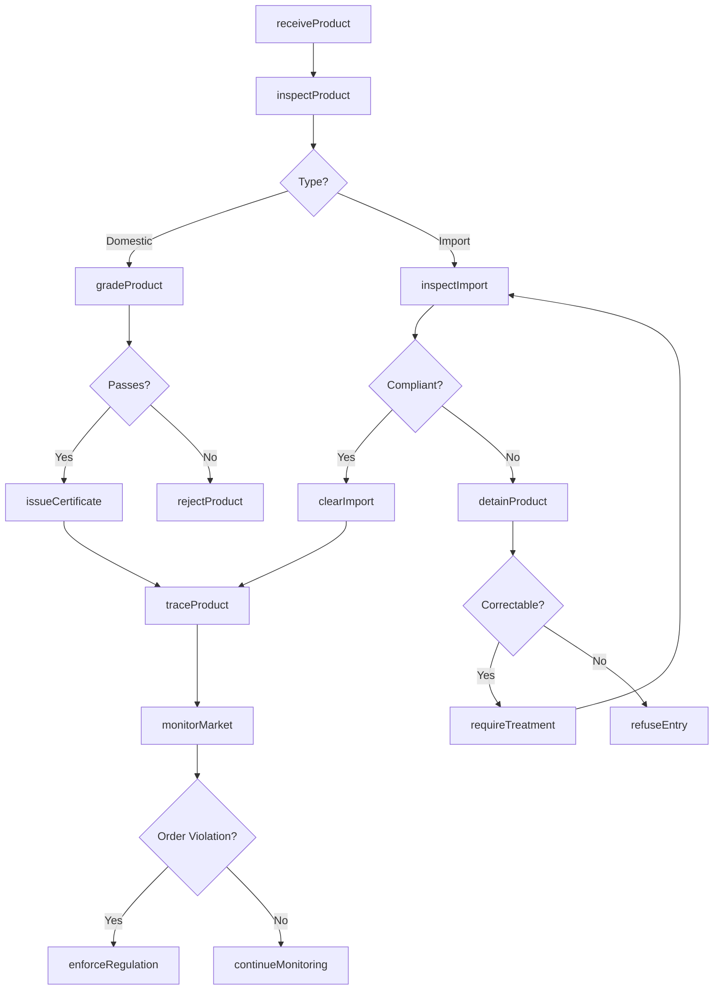
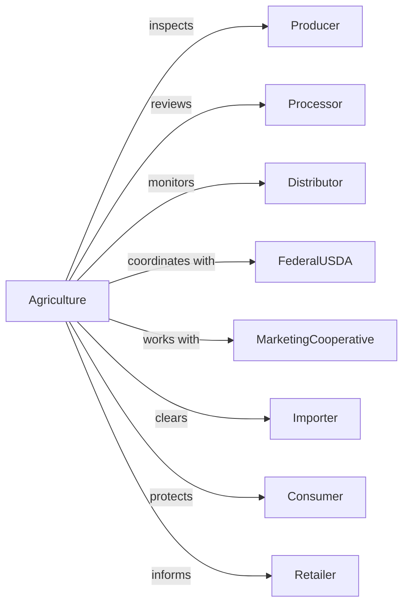

# Regulation of Agricultural Marketing and Commodities

> Business-as-Code definition for agricultural regulation administration. Models commodity grading, food safety inspection, and market order administration from inspection through certification.

## Overview

Agricultural marketing and commodities regulation encompasses government oversight of agricultural production, marketing, and food safety including commodity grading, inspection services, and market order administration. This definition exposes actions for product inspection, grading certification, market order enforcement, and food safety monitoring, events for workflow automation, and searches for agricultural regulatory data retrieval.

## Actors

| Actor | Description |
|-------|-------------|
| Producer | Farmer or rancher subject to regulation |
| Processor | Facility handling agricultural products |
| Distributor | Entity moving agricultural products |
| FederalUSDA | Agriculture department providing oversight |
| MarketingCooperative | Producer organization managing supply |
| Importer | Entity bringing agricultural products into country |
| Consumer | Individual purchasing agricultural products |
| Retailer | Store selling agricultural products |

## Roles

| Role | Description |
|------|-------------|
| AgricultureDirector | Executive leading agricultural agency |
| GradingInspector | Official certifying product quality |
| FoodSafetyInspector | Specialist examining processing facilities |
| MarketAdministrator | Manager overseeing market orders |
| AnimalHealthOfficer | Veterinarian monitoring livestock |
| PlantInspector | Specialist examining plant products |

## Entities

| Entity | Description |
|--------|-------------|
| GradeCertificate | Documentation of product quality |
| FoodSafetyInspection | Review of processing facility |
| MarketingOrder | Regulation of commodity supply and pricing |
| AnimalHealthCertificate | Documentation of livestock condition |
| PhytosanitaryCertificate | Documentation of plant health |
| OrganicCertification | Verification of production methods |
| CountryOfOriginLabel | Indication of product source |
| CommodityPrice | Market value of agricultural product |
| QuarantineOrder | Restriction on pest movement |
| SubsidyPayment | Government support for producer |
| TraceabilityRecord | Documentation of product origin |

## Actions

| Action | Description |
|--------|-------------|
| gradeProduct | Certify agricultural product quality |
| inspectFacility | Review processing operation |
| administerOrder | Manage commodity marketing regulation |
| certifyAnimalHealth | Document livestock condition |
| issuPhytosanitary | Certify plant product health |
| certifyOrganic | Verify production methods |
| labelOrigin | Document product source |
| monitorPrices | Track commodity market values |
| enforceQuarantine | Restrict pest movement |
| processSubsidy | Administer producer payments |
| traceProduct | Document product origin |
| inspectImport | Review incoming agricultural products |
| enforceRegulation | Take action for compliance violation |
| educateProducer | Train farmers on requirements |

## Events

| Event | Description |
|-------|-------------|
| productGraded | Quality certified |
| facilityInspected | Processing reviewed |
| orderAdministered | Marketing regulation managed |
| animalHealthCertified | Livestock documented |
| phytosanitaryIssued | Plant health certified |
| organicCertified | Production methods verified |
| originLabeled | Product source documented |
| pricesMonitored | Market values tracked |
| quarantineEnforced | Pest restriction implemented |
| subsidyProcessed | Producer payment administered |
| productTraced | Origin documented |
| importInspected | Incoming products reviewed |
| regulationEnforced | Violation action taken |
| producerEducated | Farmer training completed |

## Searches

| Search | Description |
|--------|-------------|
| findCertificates | Search quality documents by product or grade |
| getInspections | Retrieve facility reviews by result or date |
| listMarketingOrders | Get commodity regulations by product |
| findHealthCertificates | Search livestock documents by species or status |
| getOrganicCertifications | Retrieve production verifications by producer |
| listPrices | Get commodity values by product and date |
| findQuarantines | Search pest restrictions by area or pest |

## Workflow



## Actor Relationships



## Usage

### Calling Actions

```typescript
import { administerAgriculture } from '@headlessly/administer-agriculture'

const agriculture = administerAgriculture()

// Grade agricultural product
const certificate = await agriculture.gradeProduct({
  product: {
    type: 'beef',
    lot: 'LOT-2024-5678',
    quantity: 50000,
    unit: 'pounds'
  },
  grader: 'inspector-johnson',
  criteria: ['marbling', 'maturity', 'color', 'texture'],
  result: {
    grade: 'choice',
    yield: 3,
    qualityScore: 'A'
  }
})

// Inspect processing facility
const inspection = await agriculture.inspectFacility({
  facility: {
    name: 'Valley Meat Processing',
    type: 'slaughterhouse',
    establishment: 'EST-1234'
  },
  inspectionType: 'comprehensive',
  areas: [
    'sanitation',
    'haccp',
    'animalHandling',
    'recordkeeping',
    'waterTesting'
  ]
})

// Issue phytosanitary certificate
await agriculture.issuPhytosanitary({
  exporter: 'pacific-fruit-growers',
  product: {
    type: 'apples',
    variety: 'honeycrisp',
    quantity: 40000,
    unit: 'cases'
  },
  destination: 'taiwan',
  certifications: [
    'pestFree',
    'coldTreatment',
    'traceability'
  ]
})
```

### Event-Driven Automation

```typescript
// Process inspection results
agriculture.facilityInspected(async ({ facilityId, results, violations }) => {
  if (violations.length > 0) {
    const severity = assessSeverity(violations)

    if (severity === 'critical') {
      await agriculture.enforceRegulation({
        facilityId,
        action: 'suspendOperations',
        violations,
        requirements: generateCorrectiveActions(violations)
      })
    } else {
      await agriculture.enforceRegulation({
        facilityId,
        action: 'warningLetter',
        violations,
        deadline: addDays(new Date(), 30)
      })
    }
  }
})

// Monitor market prices
agriculture.pricesMonitored(async ({ commodity, prices, trend }) => {
  const order = await agriculture.findMarketingOrders({ commodity })

  if (order && prices.current < order.minimumPrice) {
    await agriculture.administerOrder({
      orderId: order.id,
      action: 'adjustSupply',
      mechanism: 'diversion'
    })

    await notifyProducers({
      commodity,
      marketConditions: trend,
      supportAvailable: true
    })
  }
})
```
