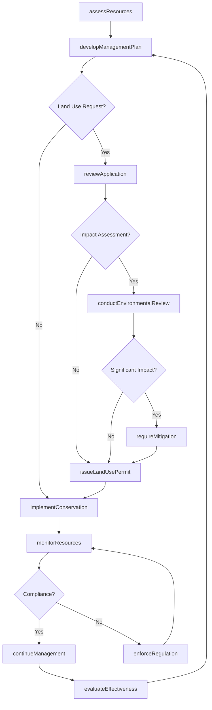
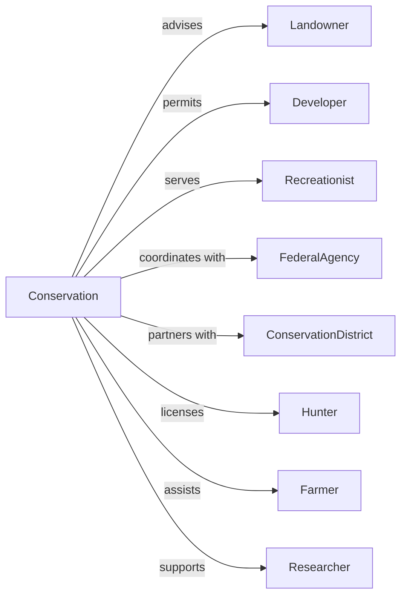

# Administration of Conservation Programs

> Business-as-Code definition for conservation program administration. Models natural resource protection, land management, and wildlife conservation from planning through enforcement.

## Overview

Conservation program administration encompasses government management of natural resources including land use regulation, wildlife protection, forest management, and geological surveys. This definition exposes actions for land use permitting, wildlife management, erosion control, and recreational area oversight, events for workflow automation, and searches for conservation data retrieval.

## Actors

| Actor | Description |
|-------|-------------|
| Landowner | Individual or entity managing private land |
| Developer | Entity planning land use changes |
| Recreationist | Individual using public lands |
| FederalAgency | Interior, Agriculture, or NOAA providing oversight |
| ConservationDistrict | Local entity promoting resource stewardship |
| Hunter | Individual participating in regulated harvest |
| Farmer | Agricultural operator using conservation practices |
| Researcher | Scientist studying natural resources |

## Roles

| Role | Description |
|------|-------------|
| ConservationDirector | Executive leading natural resources agency |
| WildlifeBiologist | Specialist managing animal populations |
| Forester | Professional overseeing forest resources |
| ParkRanger | Officer managing public lands |
| GeologicalSurveyor | Scientist mapping earth resources |
| ErosionSpecialist | Expert controlling soil loss |

## Entities

| Entity | Description |
|--------|-------------|
| LandUsePermit | Authorization for development activity |
| ConservationEasement | Restriction protecting natural values |
| WildlifePopulation | Managed animal species count |
| HuntingLicense | Authorization for game harvest |
| ForestManagementPlan | Strategy for timber and habitat |
| ErosionControlPlan | Strategy for soil protection |
| GeologicalSurvey | Mapping of earth resources |
| RecreationalArea | Public land open for visitor use |
| EndangeredSpeciesListing | Designation requiring protection |
| WeatherForecast | Prediction of atmospheric conditions |
| WildlifeCorridor | Protected movement pathway |

## Actions

| Action | Description |
|--------|-------------|
| issueLandUsePermit | Authorize development activity |
| establishEasement | Create conservation restriction |
| manageWildlife | Regulate animal populations |
| issueHuntingLicense | Authorize game harvest |
| developForestPlan | Create timber and habitat strategy |
| implementErosionControl | Execute soil protection measures |
| conductGeologicalSurvey | Map earth resources |
| manageRecreationalArea | Oversee public land use |
| listEndangeredSpecies | Designate species requiring protection |
| forecastWeather | Predict atmospheric conditions |
| protectHabitat | Preserve wildlife living space |
| enforceRegulation | Take action for conservation violation |
| monitorResources | Track natural resource conditions |
| coordinateDisaster | Manage natural hazard response |

## Events

| Event | Description |
|-------|-------------|
| landUsePermitIssued | Development authorized |
| easementEstablished | Conservation restriction created |
| wildlifeManaged | Population regulation implemented |
| huntingLicenseIssued | Game harvest authorized |
| forestPlanDeveloped | Timber strategy created |
| erosionControlImplemented | Soil protection executed |
| geologicalSurveyConducted | Earth mapping completed |
| recreationalAreaManaged | Public land oversight provided |
| speciesListed | Protection designation made |
| weatherForecast | Atmospheric prediction issued |
| habitatProtected | Wildlife space preserved |
| regulationEnforced | Violation action taken |
| resourcesMonitored | Conditions tracked |
| disasterCoordinated | Hazard response managed |
| applicationReceived | Conservation permit or license application submitted |
| wildlifeSurveyCompleted | Wildlife population survey data collected |

## Searches

| Search | Description |
|--------|-------------|
| findPermits | Search land use authorizations by location or type |
| getEasements | Retrieve conservation restrictions by area or holder |
| listWildlifePopulations | Get species counts by area or season |
| findLicenses | Search hunting authorizations by type or area |
| getForestPlans | Retrieve timber strategies by ownership or area |
| listEndangeredSpecies | Get protected species by region or status |
| findRecreationalAreas | Search public lands by amenity or activity |

## Workflow



## Actor Relationships



## Usage

### Calling Actions

```typescript
import { administerConservation } from '@headlessly/administer-conservation'

const conservation = administerConservation()

// Issue land use permit
const permit = await conservation.issueLandUsePermit({
  applicant: 'mountain-development-llc',
  projectType: 'subdivision',
  location: {
    parcel: '123-45-678',
    acres: 150,
    watershed: 'clear-creek'
  },
  conditions: [
    'stormwaterManagement',
    'riparianBuffer',
    'wildlifeCorridorPreservation'
  ],
  mitigation: {
    type: 'wetlandCreation',
    acres: 5,
    location: 'adjacent-parcel'
  }
})

// Manage wildlife population
await conservation.manageWildlife({
  species: 'whitetailDeer',
  unit: 'management-unit-5',
  population: {
    estimated: 12500,
    objective: 10000,
    density: 25
  },
  harvest: {
    quota: 2500,
    season: { start: '2024-10-15', end: '2024-12-31' }
  }
})

// Establish conservation easement
await conservation.establishEasement({
  grantor: 'smith-family-farm',
  acres: 500,
  values: ['wetland', 'riparian', 'habitat'],
  restrictions: [
    'noResidentialDevelopment',
    'sustainableAgriculture',
    'publicAccess'
  ],
  holder: 'state-land-trust'
})
```

### Event-Driven Automation

```typescript
// Process land use application
conservation.applicationReceived(async ({ applicationId, projectType, location }) => {
  const assessment = await conservation.assessResources({
    location,
    factors: ['wetlands', 'habitat', 'water', 'soils']
  })

  if (assessment.sensitiveResources.length > 0) {
    await conservation.conductEnvironmentalReview({
      applicationId,
      resources: assessment.sensitiveResources,
      reviewType: 'detailed'
    })
  }
})

// Monitor species populations
conservation.wildlifeSurveyCompleted(async ({ species, population, trend }) => {
  if (trend === 'declining' && population < thresholdLevel(species)) {
    await conservation.listEndangeredSpecies({
      species,
      status: 'threatened',
      protections: ['habitatDesignation', 'takeProhibition']
    })

    await notifyFederalAgency({
      species,
      recommendation: 'federalListing'
    })
  }
})
```
