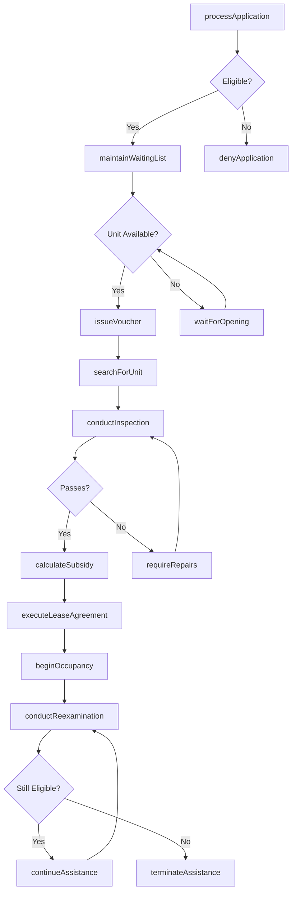
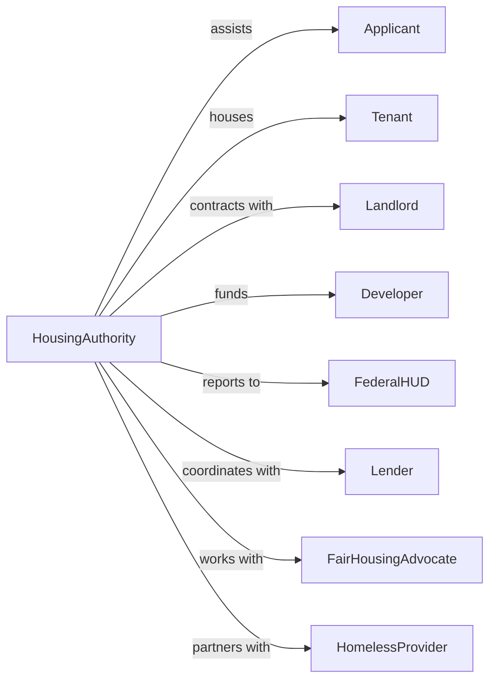

# Administration of Housing Programs

> Business-as-Code definition for housing program administration. Models affordable housing development, rental assistance, and fair housing enforcement from application through occupancy.

## Overview

Housing program administration encompasses government planning and coordination of housing assistance including public housing, rental vouchers, homeownership programs, and fair housing enforcement. This definition exposes actions for housing application processing, property management, subsidy calculation, and compliance monitoring, events for workflow automation, and searches for housing program data retrieval.

## Actors

| Actor | Description |
|-------|-------------|
| Applicant | Individual seeking housing assistance |
| Tenant | Occupant of subsidized housing |
| Landlord | Property owner participating in voucher program |
| Developer | Entity constructing affordable housing |
| FederalHUD | Housing and Urban Development providing funding |
| Lender | Financial institution providing mortgage financing |
| FairHousingAdvocate | Organization monitoring discrimination |
| HomelessProvider | Agency serving unhoused individuals |

## Roles

| Role | Description |
|------|-------------|
| HousingDirector | Executive leading housing authority |
| OccupancySpecialist | Staff processing housing applications |
| PropertyManager | Administrator overseeing public housing |
| HousingInspector | Official reviewing unit quality |
| FairHousingInvestigator | Specialist examining discrimination complaints |
| DevelopmentOfficer | Professional managing housing construction |

## Entities

| Entity | Description |
|--------|-------------|
| HousingApplication | Request for housing assistance |
| WaitingList | Queue of approved applicants |
| HousingVoucher | Subsidy for private market rental |
| PublicHousingUnit | Government-owned residential unit |
| SubsidyCalculation | Determination of assistance amount |
| HousingInspection | Review of unit condition |
| FairHousingComplaint | Allegation of discrimination |
| AffordableHousingProject | Subsidized residential development |
| LeaseAgreement | Contract between tenant and landlord |
| AnnualReexamination | Periodic eligibility review |
| HomelessAssessment | Evaluation for homeless services |

## Actions

| Action | Description |
|--------|-------------|
| processApplication | Handle housing assistance request |
| maintainWaitingList | Manage queue of approved applicants |
| issueVoucher | Provide rental subsidy authorization |
| calculateSubsidy | Determine assistance payment amount |
| conductInspection | Review unit for quality standards |
| investigateComplaint | Examine fair housing allegation |
| developAffordableHousing | Construct subsidized residential units |
| executeLeaseAgreement | Finalize tenant occupancy contract |
| conductReexamination | Perform periodic eligibility review |
| terminateAssistance | End housing subsidy |
| collectRent | Process tenant payment |
| coordinateHomeless | Manage services for unhoused individuals |
| enforceCompliance | Take action for program violation |
| administerGrant | Process federal housing funding |

## Events

| Event | Description |
|-------|-------------|
| applicationProcessed | Housing request handled |
| waitingListUpdated | Applicant queue modified |
| voucherIssued | Rental subsidy authorized |
| subsidyCalculated | Assistance amount determined |
| inspectionConducted | Unit review completed |
| complaintInvestigated | Discrimination allegation examined |
| housingDeveloped | Affordable units constructed |
| leaseExecuted | Occupancy contract finalized |
| reexaminationConducted | Eligibility review completed |
| assistanceTerminated | Housing subsidy ended |
| rentCollected | Tenant payment processed |
| homelessCoordinated | Unhoused services managed |
| complianceEnforced | Violation action taken |
| grantAdministered | Federal funding processed |

## Searches

| Search | Description |
|--------|-------------|
| findApplications | Search housing requests by status or type |
| getWaitingList | Retrieve applicant queue by preference or date |
| listVouchers | Get rental subsidies by status or landlord |
| findInspections | Search unit reviews by result or date |
| getComplaints | Retrieve discrimination allegations by status |
| listProperties | Get housing units by location or type |
| findGrants | Search federal funding by program or year |

## Workflow



## Actor Relationships



## Usage

### Calling Actions

```typescript
import { administerHousing } from '@headlessly/administer-housing'

const housing = administerHousing()

// Process housing application
const application = await housing.processApplication({
  applicant: {
    name: 'Maria Garcia',
    householdSize: 3,
    annualIncome: 28000,
    currentHousing: 'homeless'
  },
  programType: 'housingChoiceVoucher',
  preferences: ['homelessness', 'disabledHousehold'],
  documentation: ['incomeVerification', 'citizenship', 'familyComposition']
})

// Calculate subsidy
const subsidy = await housing.calculateSubsidy({
  applicationId: application.id,
  paymentStandard: 1500,
  adjustedIncome: 25000,
  utilityAllowance: 150,
  bedroomSize: 2
})

// Conduct housing inspection
await housing.conductInspection({
  unitAddress: '456 Oak Street, Apt 2B',
  inspectionType: 'initial',
  standards: 'housingQualityStandards',
  areas: [
    'structure',
    'electrical',
    'plumbing',
    'heating',
    'safety'
  ]
})
```

### Event-Driven Automation

```typescript
// Process voucher issuance
housing.voucherIssued(async ({ voucherId, tenant, bedroomSize }) => {
  await notifyTenant({
    voucherId,
    searchDeadline: addDays(new Date(), 60),
    requirements: getSearchRequirements(bedroomSize)
  })

  await enrollInHousingSearch({
    voucherId,
    assistance: 'housingLocator'
  })
})

// Handle annual reexamination
housing.reexaminationDue(async ({ tenantId, currentAssistance }) => {
  await housing.conductReexamination({
    tenantId,
    verifications: ['income', 'assets', 'familyComposition'],
    deadline: addDays(new Date(), 30)
  })
})

// Monitor fair housing complaints
housing.complaintInvestigated(async ({ complaintId, finding, respondent }) => {
  if (finding === 'discrimination') {
    await housing.enforceCompliance({
      respondent,
      action: 'conciliationAgreement',
      remedies: ['damages', 'training', 'policyChanges']
    })
  }
})
```
