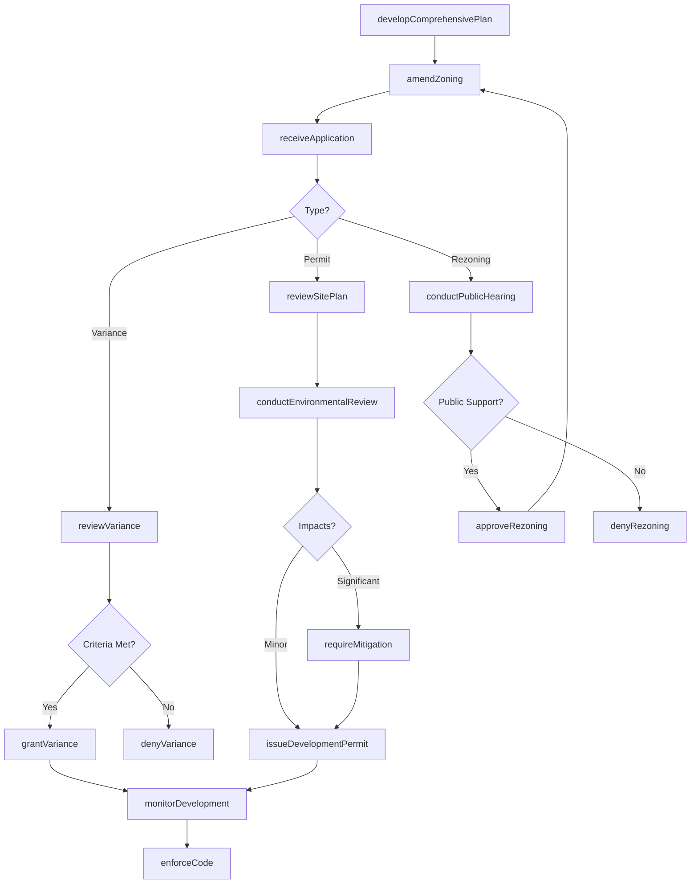
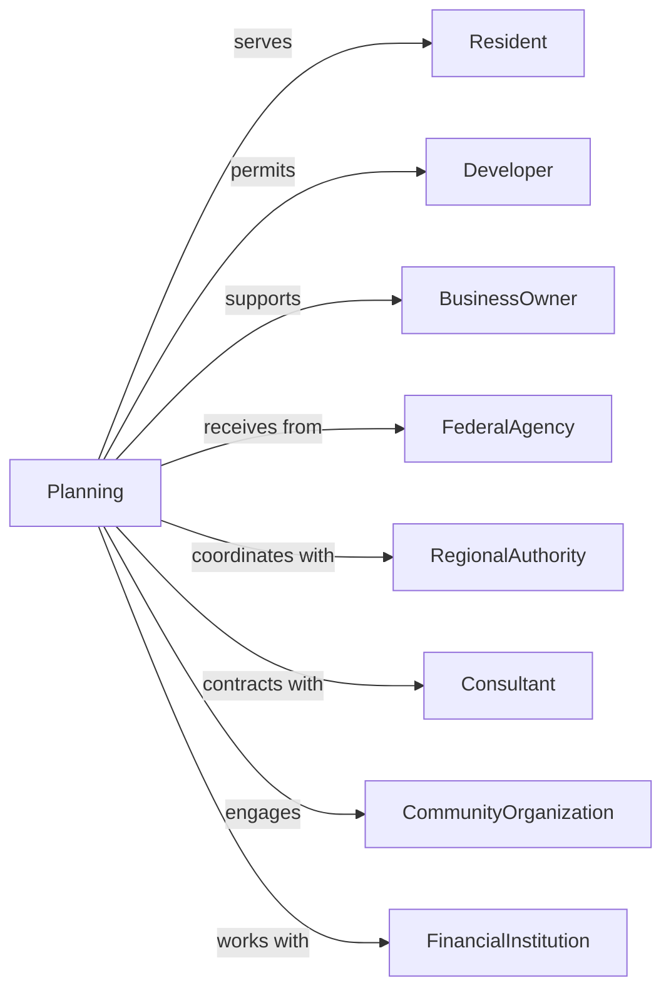

# Administration of Urban Planning and Community and Rural Development

> Business-as-Code definition for urban and community development administration. Models land use planning, zoning regulation, and economic development from comprehensive planning through project implementation.

## Overview

Urban planning and community development administration encompasses government coordination of land use planning, zoning regulation, and community revitalization for urban and rural areas. This definition exposes actions for comprehensive planning, zoning administration, economic development, and grant management, events for workflow automation, and searches for planning and development data retrieval.

## Actors

| Actor | Description |
|-------|-------------|
| Resident | Community member affected by planning decisions |
| Developer | Entity proposing land use changes |
| BusinessOwner | Commercial operator in development area |
| FederalAgency | HUD or USDA providing development funding |
| RegionalAuthority | Multi-jurisdictional planning organization |
| Consultant | Planning or engineering specialist |
| CommunityOrganization | Neighborhood group participating in planning |
| FinancialInstitution | Bank providing development financing |

## Roles

| Role | Description |
|------|-------------|
| PlanningDirector | Executive leading planning department |
| Planner | Professional developing land use plans |
| ZoningAdministrator | Official interpreting zoning regulations |
| EconomicDevelopmentOfficer | Specialist attracting business investment |
| GrantWriter | Professional securing development funding |
| CodeEnforcementOfficer | Inspector ensuring property compliance |

## Entities

| Entity | Description |
|--------|-------------|
| ComprehensivePlan | Long-range community development strategy |
| ZoningOrdinance | Regulation controlling land use |
| ZoningVariance | Exception to standard zoning requirements |
| DevelopmentPermit | Authorization for construction project |
| CommunityDevelopmentGrant | Federal funding for revitalization |
| RedevelopmentPlan | Strategy for blighted area improvement |
| ZoningMap | Geographic depiction of land use districts |
| ImpactFeeSchedule | Charges for development infrastructure |
| HistoricDistrictDesignation | Protection for cultural resources |
| TaxIncrementFinancing | Economic development funding mechanism |
| EnvironmentalReview | Assessment of project impacts |

## Actions

| Action | Description |
|--------|-------------|
| developComprehensivePlan | Create long-range community strategy |
| amendZoning | Modify land use regulations |
| grantVariance | Approve exception to zoning requirements |
| issueDevelopmentPermit | Authorize construction project |
| administerGrant | Process community development funding |
| createRedevelopmentPlan | Develop blighted area strategy |
| conductEnvironmentalReview | Assess project impacts |
| designateHistoricDistrict | Protect cultural resources |
| establishTIF | Create tax increment financing district |
| enforceCode | Take action for property violation |
| conductPublicHearing | Hold community input session |
| reviewSitePlan | Evaluate proposed development design |
| attractBusiness | Recruit commercial investment |
| coordinateRegional | Collaborate with multi-jurisdictional entities |

## Events

| Event | Description |
|-------|-------------|
| comprehensivePlanDeveloped | Long-range strategy created |
| zoningAmended | Land use regulations modified |
| varianceGranted | Zoning exception approved |
| developmentPermitIssued | Construction authorized |
| grantAdministered | Development funding processed |
| redevelopmentPlanCreated | Blighted area strategy developed |
| environmentalReviewConducted | Impact assessment completed |
| historicDistrictDesignated | Cultural protection established |
| tifEstablished | Financing district created |
| codeEnforced | Property violation addressed |
| publicHearingConducted | Community input gathered |
| sitePlanReviewed | Development design evaluated |
| businessAttracted | Commercial investment secured |
| regionalCoordinated | Multi-jurisdictional collaboration completed |

## Searches

| Search | Description |
|--------|-------------|
| findZoningDistricts | Search land use areas by type or location |
| getVariances | Retrieve zoning exceptions by property or date |
| listDevelopmentPermits | Get construction authorizations by status |
| findGrants | Search community funding by program or status |
| getRedevelopmentAreas | Retrieve revitalization zones by status |
| listHistoricDistricts | Get cultural protection areas by location |
| findTIFDistricts | Search financing zones by status or value |

## Workflow



## Actor Relationships



## Usage

### Calling Actions

```typescript
import { administerZoning } from '@headlessly/administer-zoning'

const planning = administerZoning()

// Review site plan for development
const review = await planning.reviewSitePlan({
  applicant: 'metro-development-corp',
  projectType: 'mixedUse',
  location: {
    address: '100 Main Street',
    parcel: '12-34-567',
    zoningDistrict: 'C-2'
  },
  proposal: {
    units: 150,
    commercialSqFt: 25000,
    parking: 200,
    height: 6
  },
  submittals: ['architecturalPlans', 'landscapePlan', 'trafficStudy']
})

// Administer community development grant
const grant = await planning.administerGrant({
  program: 'cdbg',
  projectType: 'infrastructureImprovement',
  amount: 500000,
  activities: [
    { type: 'streetscape', cost: 350000 },
    { type: 'waterMain', cost: 150000 }
  ],
  beneficiaries: {
    lowModIncome: 0.75,
    targetArea: 'downtown-revitalization'
  }
})

// Establish tax increment financing
await planning.establishTIF({
  districtName: 'Main Street Corridor',
  boundaries: 'mainStreetTIFBoundary',
  baseValue: 45000000,
  term: 23,
  projectedIncrement: 12000000,
  eligibleProjects: [
    'publicInfrastructure',
    'buildingRehabilitation',
    'publicFacilities'
  ]
})
```

### Event-Driven Automation

```typescript
// Process development application
planning.applicationReceived(async ({ applicationId, projectType, location }) => {
  await planning.conductEnvironmentalReview({
    applicationId,
    level: determineReviewLevel(projectType),
    factors: ['traffic', 'stormwater', 'habitat', 'historic']
  })

  if (requiresPublicHearing(projectType)) {
    await planning.conductPublicHearing({
      applicationId,
      noticePeriod: 15,
      notificationRadius: 300
    })
  }
})

// Monitor grant compliance
planning.grantAdministered(async ({ grantId, activities, beneficiaries }) => {
  await scheduleMonitoring({
    grantId,
    reviews: ['expenditure', 'progress', 'beneficiary'],
    frequency: 'quarterly'
  })

  await requireReporting({
    grantId,
    reports: ['drawdownRequest', 'progressReport', 'closeout'],
    deadlines: calculateDeadlines(grantId)
  })
})
```
