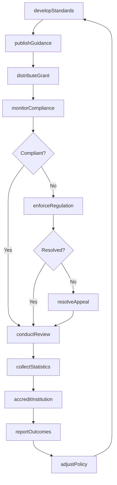
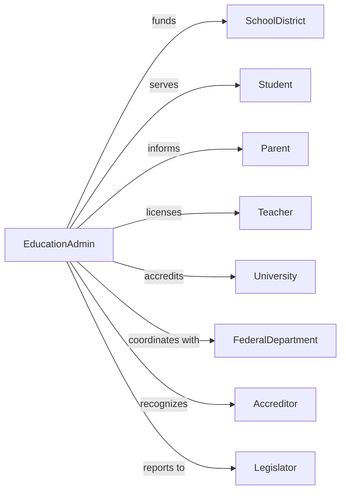

# Administration of Education Programs

> Business-as-Code definition for education program administration. Models policy coordination, funding distribution, and educational oversight from standard setting through compliance monitoring.

## Overview

Education program administration encompasses government coordination of educational policies, funding allocation, and data collection across public and private educational institutions. This definition exposes actions for curriculum standards development, grant administration, accreditation oversight, and educational statistics compilation, events for workflow automation, and searches for education data retrieval.

## Actors

| Actor | Description |
|-------|-------------|
| SchoolDistrict | Local education agency receiving state funding |
| Student | Individual enrolled in educational program |
| Parent | Guardian involved in educational decisions |
| Teacher | Educator delivering instruction |
| University | Higher education institution receiving grants |
| FederalDepartment | US Department of Education providing funding |
| Accreditor | Agency evaluating institutional quality |
| Legislator | Elected official shaping education policy |

## Roles

| Role | Description |
|------|-------------|
| EducationSecretary | Executive leading state education department |
| PolicyDirector | Administrator developing educational standards |
| GrantAdministrator | Manager overseeing education funding |
| ComplianceOfficer | Specialist monitoring regulatory adherence |
| DataAnalyst | Professional compiling educational statistics |
| LicensingSpecialist | Official credentialing educators |

## Entities

| Entity | Description |
|--------|-------------|
| EducationStandard | Curriculum requirement or learning objective |
| EducationGrant | Funding award for educational program |
| SchoolPerformance | Assessment of institutional outcomes |
| TeacherLicense | Credential authorizing instruction |
| AccreditationStatus | Recognition of institutional quality |
| EnrollmentData | Statistics on student participation |
| AchievementScore | Standardized assessment results |
| ScholarshipAward | Financial aid for student education |
| ComplianceReport | Documentation of regulatory adherence |
| EducationBudget | Allocation of state education funds |
| SpecialEducationPlan | Individualized program for disabled students |

## Actions

| Action | Description |
|--------|-------------|
| developStandards | Create curriculum requirements and objectives |
| distributeGrant | Allocate education funding to recipients |
| monitorCompliance | Verify adherence to education regulations |
| accreditInstitution | Recognize educational program quality |
| licenseEducator | Issue credential for teaching |
| collectStatistics | Gather educational performance data |
| administerAssessment | Conduct standardized testing |
| awardScholarship | Provide financial aid to student |
| approveProgram | Authorize new educational offering |
| conductReview | Evaluate institution or program performance |
| enforceRegulation | Take action for compliance failure |
| coordinateFederal | Manage relationship with federal department |
| publishGuidance | Issue policy interpretation and direction |
| resolveAppeal | Decide contested education decision |

## Events

| Event | Description |
|-------|-------------|
| standardsDeveloped | Curriculum requirements published |
| grantDistributed | Education funding allocated |
| complianceMonitored | Regulatory adherence verified |
| institutionAccredited | Quality recognition granted |
| educatorLicensed | Teaching credential issued |
| statisticsCollected | Performance data gathered |
| assessmentAdministered | Standardized testing completed |
| scholarshipAwarded | Student financial aid granted |
| programApproved | Educational offering authorized |
| reviewConducted | Performance evaluation completed |
| regulationEnforced | Compliance action taken |
| federalCoordinated | Federal relationship managed |
| guidancePublished | Policy direction issued |
| appealResolved | Contested decision finalized |

## Searches

| Search | Description |
|--------|-------------|
| findGrants | Search education funding by recipient or program |
| getSchoolPerformance | Retrieve institutional outcomes by district or year |
| listLicenses | Get educator credentials by status or type |
| findAccreditations | Search institutional recognitions by status |
| getEnrollmentData | Retrieve student statistics by level or area |
| listAssessmentResults | Get test scores by school or demographic |
| findScholarships | Search financial aid by program or recipient |

## Workflow



## Actor Relationships



## Usage

### Calling Actions

```typescript
import { administerEducation } from '@headlessly/administer-education'

const education = administerEducation()

// Search education funding by recipient or program
const findGrantsResult = await education.findGrants({ status: 'active' })

// Retrieve institutional outcomes by district or year
const getSchoolPerformanceResult = await education.getSchoolPerformance({ status: 'active' })

// Distribute education grant
const grant = await education.distributeGrant({
  program: 'title1',
  recipient: {
    type: 'schoolDistrict',
    id: 'district-springfield',
    enrollment: 15000
  },
  amount: 2500000,
  fiscalYear: 2024,
  requirements: [
    'targetLowIncome',
    'supplementNotSupplant',
    'parentalInvolvement'
  ]
})

// License educator
const license = await education.licenseEducator({
  applicant: {
    name: 'Sarah Johnson',
    degree: 'masterOfEducation',
    institution: 'state-university'
  },
  endorsements: ['elementary', 'specialEducation'],
  examScores: { praxis: 175 },
  backgroundCheck: 'cleared'
})

// Monitor district compliance
await education.monitorCompliance({
  entity: 'district-springfield',
  areas: ['title1', 'specialEducation', 'civilRights'],
  reviewType: 'desktop',
  period: 'annual'
})
```

### Event-Driven Automation

```typescript
// Process grant distribution
education.grantDistributed(async ({ grantId, recipient, amount }) => {
  await scheduleMonitoring({
    grantId,
    recipient,
    timeline: 'quarterly'
  })

  await requireReporting({
    grantId,
    reports: ['expenditure', 'performance'],
    deadlines: calculateDeadlines(grantId)
  })
})

// Handle assessment completion
education.assessmentAdministered(async ({ assessmentId, scores, demographics }) => {
  await education.collectStatistics({
    source: assessmentId,
    metrics: ['proficiency', 'growth', 'gaps'],
    demographics
  })

  const schools = identifyLowPerforming(scores)
  if (schools.length > 0) {
    await initiateSupport({
      schools,
      interventionType: 'targeted'
    })
  }
})
```
