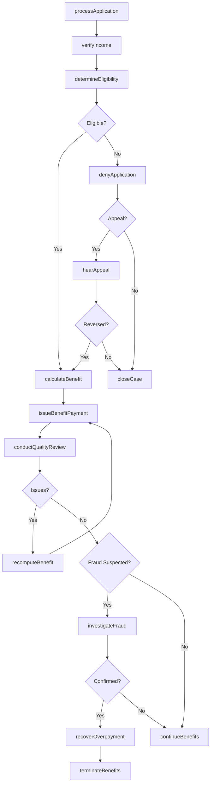
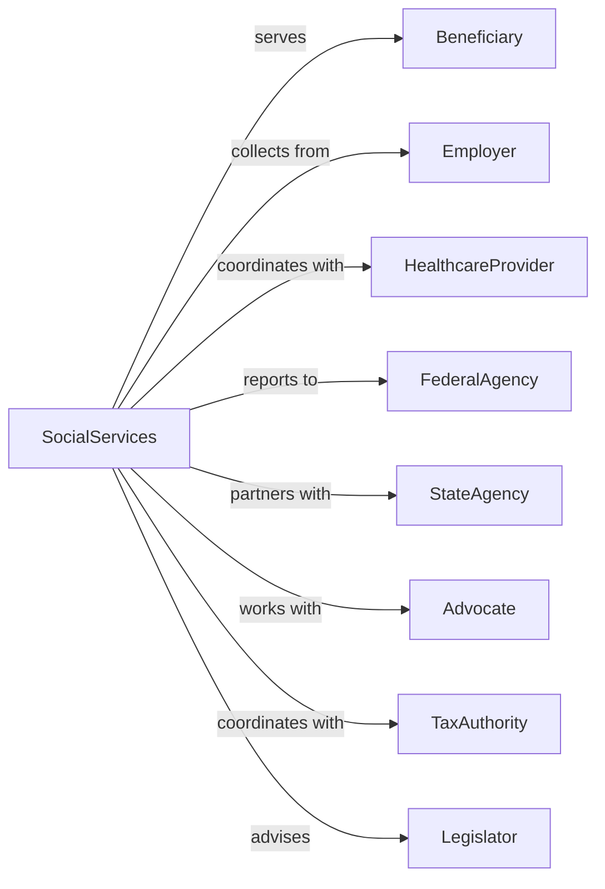

# Administration of Human Resource Programs (except Education, Public Health, and Veterans' Affairs Programs)

> Business-as-Code definition for social services program administration. Models welfare, unemployment, and disability program coordination from application through benefit delivery.

## Overview

Human resource program administration encompasses government coordination of social welfare programs including Social Security, unemployment insurance, workers compensation, and public assistance. This definition exposes actions for benefit eligibility determination, claims processing, and program compliance monitoring, events for workflow automation, and searches for benefits data retrieval.

## Actors

| Actor | Description |
|-------|-------------|
| Beneficiary | Individual receiving program benefits |
| Employer | Business contributing to insurance programs |
| HealthcareProvider | Facility delivering services to beneficiaries |
| FederalAgency | Social Security Administration or Labor Department |
| StateAgency | Workforce or human services department |
| Advocate | Organization assisting benefit applicants |
| TaxAuthority | Entity collecting program contributions |
| Legislator | Elected official shaping benefits policy |

## Roles

| Role | Description |
|------|-------------|
| ProgramDirector | Executive leading social services agency |
| EligibilityWorker | Specialist determining benefit qualification |
| ClaimsExaminer | Processor handling benefit applications |
| FraudInvestigator | Specialist detecting program abuse |
| PolicyAnalyst | Professional developing program rules |
| CaseManager | Coordinator managing beneficiary services |

## Entities

| Entity | Description |
|--------|-------------|
| BenefitApplication | Request for program assistance |
| EligibilityDetermination | Decision on benefit qualification |
| BenefitPayment | Disbursement to program recipient |
| UnemploymentClaim | Application for jobless benefits |
| DisabilityClaim | Request for incapacity benefits |
| WorkersCompClaim | Application for workplace injury benefits |
| PublicAssistanceCase | Ongoing welfare program participation |
| OverpaymentRecovery | Collection of excess benefits paid |
| FraudReferral | Suspected program abuse investigation |
| AppealDecision | Resolution of contested determination |
| QualityReview | Audit of program accuracy |

## Actions

| Action | Description |
|--------|-------------|
| processApplication | Handle new benefit request |
| determineEligibility | Decide qualification for program |
| calculateBenefit | Compute payment amount |
| issueBenefitPayment | Disburse funds to recipient |
| investigateFraud | Examine suspected program abuse |
| recoverOverpayment | Collect excess benefits paid |
| hearAppeal | Decide contested eligibility determination |
| conductQualityReview | Audit program accuracy |
| verifyIncome | Confirm applicant earnings |
| referToServices | Connect beneficiary with support programs |
| terminateBenefits | End program participation |
| recomputeBenefit | Adjust payment based on changed circumstances |
| collectContributions | Gather employer insurance payments |
| coordinateAgencies | Manage multi-program service delivery |

## Events

| Event | Description |
|-------|-------------|
| applicationProcessed | Benefit request handled |
| eligibilityDetermined | Qualification decided |
| benefitCalculated | Payment amount computed |
| paymentIssued | Funds disbursed |
| fraudInvestigated | Abuse examination completed |
| overpaymentRecovered | Excess benefits collected |
| appealHeard | Contested decision resolved |
| qualityReviewed | Program audit completed |
| incomeVerified | Earnings confirmed |
| serviceReferred | Support program connection made |
| benefitsTerminated | Program participation ended |
| benefitRecomputed | Payment adjusted |
| contributionsCollected | Insurance payments gathered |
| agenciesCoordinated | Multi-program delivery managed |

## Searches

| Search | Description |
|--------|-------------|
| findApplications | Search benefit requests by status or type |
| getCases | Retrieve beneficiary records by program or status |
| listPayments | Get disbursements by recipient or period |
| findAppeals | Search contested decisions by status or issue |
| getOverpayments | Retrieve excess payments by status or amount |
| listFraudCases | Get abuse investigations by status or outcome |
| findContributions | Search employer payments by entity or period |

## Workflow



## Actor Relationships



## Usage

### Calling Actions

```typescript
import { administerBenefits } from '@headlessly/administer-benefits'

const services = administerBenefits()

// Process unemployment claim
const claim = await services.processApplication({
  programType: 'unemployment',
  applicant: {
    ssn: '***-**-1234',
    name: 'John Smith',
    lastEmployer: 'acme-manufacturing'
  },
  separationReason: 'layoff',
  weeklyWage: 850,
  applicationDate: '2024-03-15'
})

// Determine eligibility
const determination = await services.determineEligibility({
  applicationId: claim.id,
  factors: {
    baseWages: 44200,
    workHistory: 52,
    separationType: 'involuntary',
    availability: 'fullTime'
  }
})

// Issue benefit payment
await services.issueBenefitPayment({
  caseId: determination.caseId,
  amount: determination.weeklyBenefit,
  paymentMethod: 'directDeposit',
  period: 'week-2024-12'
})
```

### Event-Driven Automation

```typescript
// Process new application
services.applicationProcessed(async ({ applicationId, program, applicant }) => {
  await services.verifyIncome({
    applicationId,
    sources: ['employers', 'taxRecords']
  })

  if (program === 'publicAssistance') {
    await services.referToServices({
      applicant: applicant.id,
      services: ['jobTraining', 'childcare', 'nutrition']
    })
  }
})

// Monitor for overpayments
services.paymentIssued(async ({ caseId, amount, beneficiary }) => {
  const income = await checkCurrentIncome(beneficiary.id)

  if (income.changed) {
    await services.recomputeBenefit({
      caseId,
      newIncome: income.current
    })

    if (income.current > income.reported) {
      await services.investigateFraud({
        caseId,
        allegation: 'unreportedIncome',
        discrepancy: income.current - income.reported
      })
    }
  }
})
```
