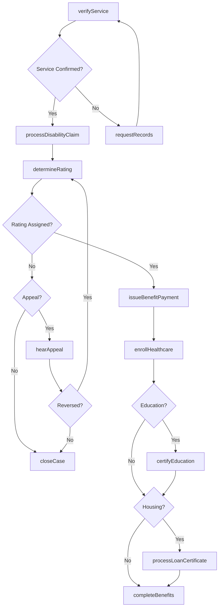
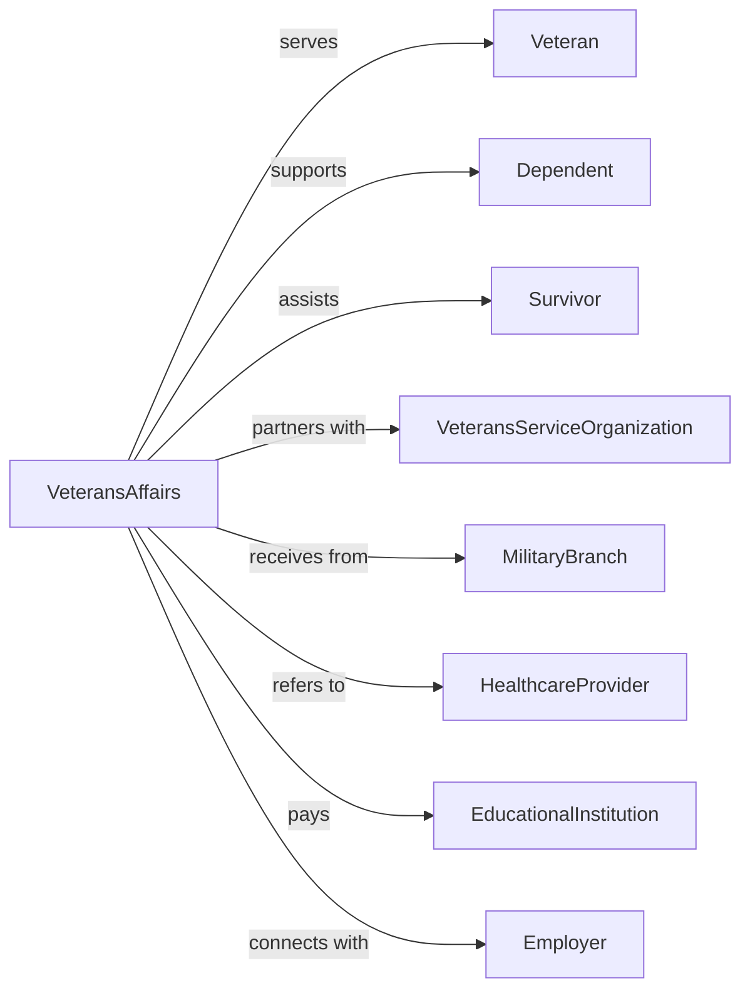

# Administration of Veterans' Affairs

> Business-as-Code definition for veterans affairs administration. Models benefits coordination, healthcare delivery, and support services for military veterans and their families.

## Overview

Veterans affairs administration encompasses government coordination of programs providing benefits, healthcare, and support services to military veterans and their dependents. This definition exposes actions for disability compensation, education benefits, healthcare enrollment, and memorial services, events for workflow automation, and searches for veterans benefits data retrieval.

## Actors

| Actor | Description |
|-------|-------------|
| Veteran | Former military service member receiving benefits |
| Dependent | Family member eligible for veteran benefits |
| Survivor | Deceased veteran family member receiving benefits |
| VeteransServiceOrganization | Nonprofit advocating for veterans |
| MilitaryBranch | Armed forces providing service records |
| HealthcareProvider | Facility delivering veteran medical care |
| EducationalInstitution | School receiving GI Bill payments |
| Employer | Business participating in veteran hiring |

## Roles

| Role | Description |
|------|-------------|
| VeteransAffairsDirector | Executive leading VA operations |
| ClaimsProcessor | Specialist handling benefit applications |
| VocationalCounselor | Advisor supporting veteran education and employment |
| HealthcareCoordinator | Manager organizing veteran medical services |
| MemorialRepresentative | Official coordinating burial services |
| OutreachSpecialist | Communicator connecting with veteran community |

## Entities

| Entity | Description |
|--------|-------------|
| DisabilityClaim | Application for service-connected compensation |
| EducationBenefit | GI Bill or vocational training entitlement |
| HealthcareEnrollment | Registration for VA medical services |
| ServiceRecord | Documentation of military service |
| DisabilityRating | Percentage determining compensation level |
| PensionClaim | Application for income-based veteran payment |
| BurialBenefit | Memorial services for deceased veteran |
| HomeLoanCertificate | Eligibility for VA mortgage guarantee |
| VocationalRehabilitation | Employment training program participation |
| DependentBenefit | Assistance for veteran family member |
| AppealDecision | Resolution of contested claim |

## Actions

| Action | Description |
|--------|-------------|
| processDisabilityClaim | Handle service-connected compensation request |
| determineRating | Establish disability percentage |
| enrollHealthcare | Register veteran for VA medical services |
| certifyEducation | Verify enrollment for GI Bill benefits |
| processLoanCertificate | Issue home loan eligibility document |
| provideVocationalRehab | Deliver employment training services |
| processBurialClaim | Handle memorial benefit request |
| adjudicatePension | Decide income-based benefit eligibility |
| coordinateOutreach | Connect with veteran community |
| hearAppeal | Resolve contested claim decision |
| verifyService | Confirm military service record |
| processDependentClaim | Handle family member benefit request |
| administerGrant | Manage veteran assistance funding |
| liaiseWithOrganization | Coordinate with veteran service groups |

## Events

| Event | Description |
|-------|-------------|
| disabilityClaimProcessed | Compensation request handled |
| ratingDetermined | Disability percentage established |
| healthcareEnrolled | Medical services registration completed |
| educationCertified | GI Bill enrollment verified |
| loanCertificateIssued | Home loan eligibility documented |
| vocationalRehabProvided | Employment training delivered |
| burialClaimProcessed | Memorial benefit handled |
| pensionAdjudicated | Income benefit decided |
| outreachCoordinated | Community connection made |
| appealHeard | Contested decision resolved |
| serviceVerified | Military record confirmed |
| dependentClaimProcessed | Family benefit handled |
| grantAdministered | Assistance funding managed |
| organizationLiaised | Service group coordination completed |

## Searches

| Search | Description |
|--------|-------------|
| findClaims | Search benefit requests by type or status |
| getVeteranRecord | Retrieve veteran profile by SSN or service number |
| listRatings | Get disability percentages by condition or date |
| findEducationBenefits | Search GI Bill usage by school or veteran |
| getHealthcareEnrollments | Retrieve medical registrations by status |
| listAppeals | Get contested decisions by issue or status |
| findBurialBenefits | Search memorial claims by status or location |

## Workflow



## Actor Relationships



## Usage

### Calling Actions

```typescript
import { administerVeterans } from '@headlessly/administer-veterans'

const va = administerVeterans()

// Process disability claim
const claim = await va.processDisabilityClaim({
  veteran: {
    ssn: '***-**-5678',
    name: 'James Wilson',
    serviceNumber: 'USN-12345'
  },
  conditions: [
    { type: 'ptsd', onset: 'inService', evidence: ['serviceRecords', 'medicalExam'] },
    { type: 'tinnitus', onset: 'inService', evidence: ['audiogram'] }
  ],
  serviceConnection: 'direct',
  priorityProcessing: false
})

// Determine disability rating
const rating = await va.determineRating({
  claimId: claim.id,
  examResults: {
    ptsd: { severity: 'moderate', impact: 'occupational' },
    tinnitus: { severity: 'persistent', bilateral: true }
  }
})

// Certify education benefits
await va.certifyEducation({
  veteranId: claim.veteranId,
  program: 'postNineEleven',
  institution: 'state-university',
  enrollmentStatus: 'fullTime',
  semester: 'fall2024',
  tuition: 12500,
  housing: 'onCampus'
})
```

### Event-Driven Automation

```typescript
// Process new claim submission
va.disabilityClaimProcessed(async ({ claimId, veteran, conditions }) => {
  await va.verifyService({
    veteran: veteran.id,
    sources: ['dpris', 'branchRecords']
  })

  for (const condition of conditions) {
    await scheduleExam({
      claimId,
      condition: condition.type,
      examType: 'compensationAndPension'
    })
  }
})

// Handle rating determination
va.ratingDetermined(async ({ veteranId, combinedRating, conditions }) => {
  await va.enrollHealthcare({
    veteranId,
    priorityGroup: calculatePriorityGroup(combinedRating),
    enrollment: 'automatic'
  })

  if (combinedRating >= 70) {
    await va.provideVocationalRehab({
      veteranId,
      eligibility: 'entitled'
    })

    await notifyDependent({
      veteranId,
      benefitsAvailable: ['champva', 'educationalAssistance']
    })
  }
})
```
