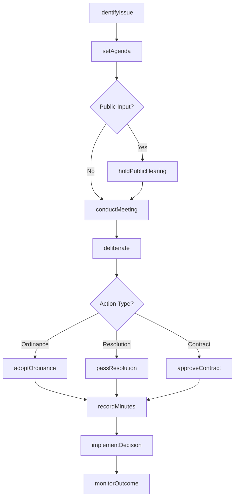
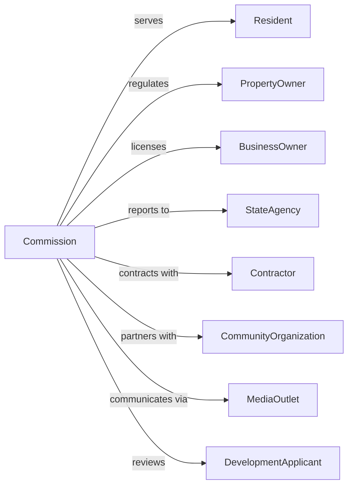

# Executive and Legislative Offices, Combined

> Business-as-Code definition for combined executive-legislative governance. Models unified local government operations where executive and legislative functions merge in councils or commissions.

## Overview

Combined executive and legislative offices represent local government structures where the chief executive serves as a member of the legislative body, such as county commissions or city councils with council-manager systems. This definition exposes actions for integrated policy development, administrative oversight, and local governance, events for workflow automation, and searches for municipal data retrieval.

## Actors

| Actor | Description |
|-------|-------------|
| Resident | Individual living within the jurisdiction |
| PropertyOwner | Person or entity owning real estate in jurisdiction |
| BusinessOwner | Operator of commercial enterprise in jurisdiction |
| StateAgency | Higher-level government entity providing oversight |
| Contractor | Vendor providing goods or services to municipality |
| CommunityOrganization | Nonprofit serving local interests |
| MediaOutlet | Local news organization covering government |
| DevelopmentApplicant | Person seeking land use or building approvals |

## Roles

| Role | Description |
|------|-------------|
| Commissioner | Elected member of combined governing body |
| BoardChair | Presiding officer of commission or council |
| CityManager | Professional administrator implementing policy |
| CountyClerk | Official maintaining records and elections |
| MunicipalAttorney | Legal counsel advising governing body |
| FinanceOfficer | Administrator managing local fiscal affairs |

## Entities

| Entity | Description |
|--------|-------------|
| Ordinance | Local law enacted by governing body |
| Resolution | Formal expression of commission opinion or intent |
| MeetingAgenda | List of items for official session |
| MeetingMinutes | Official record of proceedings |
| LocalBudget | Annual financial plan for jurisdiction |
| ZoningDecision | Determination on land use application |
| LicensePermit | Authorization for regulated activity |
| ServiceContract | Agreement for provision of municipal services |
| TaxLevy | Annual property tax rate determination |
| CapitalProject | Major infrastructure or facility investment |
| PublicHearing | Open meeting for community input |

## Actions

| Action | Description |
|--------|-------------|
| adoptOrdinance | Enact local legislation through commission vote |
| passResolution | Approve formal statement of intent or opinion |
| setAgenda | Determine items for commission consideration |
| conductMeeting | Preside over official session of governing body |
| approveContract | Authorize agreement with vendor or service provider |
| setTaxRate | Determine annual property tax levy |
| adoptBudget | Approve annual financial plan |
| holdPublicHearing | Conduct open meeting for community input |
| appointOfficer | Designate individual to administrative position |
| grantVariance | Approve exception to zoning or building code |
| issueProclamation | Make official public declaration |
| authorizeProject | Approve capital improvement undertaking |
| certifyElection | Validate results of local election |
| annexTerritory | Incorporate adjacent area into jurisdiction |

## Events

| Event | Description |
|-------|-------------|
| ordinanceAdopted | Local law enacted and effective |
| resolutionPassed | Formal statement approved |
| agendaSet | Meeting items determined |
| meetingConducted | Official session completed |
| contractApproved | Vendor agreement authorized |
| taxRateSet | Property levy determined |
| budgetAdopted | Financial plan approved |
| publicHearingHeld | Community input session completed |
| officerAppointed | Administrative position filled |
| varianceGranted | Zoning exception approved |
| proclamationIssued | Official declaration made |
| projectAuthorized | Capital improvement approved |
| electionCertified | Results validated |
| territoryAnnexed | Area incorporated |

## Searches

| Search | Description |
|--------|-------------|
| findOrdinances | Search local laws by subject, date, or status |
| getMeetingRecords | Retrieve agendas and minutes by date or topic |
| listContracts | Get vendor agreements by type, amount, or status |
| findZoningDecisions | Search land use actions by property or applicant |
| getBudgetHistory | Retrieve financial plans by year or department |
| listAppointments | Get officer designations by position or term |
| findPublicHearings | Search community input sessions by topic or date |

## Workflow



## Actor Relationships



## Usage

### Calling Actions

```typescript
import { governMunicipalities } from '@headlessly/govern-municipalities'

const commission = governMunicipalities()

// Search local laws by subject, date, or status
const findOrdinancesResult = await commission.findOrdinances({ status: 'active' })

// Retrieve agendas and minutes by date or topic
const getMeetingRecordsResult = await commission.getMeetingRecords({ status: 'active' })

// Adopt a local ordinance
const ordinance = await commission.adoptOrdinance({
  title: 'Short-Term Rental Regulations',
  chapter: 'BusinessLicensing',
  sections: [
    { number: '1', title: 'Definitions', text: '...' },
    { number: '2', title: 'Registration Required', text: '...' },
    { number: '3', title: 'Operating Standards', text: '...' },
    { number: '4', title: 'Penalties', text: '...' }
  ],
  effectiveDate: '2024-07-01',
  votes: { for: 4, against: 1 }
})

// Set annual property tax rate
await commission.setTaxRate({
  fiscalYear: 2025,
  generalFund: 0.0045,
  schoolDistrict: 0.0089,
  specialDistricts: [
    { name: 'Fire', rate: 0.0012 },
    { name: 'Library', rate: 0.0003 }
  ],
  assessedValue: 5200000000
})

// Approve capital project
await commission.authorizeProject({
  name: 'Main Street Reconstruction',
  type: 'infrastructure',
  budget: 12500000,
  funding: ['generalObligation', 'federalGrant'],
  timeline: { start: '2024-04-01', end: '2025-10-31' }
})
```

### Event-Driven Automation

```typescript
// Process ordinance after adoption
commission.ordinanceAdopted(async ({ ordinanceId, effectiveDate, subject }) => {
  await publishToCodebook({
    ordinanceId,
    effectiveDate
  })

  if (subject === 'licensing') {
    await notifyLicenseHolders({
      regulation: ordinanceId,
      complianceDeadline: effectiveDate
    })
  }
})

// Track budget adoption
commission.budgetAdopted(async ({ fiscalYear, departments }) => {
  for (const dept of departments) {
    await initializeDepartmentAllocation({
      department: dept.id,
      fiscalYear,
      amount: dept.appropriation
    })
  }

  await updateFinancialSystem({
    fiscalYear,
    status: 'active'
  })
})
```
