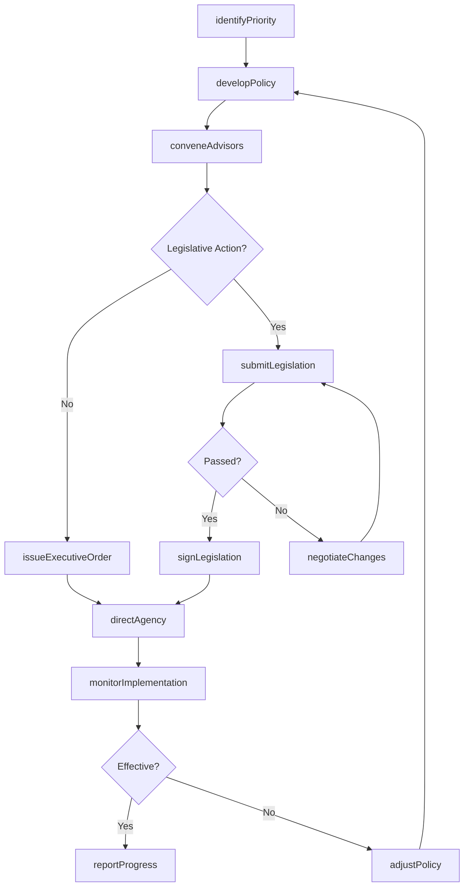
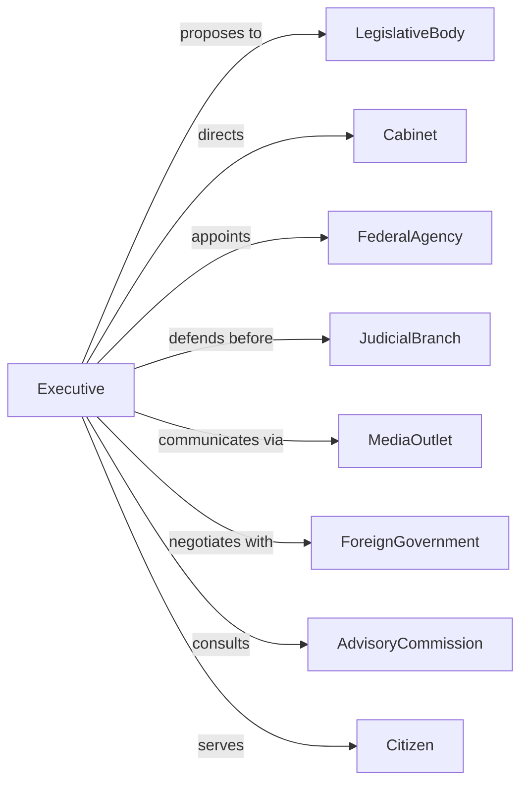

# Executive Offices

> Business-as-Code definition for executive office operations. Models policy direction, appointments, and executive administration from agenda setting through implementation.

## Overview

Executive offices serve as the nerve center of government administration, encompassing the offices of presidents, governors, mayors, and their advisory bodies. This definition exposes actions for policy development, executive orders, appointments, and intergovernmental coordination, events for workflow automation, and searches for data retrieval.

## Actors

| Actor | Description |
|-------|-------------|
| Citizen | Individual or group affected by executive decisions and policies |
| LegislativeBody | Congress, state legislature, or council receiving policy proposals |
| Cabinet | Department heads advising and implementing executive directives |
| JudicialBranch | Courts reviewing executive actions for constitutionality |
| MediaOutlet | News organizations covering executive activities |
| LobbyingGroup | Organizations advocating for policy positions |
| FederalAgency | National agencies implementing executive policy |
| ForeignGovernment | International entities engaging in diplomatic relations |
| AdvisoryCommission | Expert bodies providing policy recommendations |

## Roles

| Role | Description |
|------|-------------|
| ChiefExecutive | President, governor, or mayor making final decisions |
| ChiefOfStaff | Senior advisor managing executive office operations |
| PolicyAdvisor | Staff developing and analyzing policy options |
| PressSecretary | Official communicating with media and public |
| LegalCounsel | Attorney advising on constitutional and legal matters |
| SchedulingDirector | Coordinator managing executive calendar and priorities |

## Entities

| Entity | Description |
|--------|-------------|
| ExecutiveOrder | Directive issued by the chief executive |
| PolicyAgenda | Prioritized list of administration goals |
| Appointment | Nomination of individuals to government positions |
| Budget | Proposed allocation of government resources |
| Proclamation | Official public announcement or declaration |
| VetoMessage | Statement explaining rejection of legislation |
| StateOfAddress | Formal report on government condition and priorities |
| TransitionPlan | Strategy for administration changeover |
| CabinetMeeting | Gathering of department heads for coordination |
| BriefingDocument | Summary of issues requiring executive attention |

## Actions

| Action | Description |
|--------|-------------|
| issueExecutiveOrder | Sign and publish a binding directive to agencies |
| nominateAppointee | Submit candidate for confirmation to position |
| signLegislation | Approve and enact bills passed by legislature |
| vetoLegislation | Reject a bill and return with objections |
| deliverAddress | Present formal speech to legislature or public |
| conveneAdvisors | Gather cabinet or commission for policy discussion |
| declarEmergency | Invoke emergency powers for crisis response |
| grantPardon | Issue clemency for federal or state offenses |
| negotiateTreaty | Engage in formal agreements with foreign governments |
| submitBudget | Present proposed spending plan to legislature |
| directAgency | Instruct department to implement specific policy |
| establishCommission | Create advisory body for specialized study |
| conductBriefing | Receive intelligence or policy updates |
| coordinateResponse | Manage multi-agency action on urgent matters |

## Events

| Event | Description |
|-------|-------------|
| executiveOrderIssued | Directive has been signed and published |
| appointeeNominated | Candidate submitted for confirmation |
| legislationSigned | Bill enacted into law |
| legislationVetoed | Bill rejected and returned |
| addressDelivered | Formal speech completed |
| emergencyDeclared | Crisis powers activated |
| pardonGranted | Clemency issued to individual |
| treatyNegotiated | Agreement reached with foreign government |
| budgetSubmitted | Spending proposal sent to legislature |
| commissionEstablished | Advisory body created |
| cabinetConvened | Department heads meeting held |
| briefingCompleted | Intelligence or policy update received |
| responseCoordinated | Multi-agency action initiated |
| transitionInitiated | Administration changeover begun |

## Searches

| Search | Description |
|--------|-------------|
| findExecutiveOrders | List orders with filters for date, subject, or status |
| getAppointments | Retrieve nominations by position, status, or date |
| listPolicyPriorities | Get current agenda items and their status |
| findEmergencies | Search active or historical emergency declarations |
| getBriefings | Retrieve briefing documents by topic or date |
| listCabinetMembers | Get current department heads and their roles |
| getPublicStatements | Search speeches, proclamations, and press releases |

## Workflow



## Actor Relationships



## Usage

### Calling Actions

```typescript
import { governExecutive } from '@headlessly/govern-executive'

const executive = governExecutive()

// List orders with filters for date, subject, or status
const findExecutiveOrdersResult = await executive.findExecutiveOrders({ status: 'active' })

// Retrieve nominations by position, status, or date
const getAppointmentsResult = await executive.getAppointments({ status: 'active' })

// Issue an executive order
const order = await executive.issueExecutiveOrder({
  title: 'Modernizing Federal Customer Experience',
  subject: 'administrativeReform',
  agencies: ['GSA', 'OMB', 'OPM'],
  effectiveDate: '2024-03-01',
  provisions: [
    'Establish digital service standards',
    'Reduce paperwork burden by 25%',
    'Implement single sign-on for federal services'
  ]
})

// Nominate an appointee
const nomination = await executive.nominateAppointee({
  position: 'Secretary of Commerce',
  nominee: {
    name: 'Jane Smith',
    currentRole: 'Deputy Secretary of Treasury',
    qualifications: ['MBA', '20 years private sector', 'Former trade negotiator']
  },
  senate: 'Commerce Committee'
})

// Declare emergency
await executive.declarEmergency({
  type: 'naturalDisaster',
  region: 'Gulf Coast',
  authorities: ['StaffordAct', 'NationalEmergenciesAct'],
  duration: 90
})
```

### Event-Driven Automation

```typescript
// Auto-notify agencies of new directives
executive.executiveOrderIssued(async ({ orderId, agencies, provisions }) => {
  for (const agency of agencies) {
    await executive.directAgency({
      agencyId: agency,
      directive: orderId,
      deadline: calculateDeadline(provisions),
      reportingSchedule: 'monthly'
    })
  }
})

// Track nomination progress
executive.appointeeNominated(async ({ nomineeId, position, committee }) => {
  await scheduleHearings({
    nominee: nomineeId,
    committee,
    targetDate: addDays(new Date(), 30)
  })

  await notifyStakeholders({
    position,
    status: 'pendingConfirmation'
  })
})
```
