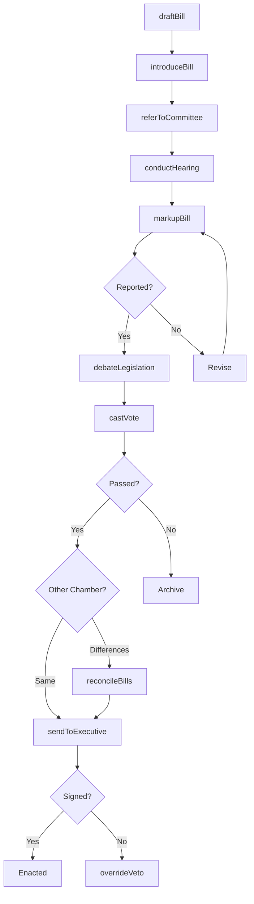
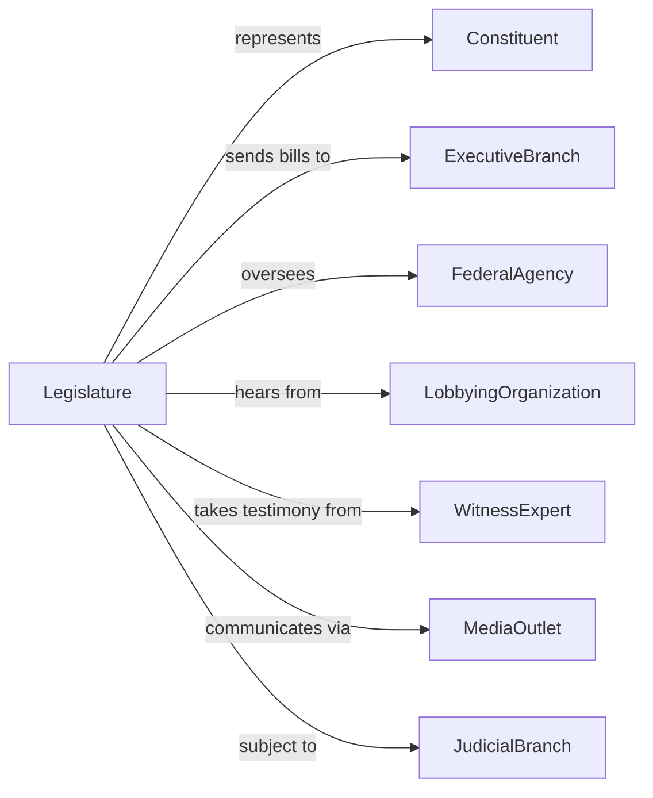

# Legislative Bodies

> Business-as-Code definition for legislative operations. Models the complete lawmaking process from bill introduction through enactment and oversight.

## Overview

Legislative bodies including Congress, state legislatures, and city councils serve as the primary lawmaking institutions of government. This definition exposes actions for bill drafting, committee proceedings, floor votes, and constituent services, events for workflow automation, and searches for legislative data retrieval.

## Actors

| Actor | Description |
|-------|-------------|
| Constituent | Voter represented by elected legislators |
| ExecutiveBranch | President, governor, or mayor proposing and signing legislation |
| LobbyingOrganization | Group advocating for or against legislation |
| WitnessExpert | Individual testifying before committees |
| MediaOutlet | News organization covering legislative activities |
| InterestGroup | Association representing industry or cause |
| FederalAgency | Executive agency subject to legislative oversight |
| JudicialBranch | Courts interpreting enacted legislation |

## Roles

| Role | Description |
|------|-------------|
| Legislator | Elected representative voting on legislation |
| CommitteeChair | Leader presiding over specialized committee |
| MajorityLeader | Official directing majority party strategy |
| MinorityLeader | Official directing minority party strategy |
| LegislativeCounsel | Attorney drafting bill language |
| ChiefOfStaff | Senior advisor managing member office operations |
| Parliamentarian | Expert advising on rules of procedure and legislative precedent |

## Entities

| Entity | Description |
|--------|-------------|
| Bill | Proposed legislation under consideration |
| Amendment | Proposed modification to pending legislation |
| Resolution | Non-binding statement of legislative intent |
| Committee | Specialized body reviewing legislation |
| Hearing | Formal proceeding gathering testimony |
| FloorVote | Recorded decision by full chamber |
| ConferenceReport | Reconciled version between chambers |
| Appropriation | Legislation allocating government funds |
| Subpoena | Legal demand for testimony or documents |
| ConstituentCase | Service request from district resident |
| CaucusMeeting | Party members gathering for strategy |

## Actions

| Action | Description |
|--------|-------------|
| draftBill | Create legislative text with counsel assistance |
| introduceBill | Submit legislation for consideration |
| referToCommittee | Assign bill to appropriate committee |
| conductHearing | Hold formal proceeding with witnesses |
| markupBill | Committee session to amend and vote on bill |
| reportBill | Send legislation to floor with recommendation |
| debateLegislation | Discuss bill merits on chamber floor |
| offerAmendment | Propose modification during floor consideration |
| castVote | Record position on legislation or amendment |
| reconcileBills | Resolve differences between chamber versions |
| overrideVeto | Vote to enact legislation despite executive rejection |
| issueSubpoena | Compel testimony or document production |
| conductOversight | Review agency implementation of laws |
| assistConstituent | Help district resident navigate government |

## Events

| Event | Description |
|-------|-------------|
| billIntroduced | Legislation submitted for consideration |
| billReferred | Legislation assigned to committee |
| hearingHeld | Formal witness testimony completed |
| billMarkedUp | Committee amendments and vote completed |
| billReported | Legislation sent to floor |
| amendmentOffered | Modification proposed during debate |
| voteCast | Chamber decision recorded |
| billPassed | Legislation approved by chamber |
| billReconciled | Differences between chambers resolved |
| vetoOverridden | Legislation enacted over executive objection |
| subpoenaIssued | Compulsory process served |
| constituentAssisted | Service request resolved |
| oversightCompleted | Agency review concluded |

## Searches

| Search | Description |
|--------|-------------|
| findBills | Search legislation by sponsor, subject, or status |
| getVoteRecords | Retrieve voting history by member or bill |
| listCommittees | Get committees with jurisdiction and membership |
| findHearings | Search hearings by topic, date, or witness |
| getConstituentCases | Retrieve service requests by status or type |
| listAmendments | Search proposed modifications by bill or sponsor |
| findAppropriations | Get funding legislation by agency or program |

## Workflow



## Actor Relationships



## Usage

### Calling Actions

```typescript
import { governLegislative } from '@headlessly/govern-legislative'

const legislature = governLegislative()

// Draft and introduce a bill
const bill = await legislature.draftBill({
  title: 'Clean Energy Innovation Act',
  sponsor: 'rep-smith-ca-12',
  cosponsors: ['rep-jones-ny-3', 'sen-brown-oh'],
  summary: 'Authorizes research funding for renewable energy technologies',
  sections: [
    { title: 'Findings', text: '...' },
    { title: 'Definitions', text: '...' },
    { title: 'Grant Programs', text: '...' },
    { title: 'Authorization of Appropriations', text: '...' }
  ]
})

await legislature.introduceBill({
  billId: bill.id,
  chamber: 'house',
  referral: ['Energy and Commerce', 'Science']
})

// Conduct oversight hearing
await legislature.conductHearing({
  committee: 'Oversight',
  subject: 'Implementation of Infrastructure Act',
  witnesses: [
    { name: 'Agency Director', role: 'executive' },
    { name: 'Inspector General', role: 'watchdog' },
    { name: 'Industry Expert', role: 'private' }
  ],
  date: '2024-04-15'
})
```

### Event-Driven Automation

```typescript
// Track bill progress
legislature.billIntroduced(async ({ billId, sponsor, committees }) => {
  await notifyStakeholders({
    bill: billId,
    action: 'introduced',
    committees
  })

  await scheduleAnalysis({
    bill: billId,
    deadline: addDays(new Date(), 14)
  })
})

// Monitor votes
legislature.voteCast(async ({ billId, result, chamber }) => {
  if (result === 'passed') {
    const bill = await legislature.findBills({ id: billId })

    if (bill.chambersPassed.length === 2) {
      await prepareEnrollment({ billId })
    } else {
      await sendToOtherChamber({ billId, from: chamber })
    }
  }
})
```
