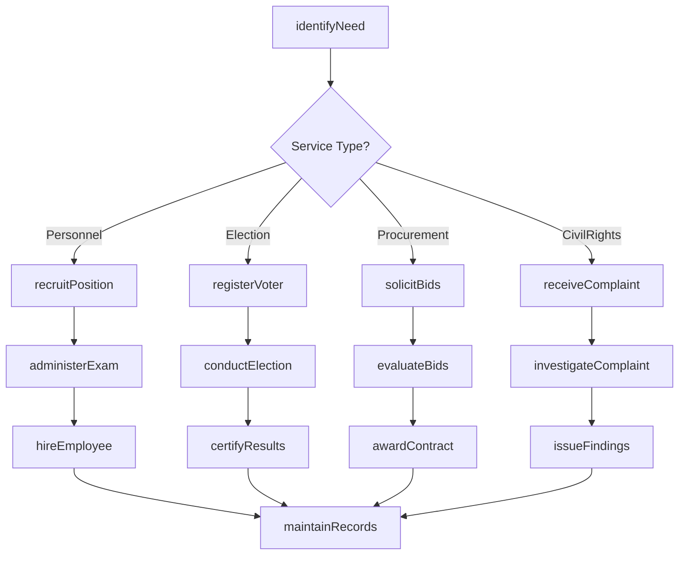
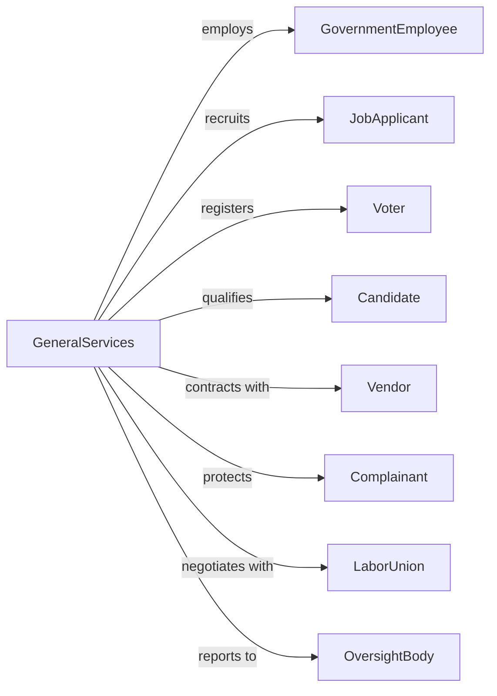

# Other General Government Support

> Business-as-Code definition for general government support services. Models personnel administration, elections, civil rights enforcement, and procurement operations.

## Overview

General government support encompasses essential administrative functions that enable government operations, including human resources, election administration, civil service management, and centralized procurement. This definition exposes actions for personnel management, election conduct, procurement processing, and civil rights protection, events for workflow automation, and searches for administrative data retrieval.

## Actors

| Actor | Description |
|-------|-------------|
| JobApplicant | Individual seeking government employment |
| GovernmentEmployee | Current public sector worker |
| Voter | Citizen eligible to participate in elections |
| Candidate | Individual running for elected office |
| Vendor | Business seeking government contracts |
| Complainant | Individual alleging rights violation |
| LaborUnion | Organization representing government workers |
| OversightBody | Entity monitoring government operations |

## Roles

| Role | Description |
|------|-------------|
| HRDirector | Administrator managing personnel functions |
| ElectionCommissioner | Official overseeing election administration |
| CivilServiceDirector | Administrator managing merit system |
| ProcurementOfficer | Official managing government purchasing |
| CivilRightsDirector | Administrator enforcing anti-discrimination laws |
| RecordsManager | Official maintaining government documents |

## Entities

| Entity | Description |
|--------|-------------|
| PositionClassification | Job category with duties and compensation |
| CivilServiceExam | Merit-based assessment for employment |
| ElectionBallot | Official voting document |
| ProcurementSolicitation | Request for vendor proposals |
| CivilRightsComplaint | Allegation of discrimination or violation |
| PersonnelRecord | Employee documentation and history |
| VoterRegistration | Record of eligible voter |
| Contract | Agreement for goods or services |
| CollectiveBargaining | Negotiation between management and labor |
| PublicRecord | Government document subject to disclosure |
| PerformanceEvaluation | Assessment of employee job performance |

## Actions

| Action | Description |
|--------|-------------|
| recruitPosition | Advertise and attract candidates for job opening |
| administerExam | Conduct civil service assessment |
| hireEmployee | Onboard new government worker |
| conductElection | Administer voting process |
| registerVoter | Add citizen to eligible voter rolls |
| certifyResults | Validate and announce election outcomes |
| solicitBids | Request vendor proposals for procurement |
| awardContract | Select vendor and execute agreement |
| investigateComplaint | Examine civil rights allegation |
| negotiateContract | Bargain with labor union |
| maintainRecords | Manage government documentation |
| processRequest | Handle public records inquiry |
| evaluatePerformance | Assess employee job effectiveness |
| manageSupply | Coordinate government inventory and distribution |

## Events

| Event | Description |
|-------|-------------|
| positionRecruited | Job opening advertised |
| examAdministered | Civil service test conducted |
| employeeHired | New worker onboarded |
| electionConducted | Voting process completed |
| voterRegistered | Citizen added to rolls |
| resultsCertified | Election outcomes validated |
| bidsSolicited | Vendor proposals requested |
| contractAwarded | Agreement executed with vendor |
| complaintInvestigated | Civil rights examination completed |
| contractNegotiated | Labor agreement reached |
| recordsMaintained | Documentation updated |
| requestProcessed | Public inquiry fulfilled |
| performanceEvaluated | Employee assessment completed |
| supplyManaged | Inventory distributed |

## Searches

| Search | Description |
|--------|-------------|
| findPositions | Search job openings by classification or agency |
| getEmployeeRecords | Retrieve personnel data by department or status |
| findVoterRegistrations | Search voter rolls by jurisdiction or status |
| listProcurements | Get solicitations by type, value, or status |
| findComplaints | Search civil rights cases by type or outcome |
| getContracts | Retrieve vendor agreements by agency or value |
| listPublicRecords | Search available government documents |

## Workflow



## Actor Relationships



## Usage

### Calling Actions

```typescript
import { governGovernment } from '@headlessly/govern-government'

const services = governGovernment()

// Search job openings by classification or agency
const findPositionsResult = await services.findPositions({ status: 'active' })

// Retrieve personnel data by department or status
const getEmployeeRecordsResult = await services.getEmployeeRecords({ status: 'active' })

// Recruit and hire for position
const posting = await services.recruitPosition({
  title: 'Senior IT Specialist',
  classification: 'IT-2210-13',
  agency: 'Department of Commerce',
  location: 'Washington, DC',
  salary: { min: 98496, max: 128043, scale: 'GS' },
  closingDate: '2024-04-30',
  requirements: ['5 years experience', 'Security clearance eligible']
})

// Conduct procurement
const solicitation = await services.solicitBids({
  type: 'requestForProposal',
  title: 'Cloud Infrastructure Services',
  naicsCode: '518210',
  estimatedValue: 5000000,
  contractType: 'indefiniteDelivery',
  setAside: 'smallBusiness',
  closingDate: '2024-05-15'
})

// Register voter
await services.registerVoter({
  applicant: {
    name: 'Maria Garcia',
    address: '123 Main St, Springfield, IL 62701',
    dateOfBirth: '1990-07-22',
    citizenship: 'verified'
  },
  precinct: 'springfield-12',
  party: 'noPreference'
})
```

### Event-Driven Automation

```typescript
// Process new hire
services.employeeHired(async ({ employeeId, position, agency, startDate }) => {
  await initializePayroll({
    employeeId,
    position,
    startDate
  })

  await assignBenefits({
    employeeId,
    enrollmentDeadline: addDays(startDate, 60)
  })

  await scheduleOrientation({
    employeeId,
    agency,
    date: startDate
  })
})

// Monitor election results
services.resultsCertified(async ({ electionId, races }) => {
  for (const race of races) {
    await publishResults({
      race: race.id,
      winner: race.winner,
      certified: true
    })

    if (race.type === 'federal') {
      await notifySecretary({
        race: race.id,
        winner: race.winner
      })
    }
  }
})
```
