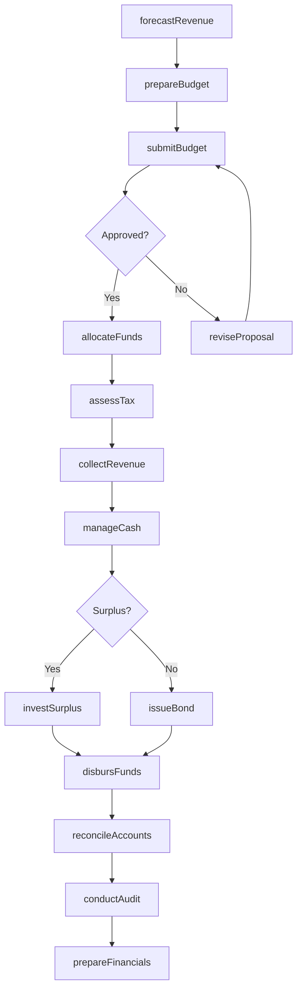
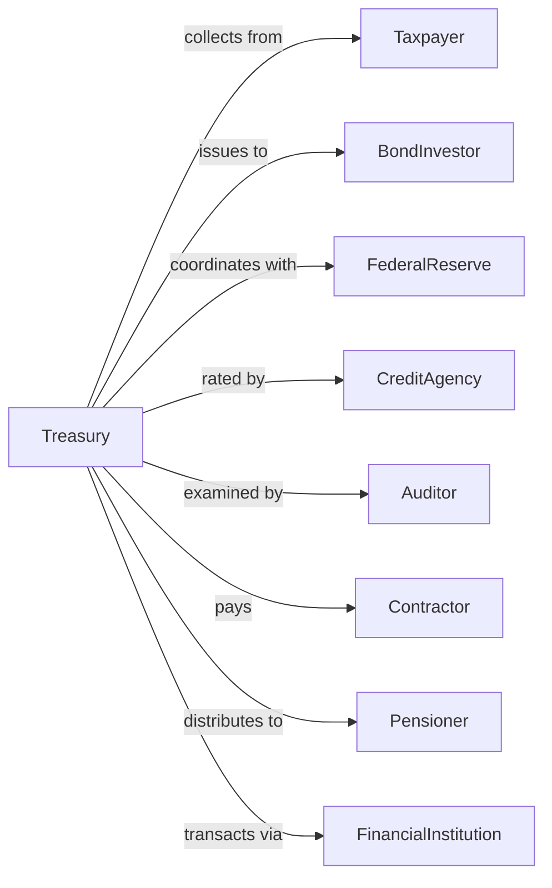

# Public Finance Activities

> Business-as-Code definition for government financial administration. Models the complete fiscal lifecycle from tax collection through debt management and audit.

## Overview

Public finance activities encompass government operations in taxation, monetary policy, debt management, and financial oversight. This definition exposes actions for revenue collection, fund disbursement, investment management, and audit functions, events for workflow automation, and searches for financial data retrieval.

## Actors

| Actor | Description |
|-------|-------------|
| Taxpayer | Individual or entity paying taxes to government |
| BondInvestor | Purchaser of government debt instruments |
| FederalReserve | Central bank coordinating monetary policy |
| CreditAgency | Organization rating government creditworthiness |
| Auditor | External examiner of government financial statements |
| Contractor | Vendor receiving government payments |
| Pensioner | Retiree receiving government retirement benefits |
| FinancialInstitution | Bank processing government transactions |

## Roles

| Role | Description |
|------|-------------|
| Treasurer | Official managing government cash and investments |
| TaxCommissioner | Administrator overseeing revenue collection |
| BudgetDirector | Official developing and monitoring spending plans |
| Comptroller | Financial officer maintaining accounts and controls |
| DebtManager | Specialist managing bond issuance and repayment |
| AuditDirector | Official overseeing internal and external audits |

## Entities

| Entity | Description |
|--------|-------------|
| TaxReturn | Filing reporting taxpayer income and liability |
| TaxAssessment | Determination of taxes owed |
| Budget | Annual plan for revenues and expenditures |
| Appropriation | Legislative authorization to spend funds |
| Bond | Debt instrument issued by government |
| Fund | Segregated pool of financial resources |
| Warrant | Authorization for payment from treasury |
| Audit | Examination of financial records and controls |
| PensionFund | Trust holding retirement assets |
| Grant | Financial award to recipient entity |
| TaxLien | Legal claim against property for unpaid taxes |

## Actions

| Action | Description |
|--------|-------------|
| assessTax | Determine tax liability for taxpayer |
| collectRevenue | Receive tax payments and deposits |
| issueBond | Sell debt instruments to investors |
| disbursFunds | Release payments to recipients |
| manageCash | Optimize government cash position and investments |
| conductAudit | Examine financial records for compliance |
| reconcileAccounts | Verify accuracy of financial records |
| forecastRevenue | Project future tax collections |
| prepareFinancials | Compile government financial statements |
| administerPension | Manage retirement fund investments and payments |
| processRefund | Return overpayments to taxpayers |
| enforcCompliance | Pursue collection of delinquent taxes |
| investSurplus | Place excess funds in approved instruments |
| rateDebt | Evaluate creditworthiness of bond issuance |

## Events

| Event | Description |
|-------|-------------|
| taxAssessed | Tax liability determined for taxpayer |
| revenueCollected | Payment received and deposited |
| bondIssued | Debt instruments sold to investors |
| fundsDisbursed | Payments released to recipients |
| auditCompleted | Financial examination concluded |
| accountsReconciled | Financial records verified |
| revenueForecast | Future collections projected |
| financialsPrepared | Statements compiled and published |
| pensionPaid | Retirement benefits distributed |
| refundProcessed | Overpayment returned to taxpayer |
| complianceEnforced | Collection action initiated |
| surplusInvested | Excess funds placed in instruments |
| debtRated | Credit rating issued or updated |

## Searches

| Search | Description |
|--------|-------------|
| findTaxReturns | Search filings by taxpayer, period, or status |
| getBondIssuances | Retrieve debt offerings by date, type, or rate |
| listAppropriations | Get authorized spending by agency or program |
| findAudits | Search examinations by entity, type, or finding |
| getRevenueTrends | Retrieve collection data by source and period |
| listPensionPayments | Get retirement distributions by recipient or date |
| findDelinquencies | Search overdue accounts by amount or duration |

## Workflow



## Actor Relationships



## Usage

### Calling Actions

```typescript
import { governFinance } from '@headlessly/govern-finance'

const finance = governFinance()

// Search filings by taxpayer, period, or status
const findTaxReturnsResult = await finance.findTaxReturns({ status: 'active' })

// Retrieve debt offerings by date, type, or rate
const getBondIssuancesResult = await finance.getBondIssuances({ status: 'active' })

// Assess and collect taxes
const assessment = await finance.assessTax({
  taxpayerId: 'corp-123456',
  taxYear: 2023,
  taxType: 'corporateIncome',
  filingBasis: 'calendar',
  grossReceipts: 50000000,
  deductions: 35000000
})

await finance.collectRevenue({
  assessmentId: assessment.id,
  amount: assessment.liability,
  paymentMethod: 'ach',
  accountNumber: '****1234'
})

// Issue municipal bonds
const bondOffering = await finance.issueBond({
  type: 'generalObligation',
  purpose: 'schoolConstruction',
  principal: 100000000,
  term: 20,
  interestRate: 4.25,
  taxExempt: true,
  underwriter: 'Morgan Stanley'
})

// Conduct financial audit
await finance.conductAudit({
  auditType: 'singleAudit',
  fiscalYear: 2023,
  scope: ['financialStatements', 'federalCompliance'],
  auditor: 'KPMG'
})
```

### Event-Driven Automation

```typescript
// Auto-process refunds
finance.taxAssessed(async ({ taxpayerId, liability, payments }) => {
  const totalPaid = payments.reduce((sum, p) => sum + p.amount, 0)

  if (totalPaid > liability) {
    await finance.processRefund({
      taxpayerId,
      amount: totalPaid - liability,
      method: 'directDeposit'
    })
  }
})

// Monitor cash position
finance.fundsDisbursed(async ({ amount, fundId }) => {
  const balance = await finance.getFundBalance(fundId)

  if (balance < threshold) {
    await finance.manageCash({
      action: 'liquidate',
      source: 'shortTermInvestments',
      amount: replenishAmount
    })
  }
})
```
