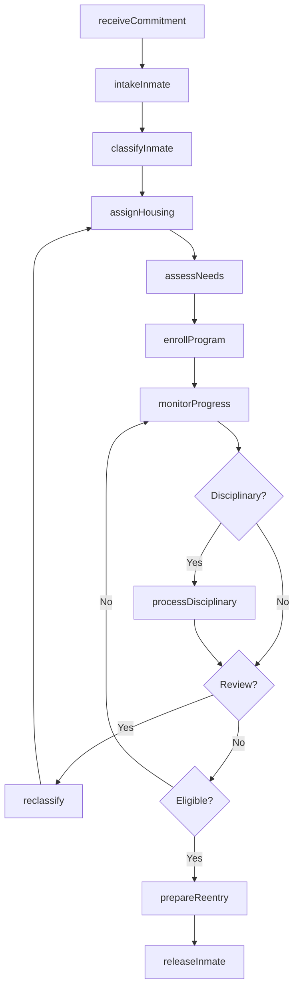
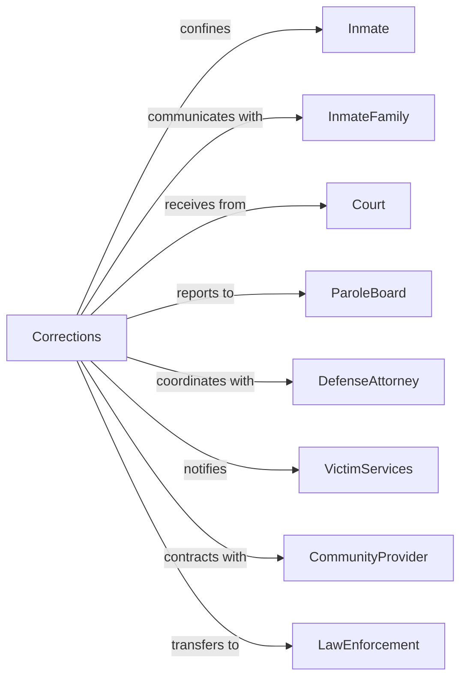

# Correctional Institutions

> Business-as-Code definition for correctional facility operations. Models inmate custody from intake through rehabilitation and release.

## Overview

Correctional institutions manage facilities for the confinement, correction, and rehabilitation of adult and juvenile offenders sentenced by courts. This definition exposes actions for inmate intake, custody classification, programming, and release preparation, events for workflow automation, and searches for correctional data retrieval.

## Actors

| Actor | Description |
|-------|-------------|
| Inmate | Individual in custody serving sentence |
| InmateFamily | Relatives of incarcerated individual |
| Court | Judicial body committing individuals to custody |
| ParoleBoard | Authority determining early release eligibility |
| DefenseAttorney | Legal counsel representing inmate |
| VictimServices | Organization supporting crime victims |
| CommunityProvider | External agency delivering inmate services |
| LawEnforcement | Agency transporting or coordinating on inmates |

## Roles

| Role | Description |
|------|-------------|
| Warden | Executive managing correctional facility |
| CorrectionalOfficer | Staff maintaining custody and security |
| CaseManager | Specialist coordinating inmate programming |
| Counselor | Professional providing mental health services |
| ClassificationOfficer | Staff determining custody level |
| MedicalProvider | Healthcare professional serving inmates |
| ShakedownOfficer | Conducts cell searches and contraband sweeps within the facility |

## Entities

| Entity | Description |
|--------|-------------|
| InmateRecord | Complete documentation of incarcerated individual |
| CustodyLevel | Security classification for inmate |
| HousingAssignment | Cell or unit placement |
| ProgramEnrollment | Participation in rehabilitation activity |
| DisciplinaryReport | Documentation of rule violation |
| VisitationSchedule | Approved family contact times |
| SentenceComputation | Calculation of release eligibility |
| GoodTimeCredit | Reduction in sentence for behavior |
| MedicalRecord | Healthcare documentation for inmate |
| ReentryPlan | Preparation for return to community |
| GrievanceRecord | Inmate complaint and resolution |

## Actions

| Action | Description |
|--------|-------------|
| intakeInmate | Process newly committed individual |
| classifyInmate | Determine appropriate custody level |
| assignHousing | Place inmate in cell or unit |
| enrollProgram | Register inmate for rehabilitation activity |
| conductCount | Verify presence of all inmates |
| processDisciplinary | Adjudicate rule violation |
| awardGoodTime | Credit sentence reduction for behavior |
| scheduleVisit | Arrange approved family contact |
| provideHealthcare | Deliver medical services to inmate |
| prepareReentry | Develop release transition plan |
| transferInmate | Move inmate between facilities |
| releaseInmate | Discharge individual from custody |
| conductSearch | Inspect for contraband |
| respondToIncident | Manage security event |

## Events

| Event | Description |
|-------|-------------|
| inmateIntaked | New commitment processed |
| inmateClassified | Custody level determined |
| housingAssigned | Cell placement completed |
| programEnrolled | Rehabilitation activity started |
| countConducted | Population verified |
| disciplinaryProcessed | Rule violation adjudicated |
| goodTimeAwarded | Sentence credit applied |
| visitScheduled | Family contact arranged |
| healthcareProvided | Medical service delivered |
| reentryPrepared | Release plan completed |
| inmateTransferred | Facility move completed |
| inmateReleased | Individual discharged |
| searchConducted | Contraband inspection completed |
| incidentResponded | Security event managed |
| releaseBecameEligible | Inmate reached eligibility date for release |

## Searches

| Search | Description |
|--------|-------------|
| findInmates | Search population by name, ID, or status |
| getCustodyLevels | Retrieve classifications by facility or level |
| listPrograms | Get rehabilitation activities by type or availability |
| findDisciplinary | Search violations by type or outcome |
| getVisitations | Retrieve scheduled contacts by inmate or date |
| listReleases | Get upcoming discharges by date or type |
| findGrievances | Search complaints by status or issue |

## Workflow



## Actor Relationships



## Usage

### Calling Actions

```typescript
import { enforceCorrections } from '@headlessly/enforce-corrections'

const corrections = enforceCorrections()

// Search population by name, ID, or status
const findInmatesResult = await corrections.findInmates({ status: 'active' })

// Retrieve classifications by facility or level
const getCustodyLevelsResult = await corrections.getCustodyLevels({ status: 'active' })

// Intake new inmate
const inmate = await corrections.intakeInmate({
  commitment: {
    court: 'superior-court-1',
    caseNumber: 'CR-2024-1234',
    sentence: { years: 5, months: 0 }
  },
  individual: {
    name: 'James Wilson',
    dob: '1985-06-15',
    identifiers: ['fingerprints', 'photo', 'dna']
  },
  initialAssessment: {
    medicalScreen: 'completed',
    mentalHealthScreen: 'completed',
    suicideRisk: 'low'
  }
})

// Classify and assign housing
const classification = await corrections.classifyInmate({
  inmateId: inmate.id,
  factors: {
    offenseType: 'violent',
    sentenceLength: 60,
    priorIncarcerations: 1,
    gangAffiliation: false
  }
})

await corrections.assignHousing({
  inmateId: inmate.id,
  custodyLevel: classification.level,
  unit: 'B-Block',
  cell: 'B-214'
})
```

### Event-Driven Automation

```typescript
// Process new commitments
corrections.inmateIntaked(async ({ inmateId, sentence, needsAssessment }) => {
  await corrections.classifyInmate({
    inmateId,
    initialClassification: true
  })

  if (needsAssessment.substanceAbuse) {
    await corrections.enrollProgram({
      inmateId,
      program: 'substanceAbuseTreatment',
      priority: 'high'
    })
  }
})

// Prepare for release
corrections.releaseBecameEligible(async ({ inmateId, releaseDate }) => {
  const plan = await corrections.prepareReentry({
    inmateId,
    releaseDate,
    components: [
      'housingAssistance',
      'employmentServices',
      'supervisionTransfer'
    ]
  })

  await notifyParole({
    inmateId,
    releaseDate,
    reentryPlan: plan.id
  })

  await notifyVictim({
    inmateId,
    releaseDate,
    notificationType: 'pending'
  })
})
```
