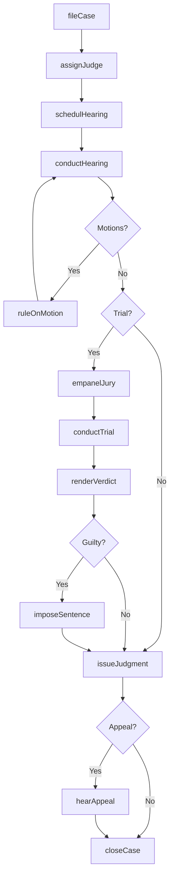
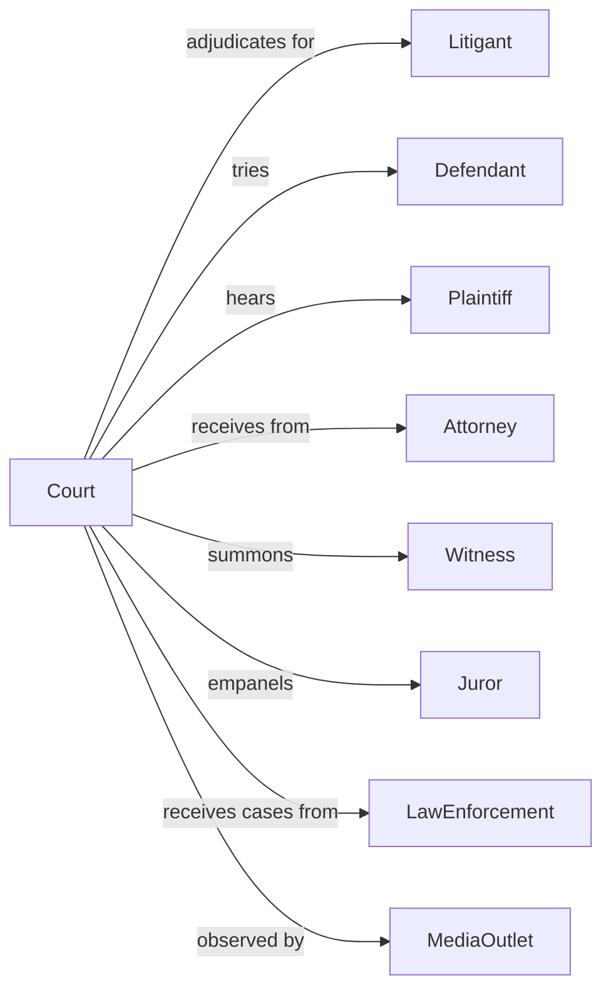

# Courts

> Business-as-Code definition for judicial court operations. Models case adjudication from filing through judgment and appeal.

## Overview

Courts comprise civilian courts of law providing judicial services including case adjudication, legal interpretation, and dispute resolution. This definition exposes actions for case management, trial proceedings, judgment issuance, and appellate review, events for workflow automation, and searches for court records retrieval.

## Actors

| Actor | Description |
|-------|-------------|
| Litigant | Party to a civil or criminal case |
| Defendant | Individual or entity accused in legal proceedings |
| Plaintiff | Party initiating civil legal action |
| Attorney | Legal counsel representing parties |
| Witness | Individual providing testimony in proceedings |
| Juror | Citizen serving on jury panel |
| LawEnforcement | Police presenting criminal cases |
| MediaOutlet | News organization covering court proceedings |

## Roles

| Role | Description |
|------|-------------|
| Judge | Judicial officer presiding over proceedings |
| Magistrate | Official handling preliminary matters |
| CourtClerk | Administrator managing case records |
| CourtReporter | Professional transcribing proceedings |
| Bailiff | Officer maintaining courtroom security |
| CourtAdministrator | Manager overseeing court operations |

## Entities

| Entity | Description |
|--------|-------------|
| Case | Legal matter before the court |
| Complaint | Document initiating civil action |
| Indictment | Formal criminal charge by grand jury |
| Motion | Request for court ruling on procedural matter |
| Order | Directive issued by the court |
| Judgment | Final court decision on case |
| Verdict | Jury determination of facts |
| Sentence | Penalty imposed in criminal case |
| Appeal | Request for higher court review |
| Subpoena | Court order compelling attendance or documents |
| Docket | Schedule of court proceedings |
| Transcript | Official record of proceedings |

## Actions

| Action | Description |
|--------|-------------|
| fileCase | Initiate legal proceeding with court |
| assignJudge | Designate judicial officer to case |
| schedulHearing | Set date for court proceeding |
| conductHearing | Preside over legal proceeding |
| ruleOnMotion | Decide procedural request |
| empanelJury | Select citizens for jury service |
| conductTrial | Oversee full evidentiary proceeding |
| renderVerdict | Announce jury determination |
| issueJudgment | Enter final court decision |
| imposeSentence | Determine penalty in criminal case |
| hearAppeal | Review lower court decision |
| enforceOrder | Compel compliance with court directive |
| sealRecords | Restrict access to case documents |
| dismissCase | Terminate proceeding before judgment |

## Events

| Event | Description |
|-------|-------------|
| caseFiled | Legal proceeding initiated |
| judgeAssigned | Judicial officer designated |
| hearingScheduled | Court date set |
| hearingConducted | Proceeding completed |
| motionRuled | Procedural request decided |
| juryEmpaneled | Panel selected for trial |
| trialConducted | Evidentiary proceeding completed |
| verdictRendered | Jury determination announced |
| judgmentIssued | Final decision entered |
| sentenceImposed | Criminal penalty determined |
| appealHeard | Higher court review completed |
| orderEnforced | Compliance compelled |
| recordsSealed | Access restricted |
| caseDismissed | Proceeding terminated |

## Searches

| Search | Description |
|--------|-------------|
| findCases | Search proceedings by party, type, or status |
| getDocket | Retrieve court schedule by date or judge |
| getJudgments | Search decisions by case, judge, or date |
| findOrders | Retrieve court directives by type or party |
| listAppeals | Get appellate matters by court or status |
| getTranscripts | Retrieve hearing records by case or date |
| findJurors | Search jury pool by demographics or service |

## Workflow



## Actor Relationships



## Usage

### Calling Actions

```typescript
import { adjudicateCases } from '@headlessly/adjudicate-cases'

const court = adjudicateCases()

// File a civil case
const civilCase = await court.fileCase({
  type: 'civil',
  caseType: 'contractDispute',
  plaintiff: {
    name: 'ABC Corporation',
    attorney: 'smith-law-firm'
  },
  defendant: {
    name: 'XYZ Industries',
    address: '456 Commerce St'
  },
  complaint: {
    claims: ['breachOfContract', 'damages'],
    amountSought: 500000,
    filingFee: 400
  }
})

// Schedule and conduct hearing
await court.schedulHearing({
  caseId: civilCase.id,
  hearingType: 'motionHearing',
  requestedDate: '2024-04-15',
  duration: 60,
  courtroom: 'A-201'
})

// Empanel jury for trial
await court.empanelJury({
  caseId: civilCase.id,
  jurySize: 12,
  alternates: 2,
  voirDireDate: '2024-06-01'
})
```

### Event-Driven Automation

```typescript
// Process case filing
court.caseFiled(async ({ caseId, caseType, priority }) => {
  await court.assignJudge({
    caseId,
    method: 'random',
    division: caseType
  })

  if (priority === 'expedited') {
    await court.schedulHearing({
      caseId,
      hearingType: 'initialConference',
      requestedDate: addDays(new Date(), 14)
    })
  }
})

// Handle judgment issuance
court.judgmentIssued(async ({ caseId, judgment, amount }) => {
  await notifyParties({
    caseId,
    notification: 'judgmentEntered',
    appealDeadline: addDays(new Date(), 30)
  })

  if (amount > 0) {
    await initiateCollection({
      caseId,
      amount,
      debtor: judgment.againstParty
    })
  }
})
```
