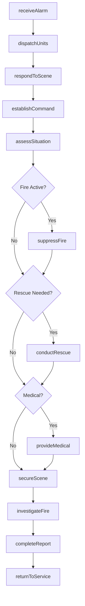
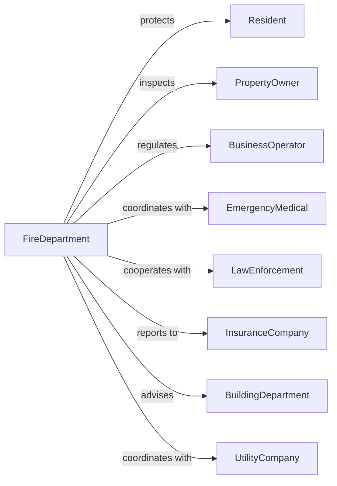

# Fire Protection

> Business-as-Code definition for fire department operations. Models emergency response from dispatch through incident mitigation and prevention.

## Overview

Fire protection encompasses government firefighting operations including fire suppression, rescue services, emergency medical response, and fire prevention activities. This definition exposes actions for emergency dispatch, incident command, fire investigation, and community education, events for workflow automation, and searches for fire service data retrieval.

## Actors

| Actor | Description |
|-------|-------------|
| Resident | Individual receiving fire protection services |
| PropertyOwner | Person responsible for building compliance |
| BusinessOperator | Commercial enterprise subject to inspection |
| EmergencyMedical | EMS agencies coordinating response |
| LawEnforcement | Police coordinating on incident scenes |
| InsuranceCompany | Carrier assessing fire loss claims |
| BuildingDepartment | Agency enforcing construction codes |
| UtilityCompany | Provider managing gas or electric emergencies |

## Roles

| Role | Description |
|------|-------------|
| FireChief | Executive leading fire department |
| Firefighter | Personnel responding to emergencies |
| FireCaptain | Officer commanding fire company |
| Paramedic | Medical professional providing advanced care |
| FireInspector | Official conducting code compliance reviews |
| FireInvestigator | Specialist determining fire origin and cause |
| HazmatTechnician | Responds to hazardous materials spills and chemical incidents |

## Entities

| Entity | Description |
|--------|-------------|
| IncidentReport | Documentation of emergency response |
| FireApparatus | Vehicle and equipment for firefighting |
| StationAssignment | Personnel placement at fire station |
| InspectionRecord | Documentation of code compliance review |
| HydrantLocation | Fire water supply access point |
| PrePlan | Building information for emergency response |
| TrainingRecord | Documentation of firefighter certification |
| HazMatInventory | Listing of dangerous materials in area |
| MutualAidAgreement | Compact with neighboring departments |
| ArsonCase | Investigation of intentionally set fire |
| ResponseTime | Measurement from dispatch to arrival |

## Actions

| Action | Description |
|--------|-------------|
| dispatchUnits | Send apparatus to emergency scene |
| establishCommand | Set up incident command structure |
| suppressFire | Extinguish active fire |
| conductRescue | Extract victims from hazardous situation |
| provideMedical | Deliver emergency medical care |
| investigateFire | Determine origin and cause of fire |
| conductInspection | Review building for code compliance |
| issueViolation | Document fire code deficiency |
| educateCommunity | Deliver fire prevention programs |
| maintainEquipment | Service apparatus and gear |
| trainPersonnel | Conduct firefighter skill development |
| coordinateMutualAid | Request or provide regional assistance |
| prePlanBuilding | Document structure for emergency response |
| mitigateHazmat | Respond to hazardous material incident |

## Events

| Event | Description |
|-------|-------------|
| unitsDispatched | Apparatus sent to scene |
| commandEstablished | Incident command activated |
| fireSuppressed | Active fire extinguished |
| rescueConducted | Victim extraction completed |
| medicalProvided | Emergency care delivered |
| fireInvestigated | Origin and cause determined |
| inspectionConducted | Code review completed |
| violationIssued | Deficiency documented |
| communityEducated | Prevention program delivered |
| equipmentMaintained | Apparatus serviced |
| personnelTrained | Skill development completed |
| mutualAidCoordinated | Regional assistance provided |
| buildingPrePlanned | Structure documented |
| hazmatMitigated | Chemical incident resolved |
| alarmReceived | Emergency alarm or 911 call received |

## Searches

| Search | Description |
|--------|-------------|
| findIncidents | Search responses by type, location, or date |
| getApparatus | Retrieve vehicles by station or status |
| listInspections | Get compliance reviews by address or result |
| findViolations | Search deficiencies by type or status |
| getResponseTimes | Retrieve performance data by area or period |
| listHydrants | Get water supply points by location or status |
| findArsonCases | Search fire investigations by status or outcome |

## Workflow



## Actor Relationships



## Usage

### Calling Actions

```typescript
import { protectCommunities } from '@headlessly/protect-communities'

const fire = protectCommunities()

// Dispatch units to emergency
const incident = await fire.dispatchUnits({
  alarmType: 'structureFire',
  location: '456 Oak Street',
  reportedConditions: 'smokeVisible',
  assignment: ['engine-1', 'engine-2', 'ladder-1', 'rescue-1'],
  priority: 1
})

// Establish incident command
await fire.establishCommand({
  incidentId: incident.id,
  incidentCommander: 'captain-johnson',
  commandPost: 'intersection',
  sectors: [
    { name: 'fire', officer: 'lt-smith' },
    { name: 'rescue', officer: 'lt-williams' },
    { name: 'medical', officer: 'paramedic-davis' }
  ]
})

// Conduct fire inspection
const inspection = await fire.conductInspection({
  propertyType: 'commercial',
  address: '789 Commerce Blvd',
  inspectionType: 'annual',
  areas: ['exits', 'sprinklers', 'extinguishers', 'alarms', 'storage']
})

if (inspection.violations.length > 0) {
  await fire.issueViolation({
    inspectionId: inspection.id,
    violations: inspection.violations,
    correctionDeadline: addDays(new Date(), 30)
  })
}
```

### Event-Driven Automation

```typescript
// Process new alarm
fire.alarmReceived(async ({ alarmType, location, severity }) => {
  const assignment = calculateAssignment(alarmType, severity)

  await fire.dispatchUnits({
    alarmType,
    location,
    assignment
  })

  if (severity === 'high') {
    await fire.coordinateMutualAid({
      location,
      requestedResources: ['additionalEngine', 'rescueSpecialist']
    })
  }
})

// Handle fire suppression completion
fire.fireSuppressed(async ({ incidentId, location, severity }) => {
  await fire.investigateFire({
    incidentId,
    investigationType: severity === 'high' ? 'full' : 'standard'
  })

  await notifyBuildingDepartment({
    location,
    incidentId,
    structuralAssessmentNeeded: severity !== 'minor'
  })

  await updateResponseStats({
    incidentId,
    outcome: 'suppressed'
  })
})
```
