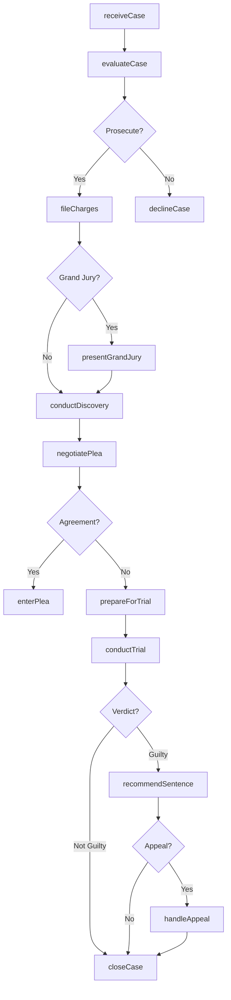
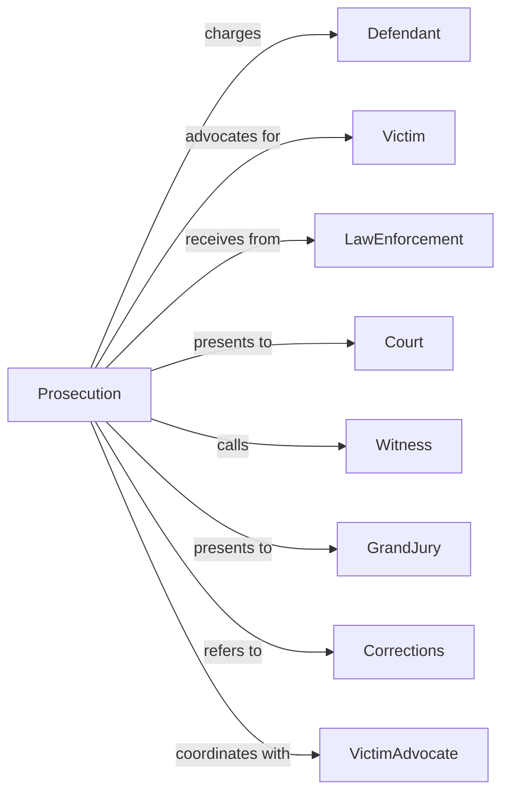

# Legal Counsel and Prosecution

> Business-as-Code definition for government legal services. Models criminal prosecution and public defense from case intake through trial and appeal.

## Overview

Legal counsel and prosecution encompasses government legal offices providing criminal prosecution and defense services, including district attorneys, public defenders, and attorney general offices. This definition exposes actions for case evaluation, charging decisions, plea negotiations, and trial advocacy, events for workflow automation, and searches for legal case data retrieval.

## Actors

| Actor | Description |
|-------|-------------|
| Defendant | Individual charged with criminal offense |
| Victim | Person harmed by criminal conduct |
| LawEnforcement | Police presenting cases for prosecution |
| Court | Judicial body adjudicating criminal cases |
| Witness | Individual with knowledge relevant to case |
| GrandJury | Panel determining whether to indict |
| Corrections | Agency executing criminal sentences |
| VictimAdvocate | Specialist supporting crime victims |

## Roles

| Role | Description |
|------|-------------|
| DistrictAttorney | Chief prosecutor for jurisdiction |
| AssistantDA | Attorney handling criminal prosecutions |
| PublicDefender | Attorney representing indigent defendants |
| LegalInvestigator | Specialist supporting case preparation |
| VictimWitnessCoordinator | Staff assisting victims and witnesses |
| ParalegalSpecialist | Professional supporting attorney casework |

## Entities

| Entity | Description |
|--------|-------------|
| CriminalCase | Prosecution matter from charge to disposition |
| ChargeDocument | Formal accusation against defendant |
| PleaAgreement | Negotiated resolution of criminal case |
| TrialBrief | Legal arguments prepared for trial |
| AppealBrief | Arguments for appellate review |
| DiscoveryPackage | Evidence shared between parties |
| VictimImpact | Statement of harm for sentencing |
| GrandJuryPresentation | Evidence submitted for indictment |
| SentenceRecommendation | Proposed penalty for convicted defendant |
| CaseEvaluation | Assessment of prosecution viability |
| MotionPractice | Written arguments on legal issues |

## Actions

| Action | Description |
|--------|-------------|
| evaluateCase | Assess evidence and charging options |
| fileCharges | Formally accuse defendant of offense |
| presentGrandJury | Seek indictment from grand jury |
| conductDiscovery | Exchange evidence with opposing counsel |
| negotiatePlea | Discuss resolution short of trial |
| prepareForTrial | Ready case for courtroom presentation |
| examineWitness | Question witness during proceedings |
| deliverArgument | Present opening or closing statement |
| recommendSentence | Propose penalty for convicted defendant |
| handleAppeal | Brief and argue appellate issues |
| representDefendant | Advocate for accused individual |
| assistVictim | Support crime victim through process |
| reviewConviction | Examine potential wrongful conviction |
| advisGovernment | Provide legal counsel to agency |

## Events

| Event | Description |
|-------|-------------|
| caseEvaluated | Prosecution viability assessed |
| chargesFiled | Formal accusation documented |
| indictmentReturned | Grand jury approved charges |
| discoveryCompleted | Evidence exchange finished |
| pleaNegotiated | Settlement terms agreed |
| trialPrepared | Case ready for presentation |
| witnessExamined | Testimony elicited in court |
| argumentDelivered | Statement presented to jury |
| sentenceRecommended | Penalty proposal submitted |
| appealHandled | Appellate matter concluded |
| defendantRepresented | Advocacy completed |
| victimAssisted | Support services provided |
| convictionReviewed | Wrongful conviction examined |
| governmentAdvised | Legal guidance provided |
| verdictReturned | Jury or judge rendered a verdict |

## Searches

| Search | Description |
|--------|-------------|
| findCases | Search prosecutions by defendant, charge, or status |
| getCharges | Retrieve accusations by offense type or severity |
| listPleaAgreements | Get negotiated dispositions by terms or date |
| findTrials | Search jury trials by outcome or judge |
| getAppeals | Retrieve appellate matters by issue or court |
| listVictims | Get crime victims by case or service needs |
| findConvictions | Search guilty verdicts by offense or sentence |

## Workflow



## Actor Relationships



## Usage

### Calling Actions

```typescript
import { enforceLegal } from '@headlessly/enforce-legal'

const prosecution = enforceLegal()

// Search prosecutions by defendant, charge, or status
const findCasesResult = await prosecution.findCases({ status: 'active' })

// Retrieve accusations by offense type or severity
const getChargesResult = await prosecution.getCharges({ status: 'active' })

// Evaluate and file case
const evaluation = await prosecution.evaluateCase({
  arrestId: 'arr-2024-5678',
  defendant: 'John Smith',
  allegations: ['robbery', 'assault'],
  evidence: {
    physical: ['weapon', 'surveillance'],
    witnesses: 3,
    confession: false
  }
})

if (evaluation.recommendation === 'prosecute') {
  await prosecution.fileCharges({
    defendant: 'John Smith',
    charges: [
      { offense: 'robbery', degree: 'first', enhancer: 'weaponUse' },
      { offense: 'assault', degree: 'second' }
    ],
    bail: { requested: 250000, arguments: 'flightRisk' }
  })
}

// Negotiate plea agreement
const plea = await prosecution.negotiatePlea({
  caseId: evaluation.caseId,
  offer: {
    reducedCharge: 'robberySecond',
    dismissedCharges: ['assault'],
    sentenceRecommendation: { min: 3, max: 7, type: 'years' }
  },
  deadline: '2024-05-01'
})
```

### Event-Driven Automation

```typescript
// Process new case referral
prosecution.caseEvaluated(async ({ caseId, recommendation, priority }) => {
  if (recommendation === 'prosecute' && priority === 'high') {
    await prosecution.fileCharges({
      caseId,
      expedited: true
    })

    await notifyVictim({
      caseId,
      status: 'chargesFiled'
    })
  }
})

// Handle guilty verdict
prosecution.verdictReturned(async ({ caseId, verdict, defendant }) => {
  if (verdict === 'guilty') {
    await prosecution.recommendSentence({
      caseId,
      factors: await gatherSentencingFactors(caseId)
    })

    await assistVictim({
      caseId,
      service: 'impactStatement',
      deadline: sentencingDate
    })
  }
})
```
