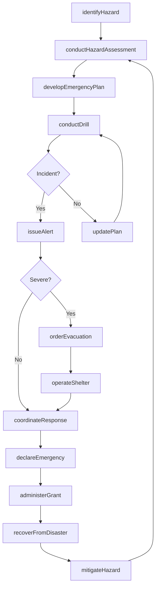
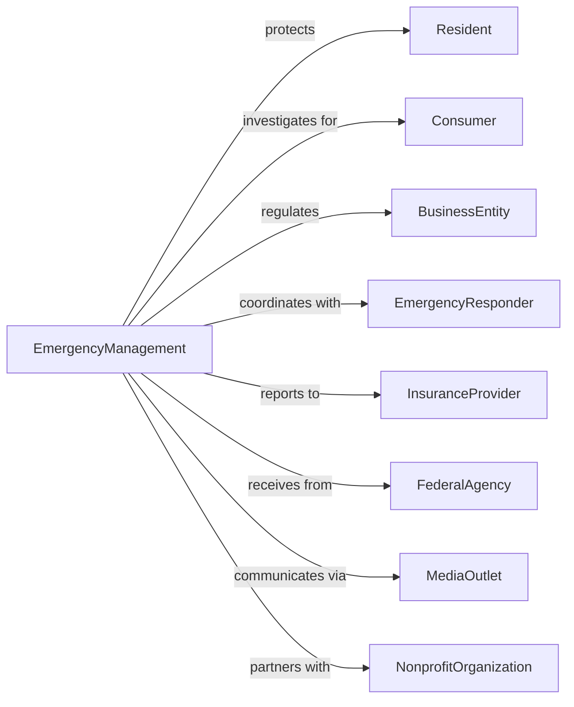

# Other Justice, Public Order, and Safety Activities

> Business-as-Code definition for public safety administration. Models emergency management, consumer protection, and safety statistics collection.

## Overview

Other justice, public order, and safety activities encompass government operations supporting public safety including emergency management, consumer protection, building safety inspection, and safety statistics collection. This definition exposes actions for emergency preparedness, hazard mitigation, consumer complaint investigation, and safety data analysis, events for workflow automation, and searches for public safety data retrieval.

## Actors

| Actor | Description |
|-------|-------------|
| Resident | Individual protected by safety programs |
| Consumer | Person filing product or service complaints |
| BusinessEntity | Commercial operation subject to safety regulation |
| EmergencyResponder | Agency coordinating disaster response |
| InsuranceProvider | Carrier requiring safety compliance |
| FederalAgency | National entity providing emergency support |
| MediaOutlet | News organization communicating safety information |
| NonprofitOrganization | Charitable entity supporting disaster recovery |

## Roles

| Role | Description |
|------|-------------|
| EmergencyManager | Director coordinating disaster preparedness |
| ConsumerProtectionOfficer | Investigator handling complaints |
| SafetyInspector | Official conducting hazard assessments |
| StatisticsAnalyst | Specialist compiling safety data |
| PublicInformationOfficer | Communicator managing safety messaging |
| GrantAdministrator | Manager overseeing federal safety funding |

## Entities

| Entity | Description |
|--------|-------------|
| EmergencyPlan | Strategy for disaster response and recovery |
| HazardAssessment | Evaluation of community risks |
| ConsumerComplaint | Allegation of unfair business practice |
| SafetyStatistic | Aggregated public safety data |
| MitigationProject | Initiative to reduce hazard impact |
| EmergencyAlert | Public notification of imminent threat |
| EvacuationOrder | Directive for residents to leave area |
| DisasterDeclaration | Official recognition of emergency event |
| RecoveryGrant | Federal funding for disaster restoration |
| MutualAidCompact | Agreement for regional emergency support |
| ShelterOperation | Facility providing emergency housing |

## Actions

| Action | Description |
|--------|-------------|
| developEmergencyPlan | Create disaster response strategy |
| conductHazardAssessment | Evaluate community risk factors |
| investigateComplaint | Examine consumer allegation |
| compileStatistics | Aggregate public safety data |
| issueAlert | Disseminate public safety notification |
| orderEvacuation | Direct residents to leave danger area |
| declareEmergency | Formally recognize disaster event |
| coordinateResponse | Manage multi-agency disaster operations |
| administerGrant | Process federal recovery funding |
| operateShelter | Manage emergency housing facility |
| conductDrill | Execute emergency preparedness exercise |
| mitigateHazard | Implement risk reduction project |
| inspectSafety | Assess building or facility hazards |
| recoverFromDisaster | Manage community restoration efforts |

## Events

| Event | Description |
|-------|-------------|
| emergencyPlanDeveloped | Disaster strategy completed |
| hazardAssessed | Community risks evaluated |
| complaintInvestigated | Consumer allegation examined |
| statisticsCompiled | Safety data aggregated |
| alertIssued | Public notification disseminated |
| evacuationOrdered | Resident departure directive issued |
| emergencyDeclared | Disaster formally recognized |
| responseCoordinated | Multi-agency operations managed |
| grantAdministered | Recovery funding processed |
| shelterOperated | Emergency housing activated |
| drillConducted | Preparedness exercise completed |
| hazardMitigated | Risk reduction implemented |
| safetyInspected | Hazard assessment completed |
| disasterRecovered | Community restoration completed |

## Searches

| Search | Description |
|--------|-------------|
| findEmergencyPlans | Search strategies by hazard or jurisdiction |
| getHazardAssessments | Retrieve risk evaluations by area or type |
| listComplaints | Get consumer allegations by type or status |
| getSafetyStats | Retrieve aggregated data by category or period |
| findAlerts | Search notifications by type or date |
| listGrants | Get recovery funding by project or status |
| findShelters | Search emergency housing by location or capacity |

## Workflow



## Actor Relationships



## Usage

### Calling Actions

```typescript
import { enforceSafety } from '@headlessly/enforce-safety'

const safety = enforceSafety()

// Search strategies by hazard or jurisdiction
const findEmergencyPlansResult = await safety.findEmergencyPlans({ status: 'active' })

// Retrieve risk evaluations by area or type
const getHazardAssessmentsResult = await safety.getHazardAssessments({ status: 'active' })

// Develop emergency plan
const plan = await safety.developEmergencyPlan({
  hazardType: 'hurricane',
  jurisdiction: 'coastal-county',
  components: [
    { phase: 'preparedness', actions: ['shelterIdentification', 'evacuationRoutes'] },
    { phase: 'response', actions: ['activationProtocols', 'resourceDeployment'] },
    { phase: 'recovery', actions: ['damageAssessment', 'debrisRemoval'] }
  ],
  reviewCycle: 'annual'
})

// Issue emergency alert
await safety.issueAlert({
  alertType: 'hurricaneWarning',
  affectedAreas: ['zone-a', 'zone-b'],
  message: 'Hurricane approaching. Prepare for evacuation.',
  channels: ['wireless', 'broadcast', 'siren'],
  expirationTime: addHours(new Date(), 24)
})

// Investigate consumer complaint
const investigation = await safety.investigateComplaint({
  complainant: 'anonymous',
  businessName: 'ABC Auto Sales',
  allegation: 'odometer rollback',
  documentation: ['salesReceipt', 'vehicleHistory'],
  priority: 'standard'
})
```

### Event-Driven Automation

```typescript
// Process emergency declaration
safety.emergencyDeclared(async ({ disasterId, affectedArea, severity }) => {
  await safety.coordinateResponse({
    disasterId,
    agencies: ['fire', 'police', 'ems', 'publicWorks']
  })

  if (severity === 'major') {
    await safety.administerGrant({
      disasterId,
      programType: 'publicAssistance',
      requestFederal: true
    })

    await safety.operateShelter({
      location: findNearestShelter(affectedArea),
      capacity: estimateDisplacedPopulation(affectedArea)
    })
  }
})

// Monitor consumer complaints
safety.complaintInvestigated(async ({ complaintId, finding, business }) => {
  if (finding === 'violation') {
    await issueEnforcementAction({
      business,
      complaintId,
      actionType: 'civilPenalty'
    })

    await safety.compileStatistics({
      category: 'consumerFraud',
      violation: true,
      businessType: business.type
    })
  }
})
```
