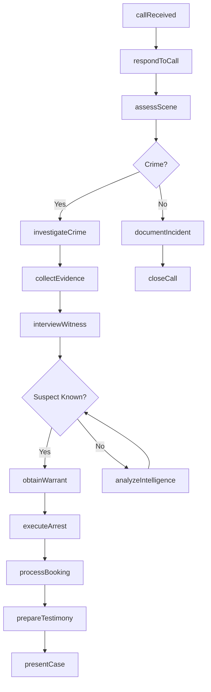
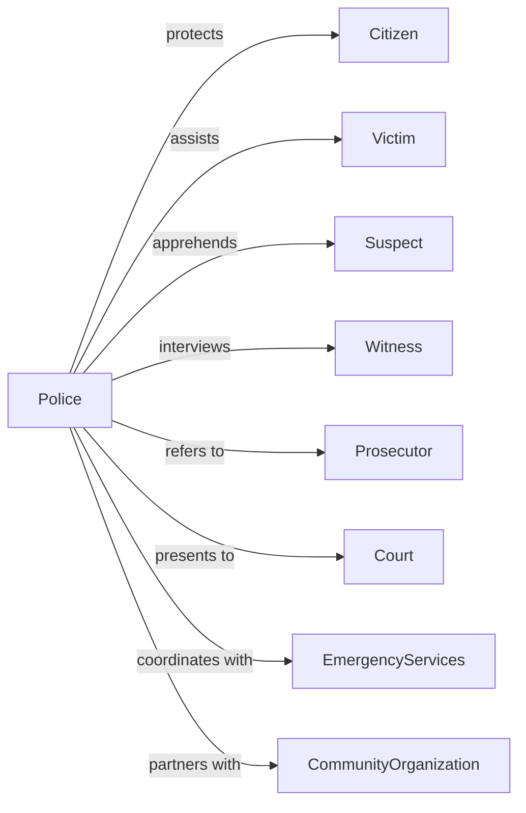

# Police Protection

> Business-as-Code definition for law enforcement operations. Models public safety services from patrol and response through investigation and arrest.

## Overview

Police protection encompasses government law enforcement operations including crime prevention, criminal investigation, traffic safety, and order maintenance. This definition exposes actions for patrol operations, incident response, criminal investigation, and community policing, events for workflow automation, and searches for law enforcement data retrieval.

## Actors

| Actor | Description |
|-------|-------------|
| Citizen | Member of public receiving police services |
| Victim | Individual harmed by criminal activity |
| Suspect | Person of interest in criminal investigation |
| Witness | Individual with knowledge of incident |
| Prosecutor | Attorney pursuing criminal charges |
| Court | Judicial body adjudicating criminal cases |
| EmergencyServices | Fire and EMS agencies coordinating response |
| CommunityOrganization | Group partnering on public safety initiatives |

## Roles

| Role | Description |
|------|-------------|
| PoliceChief | Executive leading law enforcement agency |
| PatrolOfficer | Uniformed officer responding to calls |
| Detective | Investigator handling criminal cases |
| Sergeant | Supervisor overseeing patrol operations |
| DispatchOperator | Personnel coordinating emergency response |
| CrimeAnalyst | Specialist analyzing crime patterns |
| K9Handler | Officer partnered with a trained police dog for detection or apprehension |

## Entities

| Entity | Description |
|--------|-------------|
| IncidentReport | Documentation of police response |
| CrimeReport | Official record of criminal offense |
| ArrestRecord | Documentation of suspect apprehension |
| Evidence | Physical or digital items collected |
| Warrant | Court authorization for arrest or search |
| CaseFile | Complete investigation documentation |
| Citation | Notice of traffic or minor violation |
| CallForService | Request for police response |
| BeatAssignment | Geographic patrol responsibility |
| CrimeStatistics | Aggregated offense data |
| BodyCamFootage | Video recording from officer camera |

## Actions

| Action | Description |
|--------|-------------|
| respondToCall | Dispatch and arrive at incident location |
| conductPatrol | Monitor assigned area for safety |
| investigateCrime | Gather evidence and pursue leads |
| interviewWitness | Obtain statement from knowledgeable party |
| collectEvidence | Secure and document physical items |
| executeArrest | Apprehend and detain suspect |
| obtainWarrant | Secure court authorization for action |
| issueCitation | Provide notice for minor violation |
| conductTrafficStop | Detain vehicle for enforcement |
| processBooking | Document and detain arrested individual |
| analyzeIntelligence | Evaluate crime patterns and threats |
| engageCommunity | Participate in outreach programs |
| coordinateResponse | Manage multi-agency incident |
| prepareTestimony | Ready case presentation for court |

## Events

| Event | Description |
|-------|-------------|
| callReceived | Service request documented |
| officerDispatched | Patrol unit assigned to call |
| sceneArrived | Officer reached incident location |
| incidentReported | Official documentation completed |
| crimeDetected | Criminal offense identified |
| evidenceCollected | Items secured for investigation |
| suspectIdentified | Person of interest determined |
| warrantObtained | Court authorization secured |
| arrestMade | Suspect apprehended |
| bookingCompleted | Detention processing finished |
| caseCleared | Investigation resolved |
| citationIssued | Violation notice provided |
| testimonyDelivered | Court presentation completed |
| patrolCompleted | Beat coverage finished |

## Searches

| Search | Description |
|--------|-------------|
| findIncidents | Search reports by location, type, or date |
| getCrimeStats | Retrieve offense data by area or period |
| findArrests | Search apprehensions by charge or status |
| getWarrants | Retrieve active warrants by name or offense |
| listCases | Get investigations by detective or status |
| findCitations | Search violations by location or type |
| getCallsForService | Retrieve dispatch data by area or time |

## Workflow



## Actor Relationships



## Usage

### Calling Actions

```typescript
import { enforceLaws } from '@headlessly/enforce-laws'

const police = enforceLaws()

// Search reports by location, type, or date
const findIncidentsResult = await police.findIncidents({ status: 'open', priority: 'high' })

// Retrieve offense data by area or period
const getCrimeStatsResult = await police.getCrimeStats({ area: 'downtown', period: 'last-30-days' })

// Respond to emergency call
const response = await police.respondToCall({
  callType: 'burglaryInProgress',
  location: '123 Oak Street',
  priority: 1,
  callerInfo: {
    phone: '555-0123',
    anonymous: false
  },
  dispatchUnits: ['patrol-12', 'patrol-15']
})

// Investigate crime
const investigation = await police.investigateCrime({
  incidentId: response.incidentId,
  crimeType: 'burglary',
  assignedDetective: 'det-johnson',
  initialLeads: ['neighborWitness', 'securityFootage']
})

// Execute arrest
await police.executeArrest({
  caseId: investigation.caseId,
  suspect: {
    name: 'John Doe',
    description: 'Male, 30s, brown hair'
  },
  warrantId: 'warrant-2024-1234',
  charges: ['burglary', 'possession']
})
```

### Event-Driven Automation

```typescript
// Auto-dispatch for priority calls
police.callReceived(async ({ callId, priority, location }) => {
  if (priority === 1) {
    const nearestUnits = await police.findAvailableUnits({
      location,
      count: 2,
      radius: 2
    })

    for (const unit of nearestUnits) {
      await police.respondToCall({
        callId,
        unit: unit.id
      })
    }
  }
})

// Process arrest completion
police.arrestMade(async ({ arrestId, charges, suspect }) => {
  await police.processBooking({
    arrestId,
    suspect,
    charges
  })

  await notifyProsecutor({
    arrestId,
    charges,
    evidenceReady: true
  })

  await updateCrimeStats({
    cleared: 1,
    arrestType: charges[0]
  })
})
```
