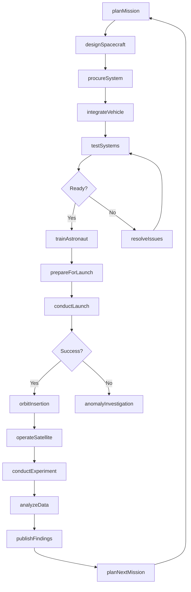
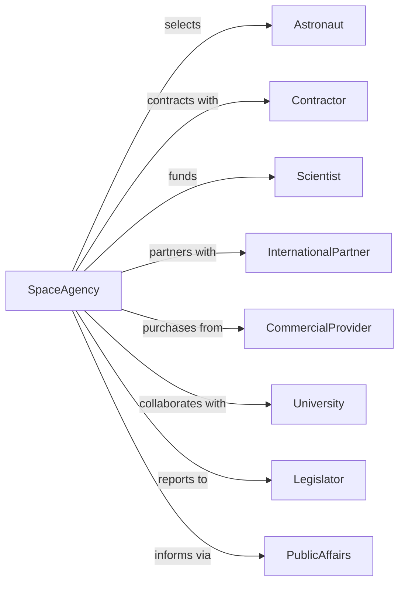

# Space Research and Technology

> Business-as-Code definition for space program administration. Models space exploration, research, and technology development from mission planning through launch operations.

## Overview

Space research and technology encompasses government administration of space flights, space research, and exploration programs including space flight centers, satellite operations, and scientific research. This definition exposes actions for mission planning, launch operations, satellite management, and scientific research coordination, events for workflow automation, and searches for space program data retrieval.

## Actors

| Actor | Description |
|-------|-------------|
| Astronaut | Crew member participating in space missions |
| Contractor | Private company providing space systems |
| Scientist | Researcher conducting space experiments |
| InternationalPartner | Foreign space agency collaborating on programs |
| CommercialProvider | Private company offering launch services |
| University | Academic institution participating in research |
| Legislator | Elected official authorizing space funding |
| PublicAffairs | Organization communicating space activities |

## Roles

| Role | Description |
|------|-------------|
| Administrator | Executive leading space agency |
| MissionDirector | Official overseeing specific space mission |
| FlightController | Specialist managing spacecraft operations |
| ProgramManager | Administrator coordinating major space program |
| ChiefScientist | Lead researcher for space science |
| LaunchDirector | Official commanding launch operations |
| CapCom | Capsule communicator serving as sole voice link between mission control and crew |

## Entities

| Entity | Description |
|--------|-------------|
| SpaceMission | Planned or executed space flight |
| Spacecraft | Vehicle designed for space travel |
| Satellite | Orbiting platform for communications or science |
| LaunchVehicle | Rocket system for reaching orbit |
| SpaceStation | Orbiting laboratory and habitat |
| ResearchExperiment | Scientific study conducted in space |
| GroundStation | Earth facility communicating with spacecraft |
| MissionControl | Facility managing space operations |
| SpacecraftComponent | Hardware element of space vehicle |
| LaunchManifest | Schedule of planned launches |
| InternationalAgreement | Treaty for space cooperation |

## Actions

| Action | Description |
|--------|-------------|
| planMission | Develop space flight strategy |
| designSpacecraft | Engineer vehicle for space mission |
| conductLaunch | Execute rocket liftoff |
| operateSatellite | Manage orbiting platform |
| conductExperiment | Perform scientific research in space |
| trainAstronaut | Prepare crew for space mission |
| manageMissionControl | Oversee spacecraft operations |
| procureSystem | Acquire space hardware from contractor |
| negotiateAgreement | Develop international partnership |
| analyzeData | Process scientific results |
| maintainStation | Service orbiting facility |
| developTechnology | Create new space capabilities |
| communicatePublic | Share space program information |
| scheduleManifest | Plan launch sequence |

## Events

| Event | Description |
|-------|-------------|
| missionPlanned | Space flight strategy developed |
| spacecraftDesigned | Vehicle engineering completed |
| launchConducted | Rocket liftoff executed |
| satelliteOperated | Orbiting platform managed |
| experimentConducted | Scientific research performed |
| astronautTrained | Crew preparation completed |
| missionControlled | Operations managed |
| systemProcured | Hardware acquired |
| agreementNegotiated | Partnership developed |
| dataAnalyzed | Scientific results processed |
| stationMaintained | Facility serviced |
| technologyDeveloped | New capability created |
| publicCommunicated | Information shared |
| manifestScheduled | Launch sequence planned |

## Searches

| Search | Description |
|--------|-------------|
| findMissions | Search space flights by status or objective |
| getSpacecraft | Retrieve vehicles by type or mission |
| listSatellites | Get orbiting platforms by function or orbit |
| findExperiments | Search research by discipline or status |
| getLaunches | Retrieve liftoffs by date or vehicle |
| listAgreements | Get partnerships by nation or program |
| findTechnologies | Search capabilities by readiness or application |

## Workflow



## Actor Relationships



## Usage

### Calling Actions

```typescript
import { researchSpace } from '@headlessly/research-space'

const space = researchSpace()

// Plan space mission
const mission = await space.planMission({
  name: 'Artemis IV',
  objective: 'lunarSurface',
  type: 'crewed',
  crew: 4,
  duration: 30,
  timeline: {
    design: '2024-2025',
    integration: '2026',
    launch: '2027'
  },
  experiments: [
    'lunarGeology',
    'radiationExposure',
    'waterIceExtraction'
  ]
})

// Conduct launch
const launch = await space.conductLaunch({
  missionId: mission.id,
  vehicle: 'sls-block2',
  spacecraft: 'orion-artemis4',
  launchSite: 'kennedy-lc39b',
  window: {
    open: '2027-09-15T14:00:00Z',
    close: '2027-09-15T16:00:00Z'
  },
  trajectory: 'transLunarInjection'
})

// Operate satellite
await space.operateSatellite({
  satelliteId: 'jwst',
  commands: [
    { type: 'pointingManeuver', target: 'ngc1333' },
    { type: 'observation', instrument: 'nircam', duration: 3600 }
  ],
  groundStation: 'goldstone',
  bandwidth: 'sband'
})
```

### Event-Driven Automation

```typescript
// Process launch event
space.launchConducted(async ({ missionId, launchTime, trajectory }) => {
  await space.manageMissionControl({
    missionId,
    phase: 'ascent',
    tracking: ['radar', 'telemetry']
  })

  await updateManifest({
    completedLaunch: missionId,
    nextInSequence: getNextMission()
  })

  await space.communicatePublic({
    event: 'launchSuccess',
    missionId,
    details: trajectory
  })
})

// Handle satellite operations
space.experimentConducted(async ({ experimentId, data, status }) => {
  await space.analyzeData({
    experimentId,
    rawData: data,
    processing: ['calibration', 'reduction', 'analysis']
  })

  await notifyScientist({
    experimentId,
    dataAvailable: true,
    accessLocation: 'scienceDataArchive'
  })
})
```
