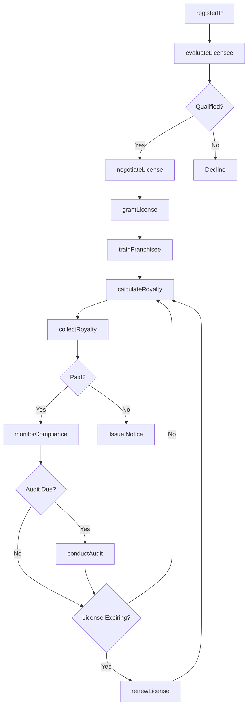
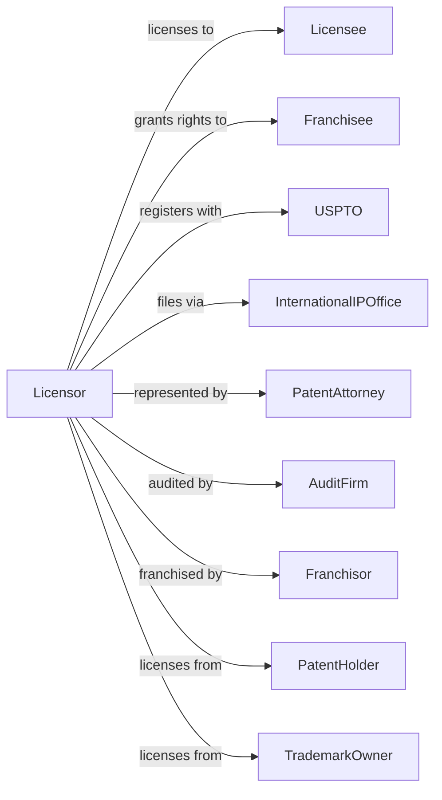

# Lessors of Nonfinancial Intangible Assets (except Copyrighted Works)

> Business-as-Code definition for intellectual property licensing operations. Models the complete licensing lifecycle from IP development through royalty collection.

## Overview

Lessors of nonfinancial intangible assets license patents, trademarks, brand names, and franchise rights to businesses in exchange for royalty payments or licensing fees. This definition exposes actions for IP portfolio management, license negotiation, royalty calculation, and compliance monitoring, with events enabling automated workflow triggers throughout the intellectual property licensing lifecycle.

## Actors

| Actor | Description |
|-------|-------------|
| Licensee | Business using licensed intellectual property |
| Franchisor | Parent company granting franchise rights |
| Franchisee | Business operating under franchise agreement |
| PatentHolder | Owner of patented technology |
| TrademarkOwner | Owner of registered brand marks |
| PatentAttorney | Handles IP legal matters |
| AuditFirm | Verifies licensee royalty compliance |
| USPTO | Patent and trademark registration authority |
| InternationalIPOffice | Foreign patent and trademark offices |

## Roles

| Role | Description |
|------|-------------|
| LicensingManager | Oversees IP licensing portfolio |
| FranchiseConsultant | Develops and supports franchisees |
| RoyaltyAccountant | Calculates and collects royalty payments |
| IPCounsel | Manages intellectual property legal matters |
| ComplianceAuditor | Monitors licensee adherence to terms |

## Entities

| Entity | Description |
|--------|-------------|
| Patent | Granted patent covering invention |
| Trademark | Registered brand name or mark |
| BrandName | Licensed commercial brand identity |
| Franchise | Business format and operating system |
| License | Agreement granting IP usage rights |
| Royalty | Payment for intellectual property use |
| Territory | Geographic scope of license grant |
| Sublicense | Secondary license from original licensee |
| Infringement | Unauthorized use of intellectual property |
| Audit | Review of licensee royalty compliance |

## Actions

| Action | Description |
|--------|-------------|
| registerIP | File patent or trademark application |
| evaluateLicensee | Assess potential licensee qualifications |
| negotiateLicense | Discuss and agree on license terms |
| grantLicense | Execute license agreement |
| calculateRoyalty | Determine royalty payment due |
| collectRoyalty | Process royalty payment |
| monitorCompliance | Track licensee adherence to terms |
| conductAudit | Review licensee financial records |
| enforceRights | Address unauthorized IP use |
| renewLicense | Extend license term |
| terminateLicense | End license agreement |
| transferIP | Assign intellectual property rights |
| expandTerritory | Grant additional geographic rights |
| trainFranchisee | Provide franchise operations training |

## Events

| Event | Description |
|-------|-------------|
| ipRegistered | Patent or trademark granted |
| licenseeEvaluated | Qualification assessment completed |
| licenseGranted | License agreement executed |
| royaltyCalculated | Payment amount determined |
| royaltyReceived | Payment collected |
| royaltyBecameOverdue | Payment past due date |
| auditScheduled | Compliance review planned |
| auditCompleted | Compliance review finished |
| infringementDetected | Unauthorized use discovered |
| licenseRenewed | Agreement term extended |
| licenseTerminated | Agreement ended |
| franchiseOpened | New franchise location operational |
| territoryExpanded | Additional rights granted |

## Searches

| Search | Description |
|--------|-------------|
| getIPPortfolio | List patents, trademarks, and brands |
| getActiveLicenses | Retrieve current license agreements |
| getRoyaltySchedule | View upcoming royalty payments |
| findOverdueRoyalties | List past-due payments |
| getAuditHistory | Retrieve compliance review records |
| findInfringements | List potential IP violations |
| getFranchiseLocations | Map franchisee locations by territory |

## Workflow



## Actor Relationships



## Usage

### Calling Actions

```typescript
import { licenseIP } from '@headlessly/license-ip'

const licensor = licenseIP()

// List patents, trademarks, and brands
const getIPPortfolioResult = await licensor.getIPPortfolio({ status: 'active' })

// Retrieve current license agreements
const getActiveLicensesResult = await licensor.getActiveLicenses({ status: 'active' })

// Register a new trademark
const trademark = await licensor.registerIP({
  type: 'trademark',
  mark: 'QuickBurger',
  classes: [43], // Restaurant services
  territories: ['US', 'CA', 'MX'],
  applicationDate: '2024-01-15'
})

// Grant a franchise license
const franchise = await licensor.grantLicense({
  ipId: trademark.id,
  licenseeId: 'smith-enterprises',
  licenseType: 'franchise',
  territory: 'Denver Metro Area',
  termYears: 10,
  initialFee: 45000,
  royaltyRate: 0.05,
  marketingFee: 0.02
})

// Calculate and collect quarterly royalty
const royalty = await licensor.calculateRoyalty({
  licenseId: franchise.id,
  period: 'Q1-2024',
  grossSales: 275000
})

await licensor.collectRoyalty({
  licenseId: franchise.id,
  amount: royalty.totalDue,
  dueDate: '2024-04-15'
})
```

### Event-Driven Automation

```typescript
// Auto-schedule compliance audit
licensor.royaltyReceived(async ({ licenseId, licenseeId }) => {
  const lastAudit = await getLastAuditDate(licenseId)
  const monthsSinceAudit = differenceInMonths(new Date(), lastAudit)

  if (monthsSinceAudit >= 24) {
    await licensor.conductAudit({
      licenseId,
      auditType: 'routineCompliance',
      scheduledDate: addMonths(new Date(), 1)
    })
  }
})

// Auto-enforce when infringement detected
licensor.infringementDetected(async ({ ipId, infringerName, evidence }) => {
  await licensor.enforceRights({
    ipId,
    infringer: infringerName,
    action: 'ceaseAndDesist',
    evidence,
    deadline: addDays(new Date(), 30)
  })
})
```
