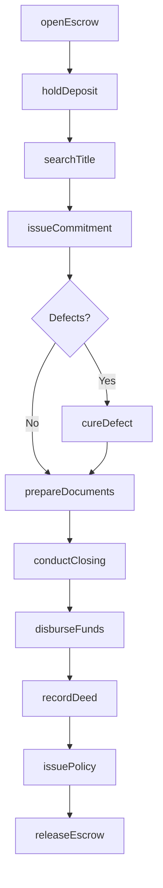
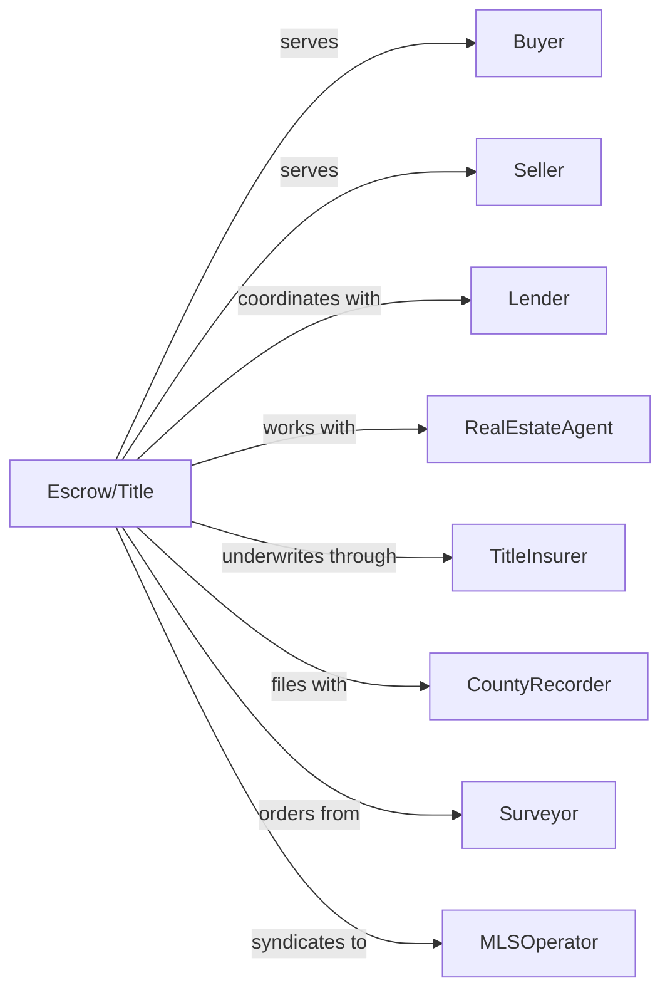

# Other Activities Related to Real Estate

> Business-as-Code definition for real estate service operations including escrow, title, and listing services. Models the complete transaction support lifecycle from engagement through closing.

## Overview

Other real estate activities include escrow agencies, title abstract companies, real estate listing services, and landman services that support property transactions. This definition exposes actions for escrow management, title search, listing syndication, and mineral rights acquisition, with events enabling automated workflow triggers throughout the real estate support services lifecycle.

## Actors

| Actor | Description |
|-------|-------------|
| Buyer | Party purchasing real property |
| Seller | Party selling real property |
| Lender | Mortgage company funding transaction |
| RealEstateAgent | Broker representing buyer or seller |
| TitleInsurer | Underwriter issuing title insurance policies |
| CountyRecorder | Government office recording deeds |
| Surveyor | Provides property boundary surveys |
| OilCompany | Energy company acquiring mineral rights |
| MLSOperator | Multiple listing service provider |

## Roles

| Role | Description |
|------|-------------|
| EscrowOfficer | Manages transaction funds and documents |
| TitleExaminer | Researches property ownership history |
| ClosingCoordinator | Schedules and facilitates closings |
| Landman | Negotiates mineral and surface rights |
| ListingAdministrator | Manages property listing data and syndication |

## Entities

| Entity | Description |
|--------|-------------|
| EscrowAccount | Third-party account holding transaction funds |
| TitleCommitment | Preliminary title report with exceptions |
| TitlePolicy | Insurance against ownership defects |
| Deed | Document transferring property ownership |
| ClosingDisclosure | Final settlement statement |
| Listing | Property data syndicated to portals |
| MineralLease | Agreement for subsurface rights |
| Survey | Property boundary and easement map |
| Lien | Recorded claim against property |
| AbstractOfTitle | Historical chain of ownership |

## Actions

| Action | Description |
|--------|-------------|
| openEscrow | Establish escrow account for transaction |
| holdDeposit | Receive and secure earnest money |
| searchTitle | Research property ownership and liens |
| issueCommitment | Prepare preliminary title report |
| cureDefect | Resolve title issues before closing |
| prepareDocuments | Draft closing documents for signature |
| conductClosing | Facilitate signing and fund disbursement |
| recordDeed | File deed with county recorder |
| issuePolicy | Issue title insurance after recording |
| syndicateListing | Distribute property data to portals |
| negotiateLease | Acquire mineral or surface rights |
| prepareSurvey | Commission property boundary survey |
| disburseFunds | Distribute closing proceeds to parties |
| releaseEscrow | Close escrow and release final funds |

## Events

| Event | Description |
|-------|-------------|
| escrowOpened | Transaction escrow established |
| depositReceived | Earnest money deposited |
| titleSearched | Ownership research completed |
| commitmentIssued | Preliminary title report delivered |
| defectFound | Title issue discovered |
| defectCured | Title issue resolved |
| documentsReady | Closing package prepared |
| closingScheduled | Signing appointment confirmed |
| closingCompleted | Transaction signed and funded |
| deedRecorded | Deed filed with county |
| policyIssued | Title insurance delivered |
| fundsDistributed | Proceeds sent to parties |
| escrowReleased | Transaction fully closed |
| listingSyndicated | Property data distributed |

## Searches

| Search | Description |
|--------|-------------|
| getEscrowStatus | Track escrow account balance and activity |
| findOpenTransactions | List pending closings by date |
| searchLiens | Find recorded claims against property |
| getChainOfTitle | Retrieve ownership history |
| findListings | Search syndicated property listings |
| getClosingSchedule | View upcoming closing appointments |
| getRecordingStatus | Check deed recording confirmation |

## Workflow



## Actor Relationships



## Usage

### Calling Actions

```typescript
import { manageProperty } from '@headlessly/manage-property'

const escrow = manageProperty()

// Open escrow for a transaction
const transaction = await escrow.openEscrow({
  buyerId: 'buyer-123',
  sellerId: 'seller-456',
  propertyAddress: '789 Oak Drive',
  purchasePrice: 550000,
  closingDate: '2024-03-15'
})

// Search title and issue commitment
const commitment = await escrow.issueCommitment({
  transactionId: transaction.id,
  searchYears: 60,
  exceptions: ['utility easement', 'mineral reservation']
})

// Conduct the closing
await escrow.conductClosing({
  transactionId: transaction.id,
  closingAgent: 'jane-smith',
  signingMethod: 'inPerson',
  wireFundsReady: true
})
```

### Event-Driven Automation

```typescript
// Auto-order survey when defect found
escrow.defectFound(async ({ transactionId, defectType }) => {
  if (defectType === 'boundaryDispute') {
    await escrow.prepareSurvey({
      transactionId,
      surveyType: 'boundary',
      certifiedTo: ['buyer', 'lender', 'titleCompany']
    })
  }
})

// Auto-disburse after recording confirmed
escrow.deedRecorded(async ({ transactionId, recordingNumber }) => {
  await escrow.disburseFunds({
    transactionId,
    recordingConfirmation: recordingNumber
  })

  await escrow.issuePolicy({
    transactionId,
    policyType: 'owners',
    effectiveDate: new Date()
  })
})
```
