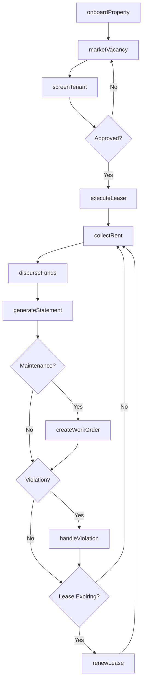
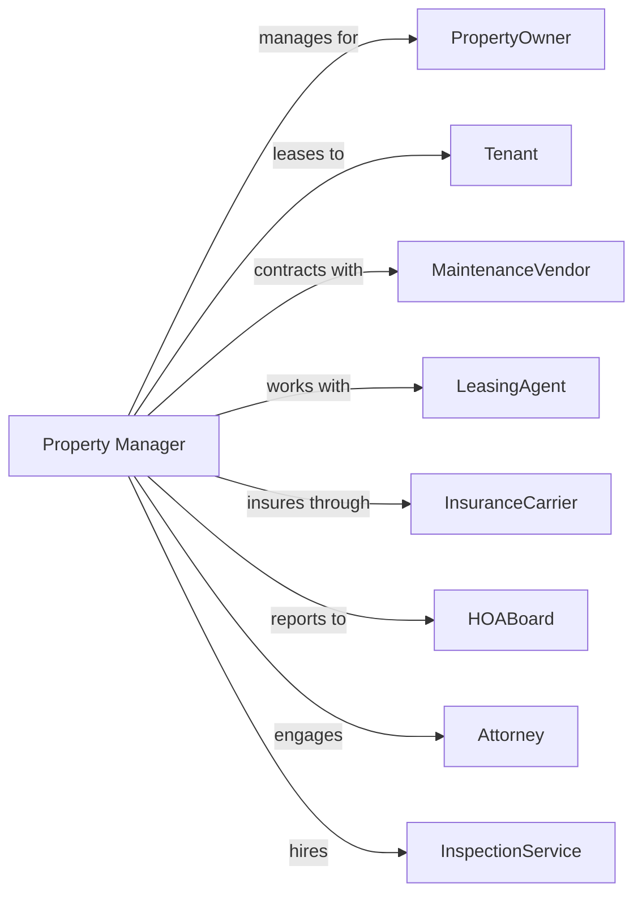

# Residential Property Managers

> Business-as-Code definition for residential property management operations. Models the complete property management lifecycle from owner onboarding through ongoing asset management.

## Overview

Residential property managers oversee apartment complexes, single-family rentals, condominiums, and HOA communities on behalf of property owners. This definition exposes actions for tenant placement, rent collection, maintenance coordination, and owner reporting, with events enabling automated workflow triggers throughout the property management lifecycle.

## Actors

| Actor | Description |
|-------|-------------|
| PropertyOwner | Individual or entity owning managed properties |
| Tenant | Resident occupying managed rental unit |
| MaintenanceVendor | Contractor performing repairs and maintenance |
| LeasingAgent | Third-party agent sourcing tenant leads |
| InsuranceCarrier | Provides property and liability coverage |
| HOABoard | Homeowners association board of directors |
| AccountingFirm | Provides bookkeeping and tax preparation |
| Attorney | Handles evictions and legal matters |
| InspectionService | Conducts property condition assessments |

## Roles

| Role | Description |
|------|-------------|
| PortfolioManager | Oversees multiple properties and owner relationships |
| OnSiteManager | Manages day-to-day operations at property location |
| LeasingCoordinator | Handles tenant screening and lease execution |
| MaintenanceSupervisor | Coordinates repair work and preventive maintenance |
| PropertyAccountant | Manages owner statements and financial reporting |

## Entities

| Entity | Description |
|--------|-------------|
| Property | Managed residential building or community |
| Unit | Individual rental apartment or home |
| Owner | Property owner client of management company |
| Tenant | Resident with active lease |
| ManagementAgreement | Contract defining management terms and fees |
| Lease | Rental agreement between owner and tenant |
| WorkOrder | Maintenance request or repair ticket |
| OwnerStatement | Monthly financial report for property owner |
| Reserve | HOA or owner reserve fund balance |
| Violation | Lease or community rule infraction |

## Actions

| Action | Description |
|--------|-------------|
| onboardProperty | Set up new property in management portfolio |
| marketVacancy | Advertise available unit for rent |
| screenTenant | Conduct background, credit, and rental checks |
| executeLease | Sign lease agreement on owner's behalf |
| collectRent | Process monthly rent payments |
| disburseFunds | Send owner distributions and pay expenses |
| createWorkOrder | Open maintenance request and assign vendor |
| inspectProperty | Conduct periodic property inspections |
| handleViolation | Address lease violations and issue notices |
| processEviction | Coordinate legal eviction proceedings |
| renewLease | Negotiate and execute lease renewals |
| generateStatement | Produce monthly owner financial reports |
| conductTurnover | Manage unit preparation between tenants |
| enforceHOARules | Ensure compliance with community guidelines |

## Events

| Event | Description |
|-------|-------------|
| propertyOnboarded | New property added to management |
| vacancyPosted | Unit advertised for rent |
| applicationReceived | Prospective tenant submitted application |
| tenantApproved | Applicant passed screening |
| leaseExecuted | Lease signed by tenant |
| rentCollected | Monthly rent payment received |
| ownerDisbursed | Owner payment distributed |
| workOrderCreated | Maintenance request logged |
| workOrderCompleted | Repair work finished |
| inspectionCompleted | Property inspection finished |
| violationIssued | Lease violation notice sent |
| leaseRenewed | Tenant renewed for another term |
| tenantVacated | Tenant moved out of unit |
| turnoverCompleted | Unit ready for new tenant |

## Searches

| Search | Description |
|--------|-------------|
| getPortfolio | List all managed properties and units |
| findVacancies | List available units across portfolio |
| getTenantLedger | Retrieve payment history for tenant |
| getDelinquencies | List overdue rent accounts |
| getOpenWorkOrders | Find pending maintenance requests |
| getOwnerStatements | Retrieve financial reports for owner |
| findExpiringLeases | List leases ending within date range |

## Workflow



## Actor Relationships



## Usage

### Calling Actions

```typescript
import { manageResidential } from '@headlessly/manage-residential'

const manager = manageResidential()

// Onboard a new property
const property = await manager.onboardProperty({
  ownerId: 'owner-123',
  address: '789 Maple Court',
  units: 24,
  managementFee: 0.08,
  leaseUpFee: 0.5
})

// Screen a prospective tenant
const screening = await manager.screenTenant({
  applicantId: 'app-456',
  unitId: 'unit-2B',
  checks: ['credit', 'criminal', 'eviction', 'income', 'rental']
})

// Generate monthly owner statement
const statement = await manager.generateStatement({
  ownerId: 'owner-123',
  propertyId: property.id,
  month: '2024-02',
  includeDetails: true
})
```

### Event-Driven Automation

```typescript
// Auto-disburse to owner after rent collected
manager.rentCollected(async ({ propertyId, ownerId, amount }) => {
  const managementFee = amount * 0.08
  const ownerPayment = amount - managementFee

  await manager.disburseFunds({
    ownerId,
    amount: ownerPayment,
    description: 'Monthly rent distribution'
  })
})

// Auto-start turnover when tenant vacates
manager.tenantVacated(async ({ unitId, moveOutDate }) => {
  await manager.conductTurnover({
    unitId,
    tasks: ['inspection', 'cleaning', 'repairs', 'painting'],
    targetReadyDate: addDays(moveOutDate, 14)
  })

  await manager.marketVacancy({
    unitId,
    availableDate: addDays(moveOutDate, 14)
  })
})
```
