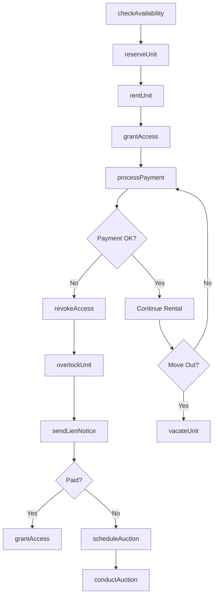
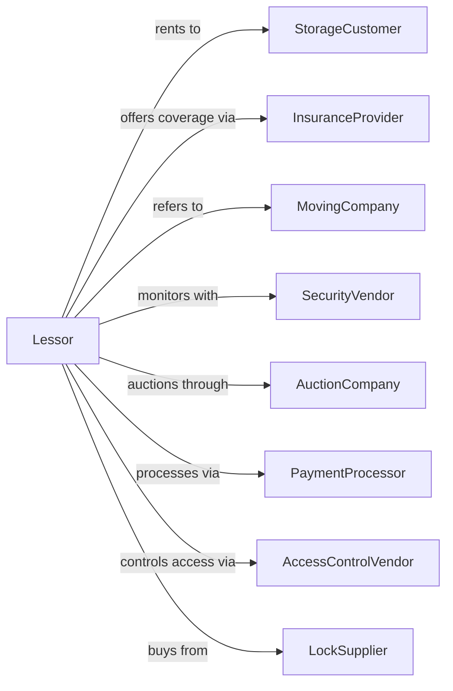

# Lessors of Miniwarehouses and Self-Storage Units

> Business-as-Code definition for self-storage facility operations. Models the complete storage rental lifecycle from unit reservation through move-out.

## Overview

Self-storage lessors provide secure, rentable storage spaces including climate-controlled units, drive-up units, and outdoor parking for vehicles and boats. This definition exposes actions for unit rental, access control, payment processing, and lien enforcement, with events enabling automated workflow triggers throughout the storage tenancy lifecycle.

## Actors

| Actor | Description |
|-------|-------------|
| StorageCustomer | Individual or business renting storage space |
| InsuranceProvider | Offers tenant storage insurance programs |
| MovingCompany | Provides moving services and referrals |
| SecurityVendor | Supplies surveillance and alarm systems |
| AuctionCompany | Conducts lien sale auctions for defaulted units |
| PaymentProcessor | Handles credit card and ACH transactions |
| AccessControlVendor | Provides gate and door access systems |
| LockSupplier | Sells disc locks and security devices |

## Roles

| Role | Description |
|------|-------------|
| FacilityManager | Oversees daily storage facility operations |
| RentalAgent | Handles customer inquiries and unit rentals |
| MaintenanceTech | Maintains facility grounds and systems |
| CollectionsSpecialist | Manages delinquent accounts and lien process |
| CustomerService | Assists customers with account and access issues |
| LienAuctioneer | Conducts auctions for defaulted and abandoned storage units |

## Entities

| Entity | Description |
|--------|-------------|
| Facility | Self-storage property with multiple units |
| Unit | Individual storage space of specific size and type |
| RentalAgreement | Month-to-month storage contract |
| Customer | Person or business renting storage unit |
| Reservation | Hold placed on unit prior to move-in |
| AccessLog | Record of gate and unit access events |
| LienNotice | Legal notice for delinquent account |
| AuctionLot | Delinquent unit contents scheduled for sale |
| Insurance | Tenant protection plan coverage |
| Payment | Recurring or one-time payment transaction |

## Actions

| Action | Description |
|--------|-------------|
| checkAvailability | Query available units by size and features |
| reserveUnit | Place hold on unit for future move-in |
| rentUnit | Execute rental agreement and move customer in |
| processPayment | Charge customer for rent and fees |
| grantAccess | Enable gate and unit access for customer |
| revokeAccess | Disable facility access for delinquent customer |
| overlockUnit | Place facility lock on delinquent unit |
| sendLienNotice | Mail statutory lien notice to customer |
| scheduleAuction | List unit contents for lien sale |
| conductAuction | Execute auction and transfer unit contents |
| transferUnit | Move customer to different unit size |
| vacateUnit | Process customer move-out and close account |
| enrollInsurance | Add tenant protection plan to account |
| adjustRate | Apply rent increase to existing rental |

## Events

| Event | Description |
|-------|-------------|
| unitReserved | Reservation placed on available unit |
| moveInCompleted | Customer has rented and accessed unit |
| paymentProcessed | Monthly rent payment successful |
| paymentFailed | Payment attempt declined or failed |
| accountBecameDelinquent | Account past due beyond grace period |
| accessRevoked | Customer gate access disabled |
| unitOverlocked | Facility lock placed on unit door |
| lienNoticeSent | Legal notice mailed to customer |
| auctionScheduled | Unit contents listed for lien sale |
| auctionCompleted | Lien sale conducted and unit cleared |
| unitTransferred | Customer moved to different unit |
| moveOutCompleted | Customer vacated and account closed |
| rateAdjusted | Rent increase applied to account |

## Searches

| Search | Description |
|--------|-------------|
| findAvailableUnits | List vacant units by size, type, and features |
| getOccupancyReport | Calculate occupancy rates by unit type |
| getDelinquentAccounts | List accounts past due by days |
| getAccessHistory | Retrieve gate and unit access logs |
| findExpiredReservations | List reservations past hold date |
| getLienPipeline | Show accounts in lien process stages |
| getRevenueReport | Calculate facility revenue by category |

## Workflow



## Actor Relationships



## Usage

### Calling Actions

```typescript
import { leaseStorage } from '@headlessly/lease-storage'

const facility = leaseStorage()

// List vacant units by size, type, and features
const availableUnits = await facility.findAvailableUnits({ size: '10x10', climate: true })

// Calculate occupancy rates by unit type
const occupancyReport = await facility.getOccupancyReport({ facility: 'main-campus' })

// Check available units
const units = await facility.checkAvailability({
  facilityId: 'storage-plus-main',
  unitSize: '10x10',
  features: ['climate', 'firstFloor'],
  moveInDate: '2024-02-15'
})

// Rent a unit
await facility.rentUnit({
  facilityId: 'storage-plus-main',
  unitId: 'A-105',
  customerId: 'cust-54321',
  monthlyRate: 185,
  moveInDate: '2024-02-15',
  autopay: true
})

// Add tenant insurance
await facility.enrollInsurance({
  customerId: 'cust-54321',
  coverageAmount: 5000,
  monthlyPremium: 12
})
```

### Event-Driven Automation

```typescript
// Auto-overlock when account is delinquent
facility.accountBecameDelinquent(async ({ customerId, unitId, daysLate }) => {
  if (daysLate >= 30) {
    await facility.overlockUnit({
      unitId,
      reason: 'nonpayment',
      overlockDate: new Date()
    })

    await facility.sendLienNotice({
      customerId,
      unitId,
      amountOwed: await getBalance(customerId)
    })
  }
})

// Auto-schedule auction after lien period expires
facility.lienNoticeSent(async ({ customerId, unitId, noticeDate }) => {
  const lienPeriod = 30 // days per state law

  scheduleTask(addDays(noticeDate, lienPeriod), async () => {
    const stillDelinquent = await isDelinquent(customerId)

    if (stillDelinquent) {
      await facility.scheduleAuction({
        unitId,
        auctionDate: addDays(new Date(), 14)
      })
    }
  })
})
```
