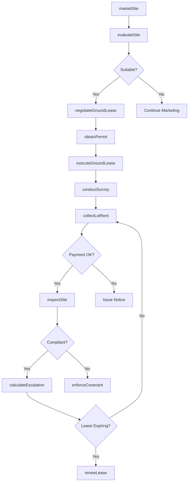
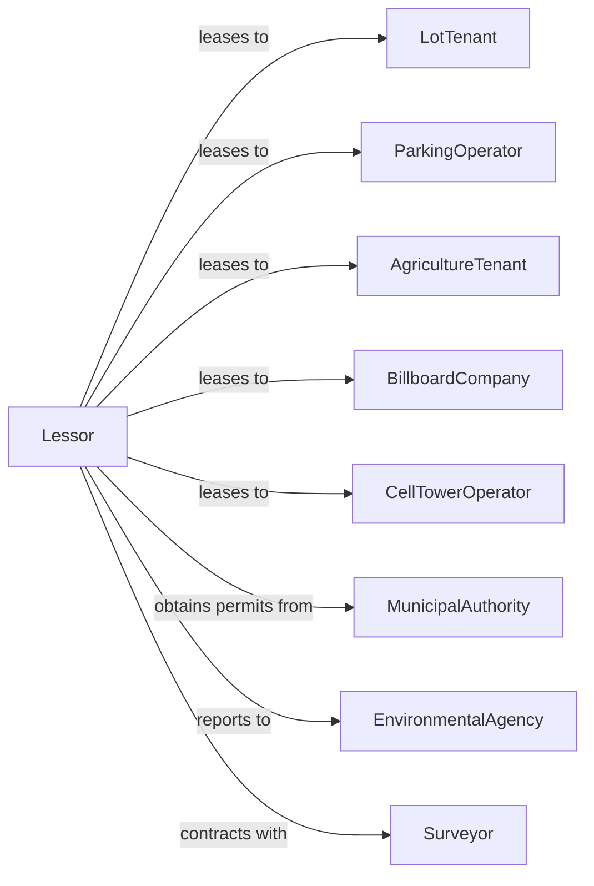

# Lessors of Other Real Estate Property

> Business-as-Code definition for land and miscellaneous real estate leasing operations. Models the complete land lease lifecycle from site marketing through lease termination.

## Overview

Lessors of other real estate lease land and property not classified as residential or commercial buildings, including manufactured home sites, vacant lots, parking facilities, agricultural land, and billboard locations. This definition exposes actions for site marketing, ground lease negotiation, lot rent collection, and land use compliance, with events enabling automated workflow triggers throughout the land tenancy lifecycle.

## Actors

| Actor | Description |
|-------|-------------|
| LotTenant | Individual leasing manufactured home site |
| ParkingOperator | Business leasing parking facility |
| AgricultureTenant | Farmer or rancher leasing grazing or crop land |
| BillboardCompany | Outdoor advertising company leasing sign locations |
| CellTowerOperator | Wireless carrier leasing antenna site |
| MunicipalAuthority | Local government overseeing land use permits |
| EnvironmentalAgency | Regulates land use and environmental compliance |
| Surveyor | Provides boundary and topographic surveys |

## Roles

| Role | Description |
|------|-------------|
| LandOwner | Owns the real property and makes leasing decisions |
| SiteManager | Oversees manufactured home park or lot operations |
| GroundsKeeper | Maintains common areas and infrastructure |
| LeaseAdministrator | Manages lease documentation and renewals |
| ComplianceManager | Ensures zoning and environmental compliance |

## Entities

| Entity | Description |
|--------|-------------|
| Parcel | Tract of land available for lease |
| Lot | Individual site within a manufactured home park |
| GroundLease | Long-term lease of land for development |
| Easement | Right to use land for specific purpose |
| LotRent | Monthly or annual rent for land use |
| Billboard | Outdoor advertising structure on leased land |
| CellSite | Telecommunications tower location |
| Permit | Land use or development permit |
| Survey | Property boundary and topographic documentation |
| Improvement | Structures or enhancements on leased land |

## Actions

| Action | Description |
|--------|-------------|
| marketSite | Advertise available land for lease |
| evaluateSite | Assess land suitability for proposed use |
| negotiateGroundLease | Negotiate long-term land lease terms |
| executeGroundLease | Finalize ground lease agreement |
| collectLotRent | Process rent payment for lot or parcel |
| conductSurvey | Commission boundary or topographic survey |
| obtainPermit | Secure required land use permits |
| inspectSite | Assess tenant compliance and land condition |
| approveImprovement | Authorize tenant improvements on land |
| renewLease | Extend land lease with updated terms |
| terminateLease | End land lease and reclaim property |
| calculateEscalation | Apply CPI or contractual rent increase |
| enforceCovenant | Ensure compliance with lease restrictions |
| releaseEasement | Terminate or modify easement rights |

## Events

| Event | Description |
|-------|-------------|
| siteMarketed | Land listed for lease |
| siteEvaluated | Due diligence completed on parcel |
| groundLeaseExecuted | Long-term land lease signed |
| tenantOccupied | Tenant has taken possession of land |
| lotRentDue | Monthly or annual rent payment due |
| paymentReceived | Rent payment processed |
| improvementApproved | Tenant improvement authorized |
| improvementCompleted | Construction on leased land finished |
| inspectionCompleted | Site compliance inspection finished |
| escalationApplied | Rent increase calculated and applied |
| leaseExpiring | Land lease term ending within notice period |
| leaseRenewed | Land lease extended |
| leaseTerminated | Tenancy ended and land returned |

## Searches

| Search | Description |
|--------|-------------|
| findAvailableParcels | List land available for lease by type and size |
| getLotRoster | Retrieve all lots and tenant information |
| getExpiringLeases | List ground leases expiring within date range |
| getPaymentHistory | Retrieve rent payment history by tenant |
| findCellSites | List active telecommunications lease sites |
| getBillboardInventory | Show billboard locations and lease status |
| getComplianceStatus | Check permit and covenant compliance by parcel |

## Workflow



## Actor Relationships



## Usage

### Calling Actions

```typescript
import { leaseLand } from '@headlessly/lease-land'

const lessor = leaseLand()

// List land available for lease by type and size
const findAvailableParcelsResult = await lessor.findAvailableParcels({ status: 'active' })

// Retrieve all lots and tenant information
const getLotRosterResult = await lessor.getLotRoster({ status: 'active' })

// Market a cell tower site
const listing = await lessor.marketSite({
  parcelId: 'hilltop-40-acres',
  siteType: 'cellTower',
  acreage: 0.5,
  zoning: 'commercial',
  accessRoad: true
})

// Execute a ground lease
await lessor.executeGroundLease({
  parcelId: 'hilltop-40-acres',
  tenantId: 'verizon-wireless',
  leaseType: 'cellSite',
  termYears: 25,
  annualRent: 24000,
  escalationRate: 0.03
})

// Collect lot rent for manufactured home park
await lessor.collectLotRent({
  parkId: 'sunny-meadows-mhp',
  lotId: 'lot-42',
  monthlyRent: 650,
  dueDate: '2024-03-01'
})
```

### Event-Driven Automation

```typescript
// Auto-apply annual escalation
lessor.escalationApplied(async ({ leaseId, oldRent, newRent }) => {
  await lessor.collectLotRent({
    leaseId,
    newMonthlyRent: newRent,
    effectiveDate: new Date()
  })

  await notifyTenant({
    leaseId,
    subject: 'Annual Rent Adjustment',
    message: `Your rent has been adjusted from $${oldRent} to $${newRent}`
  })
})

// Auto-inspect sites on schedule
lessor.improvementCompleted(async ({ parcelId, tenantId, improvementType }) => {
  // Schedule compliance inspection 30 days after improvement
  scheduleTask(addDays(new Date(), 30), async () => {
    await lessor.inspectSite({
      parcelId,
      inspectionType: 'compliance',
      checkpoints: ['permitCompliance', 'covenantAdherence', 'environmentalImpact']
    })
  })
})
```
