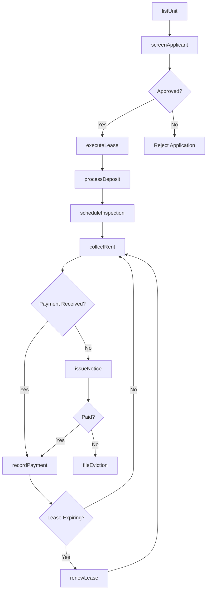
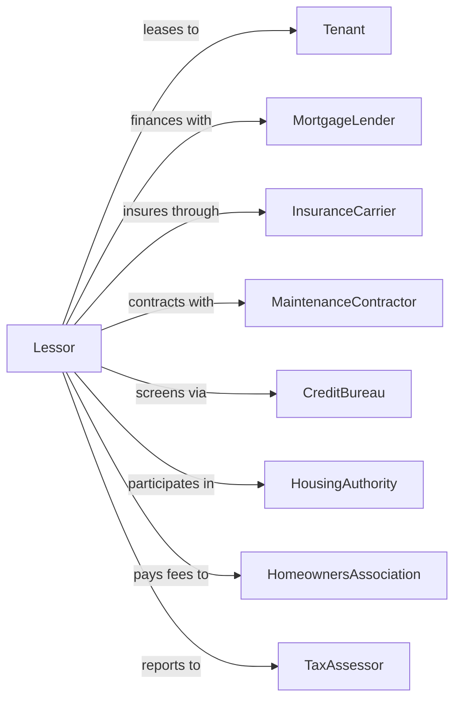

# Lessors of Residential Buildings and Dwellings

> Business-as-Code definition for residential property leasing operations. Models the complete tenant lifecycle from marketing through lease termination.

## Overview

Residential lessors own and lease apartment buildings, single-family homes, townhouses, and condominiums to tenants. This definition exposes actions for property marketing, tenant screening, lease execution, rent collection, and maintenance coordination, with events enabling automated workflow triggers throughout the tenancy lifecycle.

## Actors

| Actor | Description |
|-------|-------------|
| Tenant | Individual or family leasing residential space |
| MortgageLender | Provides financing for property acquisition |
| InsuranceCarrier | Provides property and liability coverage |
| MaintenanceContractor | Performs repairs and property upkeep |
| UtilityProvider | Supplies water, gas, electricity, and other services |
| CreditBureau | Provides tenant credit reports and background checks |
| HousingAuthority | Administers Section 8 and affordable housing programs |
| HomeownersAssociation | Enforces community rules and collects HOA fees |
| TaxAssessor | Determines property tax valuations |

## Roles

| Role | Description |
|------|-------------|
| PropertyOwner | Owns the residential buildings and makes investment decisions |
| LeasingAgent | Markets units and executes lease agreements |
| MaintenanceManager | Coordinates repairs and preventive maintenance |
| AccountsReceivable | Manages rent collection and tenant billing |
| ComplianceOfficer | Ensures fair housing and regulatory compliance |
| ResidentManager | On-site superintendent handling day-to-day building operations |

## Entities

| Entity | Description |
|--------|-------------|
| Property | Residential building or dwelling unit owned by the lessor |
| Unit | Individual rental space within a property |
| Lease | Legal agreement defining tenancy terms and conditions |
| Tenant | Person or household occupying a rental unit |
| Application | Prospective tenant's rental application and documents |
| RentRoll | Schedule of all units, tenants, and rent amounts |
| WorkOrder | Maintenance request or repair ticket |
| SecurityDeposit | Refundable deposit held during tenancy |
| Payment | Rent or fee payment transaction |
| Inspection | Condition assessment of unit or property |

## Actions

| Action | Description |
|--------|-------------|
| listUnit | Advertise available unit on rental platforms and MLS |
| screenApplicant | Run credit, background, and rental history checks |
| executeLease | Finalize and sign lease agreement with tenant |
| collectRent | Process monthly rent payment from tenant |
| recordPayment | Log payment receipt and update tenant ledger |
| issueNotice | Send legal notice for late payment or lease violation |
| createWorkOrder | Open maintenance request for repairs |
| scheduleInspection | Arrange move-in, move-out, or routine inspection |
| processDeposit | Collect or refund security deposit |
| renewLease | Extend existing lease with updated terms |
| terminateLease | End tenancy and process move-out |
| adjustRent | Modify rent amount for lease renewal |
| fileEviction | Initiate legal eviction proceedings |
| reconcileCharges | Calculate final charges and deposit disposition |

## Events

| Event | Description |
|-------|-------------|
| unitListed | Unit has been published to rental listings |
| applicationReceived | Prospective tenant submitted application |
| applicantApproved | Tenant passed screening and was approved |
| leaseExecuted | Lease agreement has been signed by all parties |
| tenantMovedIn | Tenant has taken possession of unit |
| rentDue | Monthly rent payment is due |
| paymentReceived | Rent payment has been processed |
| paymentLate | Rent payment is past due date |
| workOrderCreated | Maintenance request has been logged |
| workOrderCompleted | Repair or maintenance work finished |
| leaseExpiring | Lease term ending within notice period |
| leaseRenewed | Tenant agreed to new lease term |
| noticeGiven | Tenant or landlord provided termination notice |
| tenantMovedOut | Tenant has vacated the unit |
| depositRefunded | Security deposit returned to former tenant |

## Searches

| Search | Description |
|--------|-------------|
| findVacantUnits | List available units by property, size, or price |
| getTenantLedger | Retrieve payment history for a tenant |
| getDelinquentAccounts | List tenants with past-due balances |
| findExpiringLeases | Get leases expiring within date range |
| getWorkOrders | List open maintenance requests by property or unit |
| getOccupancyRate | Calculate occupancy percentage by property |
| findApplicants | List pending rental applications |

## Workflow



## Actor Relationships



## Usage

### Calling Actions

```typescript
import { leaseResidential } from '@headlessly/lease-residential'

const lessor = leaseResidential()

// List a vacant unit
const listing = await lessor.listUnit({
  propertyId: 'maple-gardens-101',
  unitNumber: '2B',
  bedrooms: 2,
  bathrooms: 1,
  monthlyRent: 1850,
  availableDate: '2024-03-01'
})

// Screen a prospective tenant
const screening = await lessor.screenApplicant({
  applicantId: 'app-12345',
  checks: ['credit', 'background', 'eviction', 'income']
})

// Execute the lease
await lessor.executeLease({
  unitId: 'maple-gardens-101-2B',
  tenantId: 'tenant-98765',
  startDate: '2024-03-01',
  termMonths: 12,
  monthlyRent: 1850,
  securityDeposit: 1850
})
```

### Event-Driven Automation

```typescript
// Auto-send late notice when payment is overdue
lessor.paymentLate(async ({ tenantId, amountDue, daysLate }) => {
  if (daysLate >= 5) {
    await lessor.issueNotice({
      tenantId,
      noticeType: 'payOrQuit',
      amountOwed: amountDue,
      curePeriodDays: 3
    })
  }
})

// Auto-trigger renewal workflow before lease expires
lessor.leaseExpiring(async ({ leaseId, tenantId, currentRent }) => {
  const marketRate = await getMarketRate(leaseId)
  const newRent = Math.min(currentRent * 1.03, marketRate)

  await lessor.adjustRent({
    leaseId,
    newMonthlyRent: newRent,
    effectiveDate: getLeaseEndDate(leaseId)
  })
})
```
