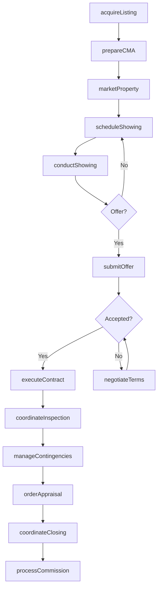
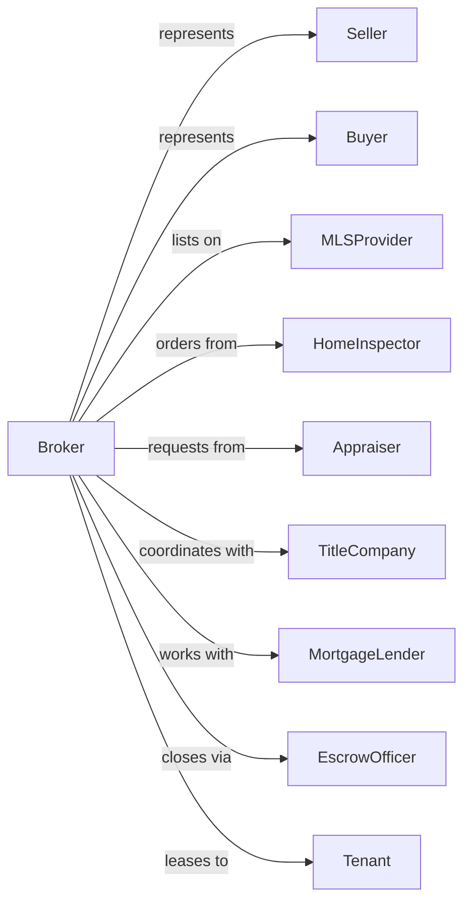

# Offices of Real Estate Agents and Brokers

> Business-as-Code definition for real estate brokerage operations. Models the complete transaction lifecycle from listing acquisition through closing.

## Overview

Real estate agents and brokers facilitate the buying, selling, and renting of residential and commercial properties on behalf of clients. This definition exposes actions for listing management, buyer representation, offer negotiation, and transaction coordination, with events enabling automated workflow triggers throughout the real estate transaction lifecycle.

## Actors

| Actor | Description |
|-------|-------------|
| Seller | Property owner listing for sale or lease |
| Buyer | Individual or entity purchasing property |
| Tenant | Person or business seeking rental property |
| TitleCompany | Provides title insurance and closing services |
| MortgageLender | Provides financing for property purchases |
| HomeInspector | Conducts property condition assessments |
| Appraiser | Determines property market value |
| EscrowOfficer | Manages transaction funds and documents |
| MLSProvider | Operates multiple listing service database |

## Roles

| Role | Description |
|------|-------------|
| BrokerOfRecord | Licensed broker responsible for brokerage compliance |
| ListingAgent | Represents sellers in property transactions |
| BuyersAgent | Represents buyers in property transactions |
| TransactionCoordinator | Manages paperwork and timeline from contract to close |
| MarketingSpecialist | Creates listings, photos, and promotional materials |

## Entities

| Entity | Description |
|--------|-------------|
| Listing | Property marketed for sale or lease |
| Client | Buyer or seller represented by agent |
| Offer | Purchase proposal with price and terms |
| Contract | Executed purchase or lease agreement |
| Commission | Fee earned for successful transaction |
| Showing | Scheduled property viewing appointment |
| CMA | Comparative market analysis for pricing |
| Disclosure | Required property condition disclosures |
| Contingency | Contract condition that must be satisfied |
| Escrow | Third-party account holding transaction funds |

## Actions

| Action | Description |
|--------|-------------|
| acquireListing | Sign listing agreement with property seller |
| marketProperty | Advertise listing through MLS and marketing channels |
| scheduleShowing | Arrange property viewing for prospective buyer |
| conductShowing | Present property to buyer and answer questions |
| prepareCMA | Analyze comparable sales for pricing guidance |
| submitOffer | Present purchase offer to seller on behalf of buyer |
| negotiateTerms | Counter and negotiate price and conditions |
| executeContract | Finalize signed purchase agreement |
| coordinateInspection | Schedule and manage property inspections |
| manageContingencies | Track and satisfy contract conditions |
| orderAppraisal | Request property valuation for lender |
| coordinateClosing | Manage final walkthrough and closing process |
| processCommission | Calculate and distribute commission payments |
| referClient | Send lead to another agent or brokerage |

## Events

| Event | Description |
|-------|-------------|
| listingAcquired | New listing agreement signed |
| listingPublished | Property posted to MLS and marketing channels |
| showingScheduled | Property viewing appointment confirmed |
| showingCompleted | Buyer has viewed the property |
| offerReceived | Purchase offer submitted |
| offerAccepted | Seller accepted offer terms |
| counterOfferIssued | Counter proposal sent to buyer |
| contractExecuted | Purchase agreement signed by all parties |
| inspectionCompleted | Property inspection finished |
| contingencyCleared | Contract contingency satisfied |
| appraisalCompleted | Property valuation received |
| clearedToClose | All conditions met for closing |
| transactionClosed | Sale completed and recorded |
| commissionPaid | Agent commission disbursed |

## Searches

| Search | Description |
|--------|-------------|
| findListings | Search active listings by criteria |
| getClientHistory | Retrieve transaction history for client |
| getActiveOffers | List pending offers by listing or agent |
| findPendingTransactions | Get contracts in progress by stage |
| getShowingSchedule | View upcoming property showings |
| getCommissionPipeline | Calculate projected commission revenue |
| findComparables | Search sold properties for CMA |

## Workflow



## Actor Relationships



## Usage

### Calling Actions

```typescript
import { brokerProperty } from '@headlessly/broker-property'

const brokerage = brokerProperty()

// Search active listings by criteria
const findListingsResult = await brokerage.findListings({ status: 'active', priceMax: 500000 })

// Retrieve transaction history for client
const getClientHistoryResult = await brokerage.getClientHistory({ clientId: 'client-abc' })

// Acquire a new listing
const listing = await brokerage.acquireListing({
  sellerId: 'seller-123',
  propertyAddress: '456 Oak Lane',
  listPrice: 525000,
  commissionRate: 0.06,
  listingTermDays: 180
})

// Submit an offer on behalf of buyer
const offer = await brokerage.submitOffer({
  listingId: 'listing-789',
  buyerId: 'buyer-456',
  offerPrice: 510000,
  earnestMoney: 15000,
  contingencies: ['financing', 'inspection', 'appraisal'],
  closingDate: '2024-04-15'
})

// Execute the purchase contract
await brokerage.executeContract({
  offerId: offer.id,
  acceptedPrice: 515000,
  closingDate: '2024-04-15',
  earnestMoneyHolder: 'first-title-co'
})
```

### Event-Driven Automation

```typescript
// Auto-schedule inspection when contract executed
brokerage.contractExecuted(async ({ contractId, propertyId, buyerId }) => {
  await brokerage.coordinateInspection({
    contractId,
    inspectionTypes: ['general', 'pest', 'radon'],
    deadlineDate: addDays(new Date(), 10)
  })
})

// Auto-notify when contingency cleared
brokerage.contingencyCleared(async ({ contractId, contingencyType }) => {
  const allCleared = await checkAllContingencies(contractId)

  if (allCleared) {
    await notifyParties({
      contractId,
      message: 'All contingencies satisfied - clear to proceed to closing'
    })

    await brokerage.coordinateClosing({
      contractId,
      scheduleFinalWalkthrough: true
    })
  }
})
```
