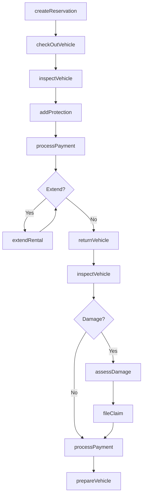
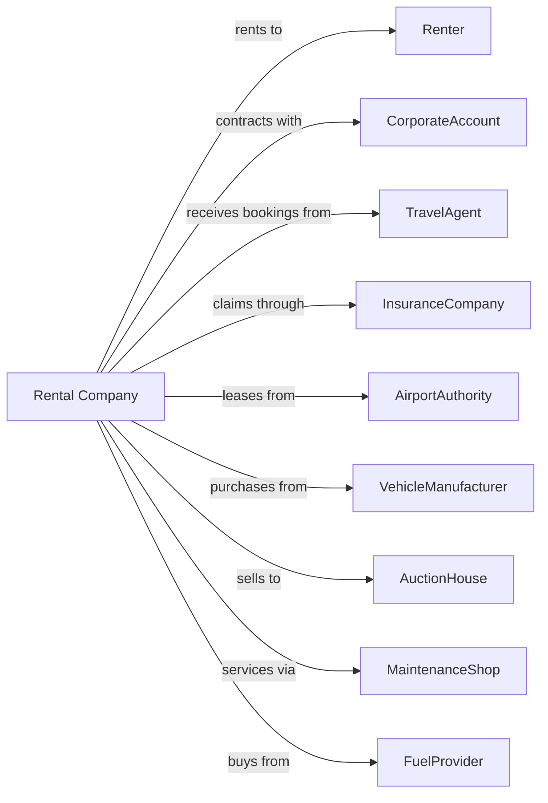

# Passenger Car Rental

> Business-as-Code definition for passenger car rental operations. Models the complete rental lifecycle from reservation through vehicle return.

## Overview

Passenger car rental companies provide short-term vehicle rentals to consumers and businesses, typically at airport and neighborhood locations. This definition exposes actions for fleet management, reservation handling, vehicle checkout, and damage claims, with events enabling automated workflow triggers throughout the car rental lifecycle.

## Actors

| Actor | Description |
|-------|-------------|
| Renter | Individual or business renting a vehicle |
| CorporateAccount | Business with negotiated rental rates |
| TravelAgent | Books rentals on behalf of travelers |
| InsuranceCompany | Provides collision and liability coverage |
| AirportAuthority | Manages airport rental facility concessions |
| VehicleManufacturer | Supplies fleet vehicles |
| AuctionHouse | Purchases retired fleet vehicles |
| FuelProvider | Supplies fuel for fleet vehicles |
| MaintenanceShop | Performs vehicle service and repairs |

## Roles

| Role | Description |
|------|-------------|
| LocationManager | Oversees rental location operations |
| RentalAgent | Processes reservations and checkouts |
| FleetManager | Manages vehicle inventory and utilization |
| ServiceTechnician | Maintains and prepares vehicles |
| ClaimsAdjuster | Processes damage and insurance claims |

## Entities

| Entity | Description |
|--------|-------------|
| Vehicle | Car, SUV, or van available for rent |
| Reservation | Booking for future vehicle rental |
| RentalAgreement | Contract for vehicle use |
| Rate | Daily, weekly, or monthly rental price |
| Damage | Vehicle damage requiring repair |
| Claim | Insurance or damage claim |
| Location | Rental branch or airport counter |
| Fleet | Collection of rental vehicles |
| AddOn | Optional product like GPS or insurance |
| Fuel | Vehicle fuel level and charges |

## Actions

| Action | Description |
|--------|-------------|
| createReservation | Book vehicle for future pickup |
| modifyReservation | Change dates, location, or vehicle class |
| checkOutVehicle | Process rental start and vehicle handoff |
| inspectVehicle | Document vehicle condition at checkout or return |
| addProtection | Attach insurance or damage waiver to rental |
| processPayment | Charge rental fees to customer |
| extendRental | Add days to active rental agreement |
| returnVehicle | Process rental completion and vehicle return |
| assessDamage | Evaluate and document new vehicle damage |
| fileClaim | Submit damage claim to insurance |
| prepareVehicle | Clean, fuel, and ready vehicle for rental |
| transferVehicle | Move vehicle between locations |
| retireVehicle | Remove vehicle from fleet for sale |
| reconcileReservation | Match reservation to completed rental |

## Events

| Event | Description |
|-------|-------------|
| reservationCreated | New booking confirmed |
| reservationModified | Booking details changed |
| reservationCanceled | Booking canceled by customer |
| vehicleCheckedOut | Rental started and vehicle departed |
| vehicleReturned | Vehicle returned to location |
| damageDetected | New damage found during inspection |
| claimFiled | Insurance claim submitted |
| claimResolved | Damage claim settled |
| paymentProcessed | Rental charges collected |
| vehiclePrepared | Vehicle ready for next rental |
| vehicleTransferred | Vehicle moved to new location |
| vehicleRetired | Vehicle removed from fleet |
| noShowOccurred | Customer did not pick up reservation |

## Searches

| Search | Description |
|--------|-------------|
| findAvailableVehicles | Search inventory by class and location |
| getReservations | List bookings by date or customer |
| getFleetStatus | View vehicle availability and location |
| getRentalHistory | Retrieve past rentals for customer |
| getDamageQueue | List vehicles with pending damage claims |
| getUtilizationReport | Calculate fleet utilization metrics |
| findOverdueRentals | List rentals past expected return |

## Workflow



## Actor Relationships



## Usage

### Calling Actions

```typescript
import { rentCars } from '@headlessly/rent-cars'

const rental = rentCars()

// Search inventory by class and location
const availableVehicles = await rental.findAvailableVehicles({ location: 'LAX-airport', class: 'fullSize', date: '2024-03-15' })

// List bookings by date or customer
const reservations = await rental.getReservations({ location: 'LAX-airport', date: '2024-03-15' })

// Create a reservation
const reservation = await rental.createReservation({
  customerId: 'cust-12345',
  pickupLocation: 'LAX-airport',
  returnLocation: 'LAX-airport',
  pickupDate: '2024-03-15T10:00:00',
  returnDate: '2024-03-20T10:00:00',
  vehicleClass: 'fullSize'
})

// Check out the vehicle
const agreement = await rental.checkOutVehicle({
  reservationId: reservation.id,
  vehicleId: 'VH-78234',
  addOns: ['gps', 'cdw'],
  prepaidFuel: true
})

// Return the vehicle
await rental.returnVehicle({
  agreementId: agreement.id,
  returnMileage: 45230,
  fuelLevel: 0.75,
  inspectionNotes: 'Clean, no new damage'
})
```

### Event-Driven Automation

```typescript
// Auto-file claim when damage detected
rental.damageDetected(async ({ agreementId, vehicleId, damageDescription }) => {
  const agreement = await getRentalAgreement(agreementId)

  if (agreement.hasDamageWaiver) {
    await rental.fileClaim({
      agreementId,
      vehicleId,
      claimType: 'damageWaiver',
      description: damageDescription
    })
  } else {
    await chargeCustomer({
      customerId: agreement.customerId,
      amount: await estimateRepairCost(damageDescription)
    })
  }
})

// Auto-prepare vehicle after return
rental.vehicleReturned(async ({ vehicleId, locationId }) => {
  await rental.prepareVehicle({
    vehicleId,
    tasks: ['inspection', 'cleaning', 'fueling'],
    prioritize: await isHighDemand(locationId)
  })
})
```
