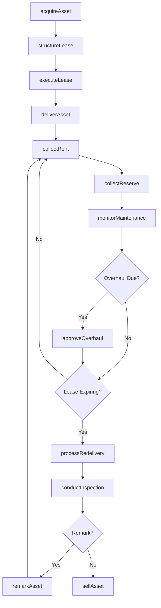
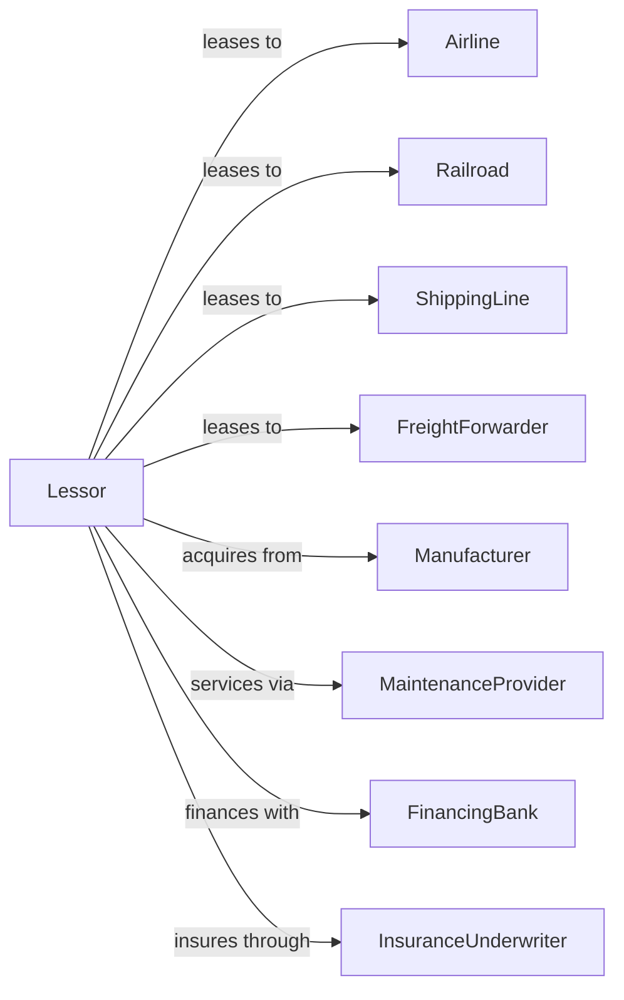

# Commercial Air, Rail, and Water Transportation Equipment Rental and Leasing

> Business-as-Code definition for commercial transportation equipment leasing operations. Models the complete lease lifecycle from inquiry through asset return.

## Overview

Commercial transportation equipment lessors provide aircraft, railcars, ships, barges, and intermodal containers to airlines, railroads, and shipping companies under operating and finance leases. This definition exposes actions for asset acquisition, lease structuring, maintenance oversight, and residual value management, with events enabling automated workflow triggers throughout the transportation equipment leasing lifecycle.

## Actors

| Actor | Description |
|-------|-------------|
| Airline | Air carrier leasing aircraft |
| Railroad | Rail company leasing rolling stock |
| ShippingLine | Marine carrier leasing vessels |
| FreightForwarder | Logistics company leasing containers |
| Manufacturer | Produces aircraft, railcars, or vessels |
| MaintenanceProvider | Performs heavy maintenance and overhauls |
| FinancingBank | Provides leverage for asset acquisition |
| InsuranceUnderwriter | Provides hull and liability coverage |
| RegulatoryAuthority | FAA, FRA, or maritime safety agency |

## Roles

| Role | Description |
|------|-------------|
| AssetManager | Oversees fleet value and utilization |
| PortfolioManager | Manages lessee relationships and lease terms |
| TechnicalManager | Monitors asset condition and maintenance |
| StructuringAnalyst | Designs lease financial structures |
| RemarketingSpecialist | Places returned assets with new lessees |

## Entities

| Entity | Description |
|--------|-------------|
| Asset | Aircraft, railcar, vessel, or container |
| Lease | Operating or finance lease agreement |
| Lessee | Company using leased equipment |
| MaintenanceReserve | Escrow for overhaul expenses |
| Residual | Estimated asset value at lease end |
| Certificate | Airworthiness or safety certification |
| Overhaul | Major maintenance event |
| Redelivery | Asset return process and conditions |
| Sublease | Secondary lease to third party |
| Portfolio | Collection of leased assets |

## Actions

| Action | Description |
|--------|-------------|
| acquireAsset | Purchase aircraft, railcar, or vessel |
| structureLease | Design lease terms and financial structure |
| executeLease | Finalize and sign lease agreement |
| deliverAsset | Transfer asset to lessee |
| collectRent | Process monthly lease payment |
| collectReserve | Accumulate maintenance reserves |
| monitorMaintenance | Track asset condition and compliance |
| approveOverhaul | Authorize major maintenance event |
| conductInspection | Physical examination of leased asset |
| processRedelivery | Manage asset return from lessee |
| remarkAsset | Place returned asset with new lessee |
| sellAsset | Dispose of asset at end of life |
| refinanceAsset | Restructure asset financing |
| extendLease | Negotiate lease term extension |

## Events

| Event | Description |
|-------|-------------|
| assetAcquired | New equipment purchased |
| leaseExecuted | Agreement signed with lessee |
| assetDelivered | Equipment transferred to lessee |
| rentReceived | Monthly payment processed |
| reserveCollected | Maintenance escrow deposited |
| maintenanceScheduled | Service event planned |
| overhaulCompleted | Major maintenance finished |
| inspectionCompleted | Asset condition assessed |
| leaseExpiring | Lease approaching maturity |
| redeliveryInitiated | Asset return process started |
| assetRemarked | Equipment placed with new lessee |
| assetSold | Equipment disposed |
| defaultOccurred | Lessee failed to perform |

## Searches

| Search | Description |
|--------|-------------|
| getPortfolio | List all leased assets |
| findAvailableAssets | Search unleased equipment |
| getLeaseExpirations | List leases maturing within period |
| getMaintenanceSchedule | View upcoming service events |
| getReserveBalances | Check maintenance escrow by asset |
| getUtilizationReport | Analyze asset usage metrics |
| findDefaultedLeases | List non-performing agreements |

## Workflow



## Actor Relationships



## Usage

### Calling Actions

```typescript
import { leaseAircraft } from '@headlessly/lease-aircraft'

const lessor = leaseAircraft()

// List all leased assets
const getPortfolioResult = await lessor.getPortfolio({ status: 'active' })

// Search unleased equipment
const findAvailableAssetsResult = await lessor.findAvailableAssets({ status: 'active' })

// Acquire a new aircraft
const asset = await lessor.acquireAsset({
  type: 'aircraft',
  manufacturer: 'Boeing',
  model: '737-800',
  msn: '12345',
  deliveryDate: '2024-06-01',
  purchasePrice: 45000000
})

// Structure and execute a lease
const lease = await lessor.executeLease({
  assetId: asset.id,
  lesseeId: 'southwest-airlines',
  termMonths: 120,
  monthlyRent: 385000,
  maintenanceReserve: 125000,
  redeliveryConditions: 'fullLifeOverhaul'
})

// Collect monthly rent and reserves
await lessor.collectRent({
  leaseId: lease.id,
  amount: 385000,
  dueDate: '2024-07-01'
})

await lessor.collectReserve({
  leaseId: lease.id,
  reserveType: 'engine',
  amount: 125000
})
```

### Event-Driven Automation

```typescript
// Auto-notify when lease expiring
lessor.leaseExpiring(async ({ leaseId, assetId, lesseeId, expirationDate }) => {
  const monthsRemaining = differenceInMonths(expirationDate, new Date())

  if (monthsRemaining === 24) {
    await initiateRenewalDiscussion({
      lesseeId,
      assetId,
      currentTerms: await getLeaseTerms(leaseId)
    })

    // Start remarketing in parallel
    await lessor.remarkAsset({
      assetId,
      availableDate: expirationDate,
      marketingChannels: ['directContacts', 'brokers', 'tradePubs']
    })
  }
})

// Auto-approve standard overhauls from reserves
lessor.maintenanceScheduled(async ({ assetId, leaseId, overhaulType, estimatedCost }) => {
  const reserveBalance = await getReserveBalance(leaseId, overhaulType)

  if (reserveBalance >= estimatedCost) {
    await lessor.approveOverhaul({
      assetId,
      overhaulType,
      fundingSource: 'reserves',
      approvedAmount: estimatedCost
    })
  }
})
```
