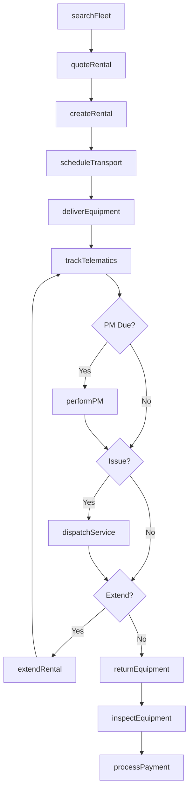
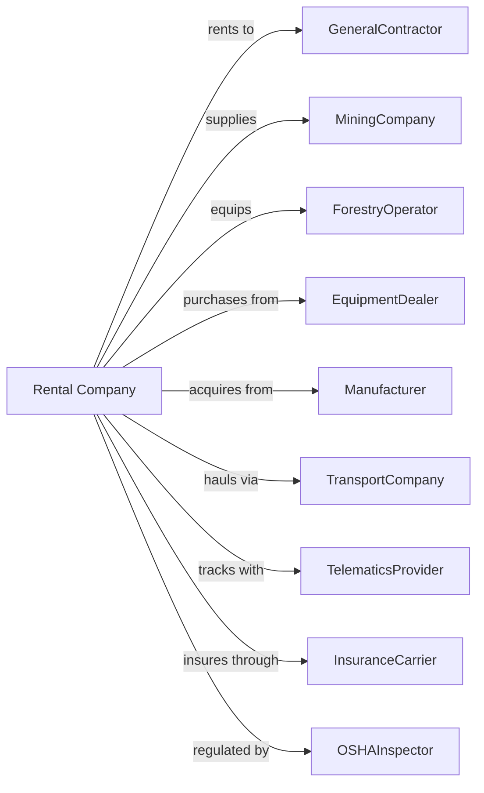

# Construction, Mining, and Forestry Machinery and Equipment Rental and Leasing

> Business-as-Code definition for heavy equipment rental and leasing operations. Models the complete rental lifecycle from fleet acquisition through equipment return.

## Overview

Heavy equipment rental companies provide excavators, bulldozers, cranes, drilling rigs, and forestry machines to construction contractors, mining operations, and timber companies. This definition exposes actions for fleet management, job site delivery, maintenance coordination, and utilization tracking, with events enabling automated workflow triggers throughout the heavy equipment rental lifecycle.

## Actors

| Actor | Description |
|-------|-------------|
| GeneralContractor | Construction company renting equipment |
| MiningCompany | Resource extraction firm leasing machinery |
| ForestryOperator | Timber company renting logging equipment |
| EquipmentDealer | Sells and services heavy machinery |
| Manufacturer | Produces construction and mining equipment |
| TransportCompany | Hauls equipment to job sites |
| TelematicsProvider | Supplies equipment tracking systems |
| InsuranceCarrier | Provides equipment and liability coverage |
| OSHAInspector | Regulates workplace safety compliance |

## Roles

| Role | Description |
|------|-------------|
| BranchManager | Oversees regional rental operations |
| FleetManager | Manages equipment inventory and utilization |
| FieldServiceTech | Performs on-site repairs |
| TransportCoordinator | Schedules equipment hauling |
| SalesRepresentative | Develops contractor relationships |

## Entities

| Entity | Description |
|--------|-------------|
| Equipment | Excavator, crane, or heavy machine |
| Rental | Active equipment rental agreement |
| Fleet | Collection of rental equipment |
| JobSite | Customer work location |
| Transport | Equipment delivery or pickup |
| Telematics | Equipment tracking and diagnostics |
| Maintenance | Service event or repair |
| Utilization | Equipment usage metrics |
| Rate | Daily, weekly, or monthly rental price |
| Attachment | Bucket, blade, or accessory |

## Actions

| Action | Description |
|--------|-------------|
| searchFleet | Find available equipment by type and size |
| quoteRental | Calculate rental rate and terms |
| createRental | Process equipment rental agreement |
| scheduleTransport | Arrange equipment hauling |
| deliverEquipment | Transport machine to job site |
| trackTelematics | Monitor equipment location and hours |
| performPM | Conduct preventive maintenance |
| dispatchService | Send technician for field repair |
| extendRental | Add time to active rental |
| returnEquipment | Process rental completion |
| inspectEquipment | Assess condition and damage |
| processPayment | Charge rental and service fees |
| retireEquipment | Remove from fleet for sale |
| transferEquipment | Move between branches |

## Events

| Event | Description |
|-------|-------------|
| rentalCreated | Equipment booked for job |
| transportScheduled | Hauling arranged |
| equipmentDelivered | Machine arrived at job site |
| telematicsAnomalyDetected | Telematics system detected equipment anomaly |
| pmBecameDue | Preventive maintenance required |
| serviceDispatched | Technician sent to site |
| serviceCompleted | Repair finished |
| rentalExtended | Additional time added |
| equipmentReturned | Machine back at yard |
| damageAssessed | Condition report completed |
| paymentProcessed | Charges collected |
| lowUtilizationDetected | Equipment utilization dropped below threshold |

## Searches

| Search | Description |
|--------|-------------|
| findAvailableEquipment | Search by type, size, and location |
| getActiveRentals | List equipment currently on rent |
| getFleetUtilization | Calculate usage by branch and type |
| getMaintenanceSchedule | View upcoming service requirements |
| getTelematicsData | Retrieve location and hours data |
| getTransportSchedule | View pending deliveries and pickups |
| findUnderutilized | List equipment below target utilization |

## Workflow



## Actor Relationships



## Usage

### Calling Actions

```typescript
import { leaseMachinery } from '@headlessly/lease-machinery'

const rental = leaseMachinery()

// Search by type, size, and location
const availableEquipment = await rental.findAvailableEquipment({ type: 'excavator', tonnage: 20, location: 'Dallas' })

// List equipment currently on rent
const activeRentals = await rental.getActiveRentals({ customer: 'turner-construction' })

// Search for excavators
const available = await rental.searchFleet({
  equipmentType: 'excavator',
  sizeClass: '35-ton',
  location: 'denver-branch',
  startDate: '2024-04-01',
  duration: 30
})

// Create rental with transport
const agreement = await rental.createRental({
  customerId: 'abc-construction',
  equipmentId: 'CAT-349F-1234',
  startDate: '2024-04-01',
  estimatedDays: 30,
  jobSite: {
    address: '1000 Highway Construction Project',
    accessNotes: 'Enter from mile marker 45'
  },
  attachments: ['36-inch-bucket', '60-inch-cleanup-bucket']
})

await rental.scheduleTransport({
  rentalId: agreement.id,
  transportType: 'lowboy',
  deliveryDate: '2024-04-01T06:00:00',
  permitRequired: true
})
```

### Event-Driven Automation

```typescript
// Auto-dispatch service on telematics alert
rental.telematicsAnomalyDetected(async ({ equipmentId, alertType, severity }) => {
  if (severity === 'critical') {
    await rental.dispatchService({
      equipmentId,
      issueType: alertType,
      priority: 'emergency',
      onSiteBy: addHours(new Date(), 4)
    })
  }
})

// Auto-transfer underutilized equipment
rental.lowUtilizationDetected(async ({ equipmentId, currentBranch, utilization }) => {
  const demandAnalysis = await analyzeDemand(equipmentId)

  if (demandAnalysis.higherDemandBranch) {
    await rental.transferEquipment({
      equipmentId,
      fromBranch: currentBranch,
      toBranch: demandAnalysis.higherDemandBranch,
      transferDate: addDays(new Date(), 3)
    })
  }
})
```
