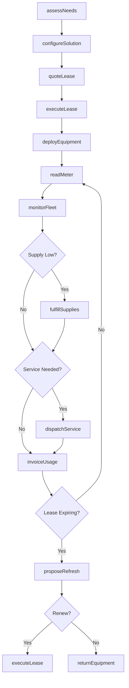
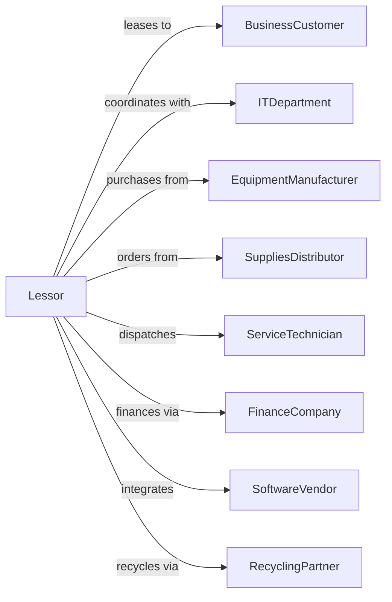

# Office Machinery and Equipment Rental and Leasing

> Business-as-Code definition for office equipment leasing operations. Models the complete lease lifecycle from assessment through equipment return.

## Overview

Office equipment lessors provide computers, copiers, printers, office furniture, and telecommunications equipment to businesses under lease agreements and managed print services contracts. This definition exposes actions for equipment deployment, usage monitoring, supplies fulfillment, and technology refresh, with events enabling automated workflow triggers throughout the office equipment leasing lifecycle.

## Actors

| Actor | Description |
|-------|-------------|
| BusinessCustomer | Company leasing office equipment |
| ITDepartment | Customer IT staff coordinating deployments |
| EquipmentManufacturer | Produces copiers, printers, and computers |
| SuppliesDistributor | Provides toner, ink, and consumables |
| ServiceTechnician | Performs equipment repairs |
| FinanceCompany | Provides lease financing |
| SoftwareVendor | Supplies print management software |
| RecyclingPartner | Disposes of end-of-life equipment |
| TradeInProgram | Accepts used equipment for credit |

## Roles

| Role | Description |
|------|-------------|
| AccountExecutive | Manages customer relationships |
| SolutionsArchitect | Designs equipment configurations |
| ServiceCoordinator | Schedules repairs and maintenance |
| BillingSpecialist | Manages lease invoicing and usage charges |
| RefreshPlanner | Coordinates technology upgrade cycles |

## Entities

| Entity | Description |
|--------|-------------|
| Equipment | Copier, printer, computer, or furniture |
| Lease | Equipment lease agreement |
| MPS | Managed print services contract |
| Usage | Print volume or equipment utilization |
| Supplies | Toner, ink, and consumables |
| ServiceCall | Repair or maintenance request |
| Fleet | Customer's deployed equipment |
| Invoice | Monthly lease and usage charges |
| Refresh | Technology upgrade cycle |
| Meter | Equipment usage counter |

## Actions

| Action | Description |
|--------|-------------|
| assessNeeds | Evaluate customer equipment requirements |
| configureSolution | Design equipment and service package |
| quoteLease | Calculate monthly lease and usage rates |
| executeLease | Finalize equipment lease agreement |
| deployEquipment | Install and configure equipment |
| readMeter | Capture usage counters |
| fulfillSupplies | Ship toner and consumables |
| dispatchService | Send technician for repair |
| invoiceUsage | Bill for prints and usage |
| monitorFleet | Track equipment health and usage |
| proposeRefresh | Recommend technology upgrade |
| returnEquipment | Process lease-end equipment return |
| disposEquipment | Recycle or remarket returned units |
| extendLease | Negotiate lease term extension |

## Events

| Event | Description |
|-------|-------------|
| needsAssessed | Customer requirements documented |
| leaseExecuted | Agreement signed |
| equipmentDeployed | Devices installed at customer |
| meterRead | Usage counters captured |
| suppliesShipped | Consumables dispatched |
| supplyLow | Toner or ink running low |
| serviceRequested | Repair call logged |
| serviceCompleted | Repair finished |
| invoiceGenerated | Monthly bill created |
| leaseExpiring | Lease approaching maturity |
| refreshProposed | Upgrade recommendation sent |
| equipmentReturned | Devices picked up |

## Searches

| Search | Description |
|--------|-------------|
| getCustomerFleet | List deployed equipment by customer |
| getUsageReport | View print volumes and trends |
| getServiceHistory | Retrieve repair records |
| getSupplyLevels | Check consumable inventory |
| findExpiringLeases | List leases maturing soon |
| getInvoiceHistory | Retrieve billing records |
| getMeterReadings | View historical usage data |

## Workflow



## Actor Relationships



## Usage

### Calling Actions

```typescript
import { leaseOfficeEquipment } from '@headlessly/lease-office-equipment'

const lessor = leaseOfficeEquipment()

// Assess customer needs
const assessment = await lessor.assessNeeds({
  customerId: 'acme-corp',
  locations: ['headquarters', 'branch-west'],
  currentVolume: 50000,
  colorPercentage: 0.20,
  scanRequirements: true
})

// Configure solution
const solution = await lessor.configureSolution({
  assessmentId: assessment.id,
  devices: [
    { model: 'MFP-Color-60ppm', quantity: 3 },
    { model: 'Desktop-BW-40ppm', quantity: 10 }
  ],
  services: ['managedPrint', 'autoSupply', 'secureRelease']
})

// Execute lease agreement
const lease = await lessor.executeLease({
  customerId: 'acme-corp',
  solutionId: solution.id,
  termMonths: 60,
  monthlyBase: 1250,
  bwCostPerPage: 0.008,
  colorCostPerPage: 0.05,
  includeSupplies: true
})
```

### Event-Driven Automation

```typescript
// Auto-ship supplies when low
lessor.supplyLow(async ({ equipmentId, supplyType, remainingPercent }) => {
  if (remainingPercent <= 15) {
    await lessor.fulfillSupplies({
      equipmentId,
      supplyType,
      quantity: 1,
      shippingMethod: 'standard'
    })
  }
})

// Auto-propose refresh before lease expires
lessor.leaseExpiring(async ({ leaseId, customerId, expirationDate }) => {
  const monthsRemaining = differenceInMonths(expirationDate, new Date())

  if (monthsRemaining === 6) {
    const currentFleet = await getCustomerFleet(customerId)
    const upgradedConfig = await generateRefreshProposal(currentFleet)

    await lessor.proposeRefresh({
      customerId,
      currentLeaseId: leaseId,
      proposedConfiguration: upgradedConfig,
      incentives: ['earlyTermination', 'tradeInCredit']
    })
  }
})
```
