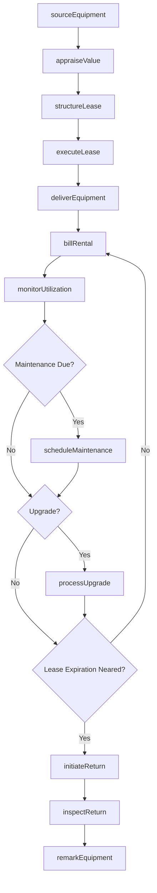
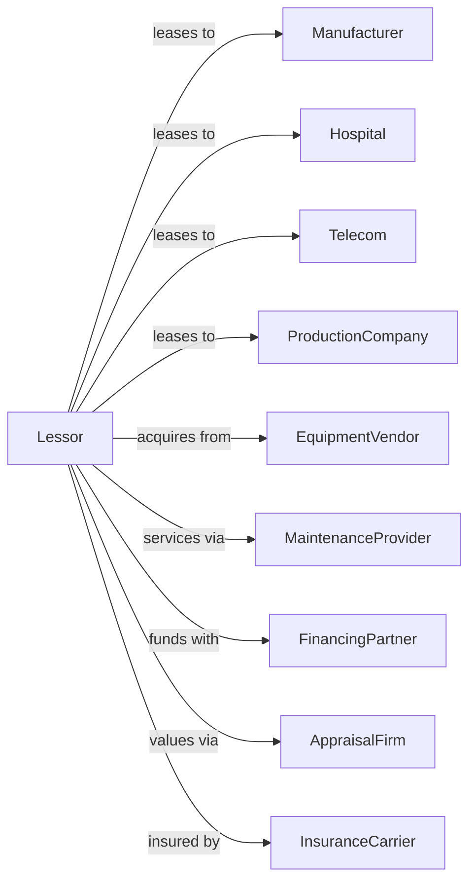

# Other Commercial and Industrial Machinery and Equipment Rental and Leasing

> Business-as-Code definition for specialized commercial equipment leasing operations. Models the complete lease lifecycle from equipment selection through return.

## Overview

Specialized equipment lessors provide manufacturing machinery, medical equipment, telecommunications systems, stage and theatrical equipment, and other commercial assets not classified elsewhere. This definition exposes actions for equipment acquisition, lease structuring, maintenance management, and asset remarketing, with events enabling automated workflow triggers throughout the commercial equipment leasing lifecycle.

## Actors

| Actor | Description |
|-------|-------------|
| Manufacturer | Industrial company leasing production equipment |
| Hospital | Healthcare facility leasing medical equipment |
| Telecom | Communications provider leasing network gear |
| ProductionCompany | Film or theater company leasing stage equipment |
| EquipmentVendor | Sells commercial and industrial machinery |
| MaintenanceProvider | Services and repairs leased equipment |
| FinancingPartner | Provides lease funding |
| InsuranceCarrier | Covers equipment and liability |
| AppraisalFirm | Values equipment for residual estimates |

## Roles

| Role | Description |
|------|-------------|
| LeaseOriginator | Structures and closes lease transactions |
| AssetSpecialist | Evaluates equipment value and condition |
| PortfolioManager | Oversees active lease portfolio |
| ServiceCoordinator | Manages maintenance and repairs |
| RemarketingManager | Places off-lease equipment |

## Entities

| Entity | Description |
|--------|-------------|
| Equipment | Machinery or commercial asset |
| Lease | Operating or finance lease agreement |
| Lessee | Company using leased equipment |
| Residual | Estimated end-of-lease value |
| Maintenance | Service and repair requirements |
| Appraisal | Equipment valuation report |
| RentalRate | Monthly or usage-based charge |
| Upgrade | Mid-term equipment enhancement |
| Return | Lease-end equipment redelivery |
| Remarket | Process to place returned equipment |

## Actions

| Action | Description |
|--------|-------------|
| sourceEquipment | Acquire or locate equipment for lease |
| appraiseValue | Determine equipment fair market value |
| structureLease | Design lease terms and payment schedule |
| executeLease | Finalize lease agreement |
| deliverEquipment | Install equipment at lessee site |
| billRental | Invoice monthly lease payments |
| scheduleMaintenance | Arrange equipment service |
| performMaintenance | Complete equipment repair or service |
| processUpgrade | Implement mid-term equipment enhancement |
| monitorUtilization | Track equipment usage |
| initiateReturn | Begin lease-end return process |
| inspectReturn | Assess returned equipment condition |
| remarkEquipment | Market and place returned equipment |
| extendLease | Negotiate lease term extension |

## Events

| Event | Description |
|-------|-------------|
| equipmentSourced | Asset acquired for lease |
| appraisalCompleted | Valuation report received |
| leaseExecuted | Agreement signed |
| equipmentDelivered | Asset installed at lessee |
| rentalBilled | Invoice generated |
| paymentReceived | Lease payment processed |
| maintenanceScheduled | Service appointment set |
| maintenanceCompleted | Service finished |
| upgradeCompleted | Enhancement installed |
| leaseExpirationNeared | Lease approaching maturity |
| returnInitiated | Lease-end process started |
| equipmentInspected | Return condition assessed |
| equipmentRemarked | Asset placed with new lessee |

## Searches

| Search | Description |
|--------|-------------|
| getLeasePortfolio | List active leases by status |
| findAvailableEquipment | Search unleased inventory |
| getExpiringLeases | List leases maturing within period |
| getMaintenanceSchedule | View upcoming service events |
| getUtilizationReport | Analyze equipment usage |
| getAppraisalHistory | Retrieve equipment valuations |
| findRemarketingQueue | List equipment awaiting placement |

## Workflow



## Actor Relationships



## Usage

### Calling Actions

```typescript
import { leaseEquipment } from '@headlessly/lease-equipment'

const lessor = leaseEquipment()

// List active leases by status
const getLeasePortfolioResult = await lessor.getLeasePortfolio({ status: 'active' })

// Search unleased inventory
const findAvailableEquipmentResult = await lessor.findAvailableEquipment({ status: 'active' })

// Source medical imaging equipment
const equipment = await lessor.sourceEquipment({
  type: 'medicalImaging',
  manufacturer: 'GE Healthcare',
  model: 'Discovery CT750 HD',
  condition: 'new',
  purchasePrice: 850000
})

// Get appraisal for residual
const appraisal = await lessor.appraiseValue({
  equipmentId: equipment.id,
  valuationDate: new Date(),
  projectedLifeYears: 7
})

// Structure and execute lease
const lease = await lessor.executeLease({
  equipmentId: equipment.id,
  lesseeId: 'regional-medical-center',
  termMonths: 60,
  monthlyRent: 18500,
  maintenanceIncluded: true,
  residualGuarantee: appraisal.projectedResidual * 0.85
})
```

### Event-Driven Automation

```typescript
// Auto-schedule preventive maintenance
lessor.equipmentDelivered(async ({ equipmentId, equipmentType }) => {
  const pmSchedule = getPMSchedule(equipmentType)

  for (const interval of pmSchedule) {
    scheduleTask(addMonths(new Date(), interval.months), async () => {
      await lessor.scheduleMaintenance({
        equipmentId,
        maintenanceType: interval.type,
        priority: 'scheduled'
      })
    })
  }
})

// Auto-remarket when lease expires
lessor.leaseExpirationNeared(async ({ leaseId, equipmentId, lesseeId }) => {
  // Offer renewal first
  const renewed = await offerRenewal(leaseId, lesseeId)

  if (!renewed) {
    await lessor.initiateReturn({
      leaseId,
      returnDate: getLeaseEndDate(leaseId)
    })

    // Begin remarketing
    await lessor.remarkEquipment({
      equipmentId,
      channels: ['directSales', 'brokers', 'auctions'],
      minimumPrice: await getResidualValue(equipmentId)
    })
  }
})
```
