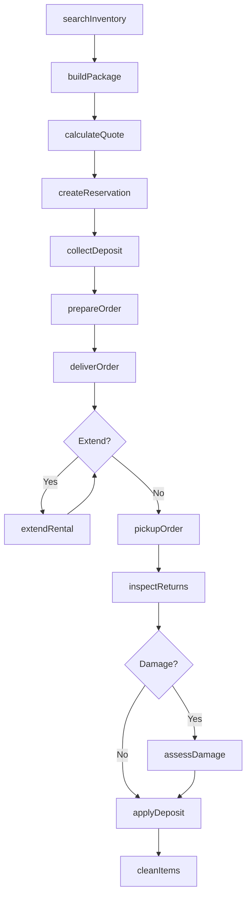
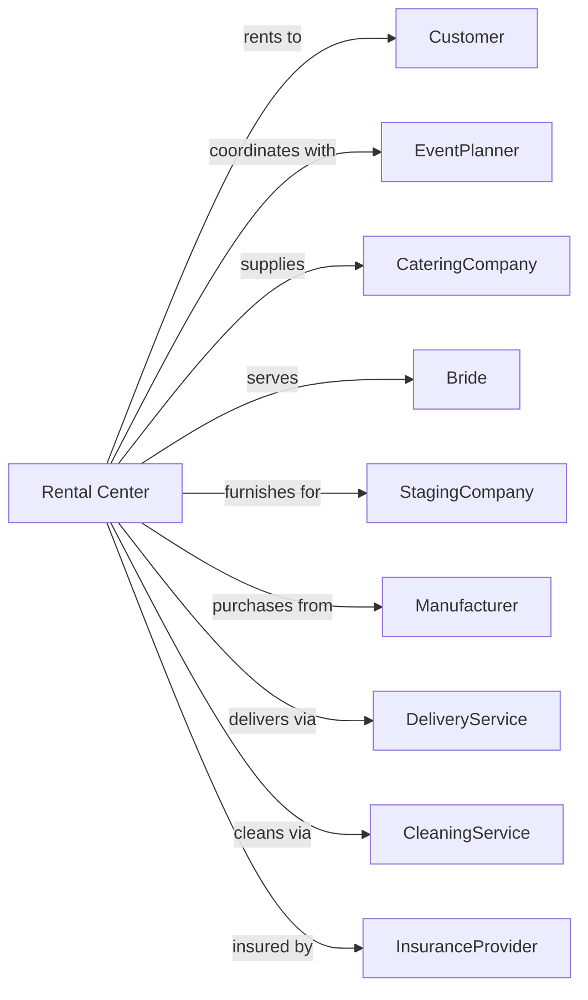

# All Other Consumer Goods Rental

> Business-as-Code definition for general consumer goods rental operations including party supplies, furniture, and specialty items. Models the complete rental lifecycle from inquiry through return.

## Overview

Consumer goods rental centers provide furniture, party supplies, baby equipment, tools, and specialty items for temporary use by individuals and event planners. This definition exposes actions for inventory management, event coordination, delivery scheduling, and damage assessment, with events enabling automated workflow triggers throughout the consumer rental lifecycle.

## Actors

| Actor | Description |
|-------|-------------|
| Customer | Individual renting consumer goods |
| EventPlanner | Professional coordinating party rentals |
| CateringCompany | Business renting event supplies |
| Bride | Wedding customer coordinating rentals |
| StagingCompany | Home stager renting furniture |
| Manufacturer | Supplies rental inventory |
| DeliveryService | Transports items to events |
| CleaningService | Cleans and sanitizes returns |
| InsuranceProvider | Offers damage protection |

## Roles

| Role | Description |
|------|-------------|
| StoreManager | Oversees rental center operations |
| EventCoordinator | Plans and coordinates large events |
| WarehouseManager | Manages inventory and fulfillment |
| DeliveryDriver | Delivers and sets up rentals |
| SalesConsultant | Assists customers with selections |
| SetupCrew | Assembles, installs, and strikes rental items at event venues |

## Entities

| Entity | Description |
|--------|-------------|
| Item | Furniture, party supply, or rental good |
| Reservation | Booking for rental items |
| Rental | Active rental agreement |
| Event | Party, wedding, or occasion using rentals |
| Package | Bundled rental items for event |
| Delivery | Scheduled delivery and pickup |
| Damage | Item damage or loss |
| Deposit | Security deposit for rental |
| Category | Product type classification |
| SetupService | Assembly and arrangement service |

## Actions

| Action | Description |
|--------|-------------|
| searchInventory | Find items by category and availability |
| createReservation | Book items for event date |
| buildPackage | Assemble bundled rental for event |
| calculateQuote | Price rental with delivery and setup |
| collectDeposit | Charge security deposit |
| prepareOrder | Pull and stage items for delivery |
| deliverOrder | Transport and set up rentals |
| extendRental | Add days to active rental |
| pickupOrder | Retrieve items after event |
| inspectReturns | Check items for damage |
| assessDamage | Price repair or replacement |
| applyDeposit | Credit or charge against deposit |
| cleanItems | Sanitize and prepare for next rental |
| retireItem | Remove damaged or worn inventory |

## Events

| Event | Description |
|-------|-------------|
| reservationCreated | Items booked for event |
| quoteProvided | Pricing sent to customer |
| depositCollected | Security deposit charged |
| orderPrepared | Items staged for delivery |
| orderDelivered | Rentals set up at venue |
| rentalExtended | Additional time added |
| pickupCompleted | Items retrieved from venue |
| damageFound | Issue discovered during inspection |
| depositApplied | Deposit credited or charged |
| itemCleaned | Item sanitized and restocked |
| itemRetired | Item removed from inventory |
| paymentProcessed | Rental charges collected |

## Searches

| Search | Description |
|--------|-------------|
| findAvailableItems | Search by category and date |
| getReservations | List bookings by date or event |
| getEventDetails | View complete event rental order |
| getDeliverySchedule | View upcoming deliveries and pickups |
| getDamageQueue | List items awaiting damage assessment |
| getInventoryLevels | Check stock by category |
| getPackageOptions | List available event packages |

## Workflow



## Actor Relationships



## Usage

### Calling Actions

```typescript
import { rentGoods } from '@headlessly/rent-goods'

const center = rentGoods()

// Search by category and date
const availableItems = await center.findAvailableItems({ category: 'party-supplies', date: '2024-06-15' })

// List bookings by date or event
const reservations = await center.getReservations({ date: '2024-06-15' })

// Search for party supplies
const items = await center.searchInventory({
  category: 'partyTables',
  eventDate: '2024-05-15',
  quantity: 10,
  style: 'round-60inch'
})

// Build a wedding reception package
const package_ = await center.buildPackage({
  eventType: 'weddingReception',
  guestCount: 150,
  items: [
    { category: 'tables', quantity: 15 },
    { category: 'chairs', quantity: 150 },
    { category: 'linens', quantity: 15 },
    { category: 'centerpieces', quantity: 15 },
    { category: 'danceFloor', quantity: 1 }
  ],
  services: ['delivery', 'setup', 'breakdown', 'pickup']
})

// Create reservation and collect deposit
const reservation = await center.createReservation({
  customerId: 'bride-12345',
  packageId: package_.id,
  eventDate: '2024-05-15',
  eventVenue: '123 Wedding Hall Lane',
  deliveryTime: '09:00',
  pickupTime: '23:00'
})

await center.collectDeposit({
  reservationId: reservation.id,
  amount: reservation.depositRequired
})
```

### Event-Driven Automation

```typescript
// Auto-prepare order before delivery
center.depositCollected(async ({ reservationId, eventDate }) => {
  const prepDate = subDays(eventDate, 2)

  scheduleTask(prepDate, async () => {
    await center.prepareOrder({
      reservationId,
      verifyInventory: true,
      stageForLoading: true
    })
  })
})

// Auto-assess and apply deposit after inspection
center.pickupCompleted(async ({ reservationId, depositAmount }) => {
  const inspection = await center.inspectReturns({ reservationId })

  if (inspection.damageItems.length > 0) {
    const damages = await center.assessDamage({
      reservationId,
      items: inspection.damageItems
    })

    await center.applyDeposit({
      reservationId,
      deductions: damages.totalCost,
      refundAmount: Math.max(0, depositAmount - damages.totalCost)
    })
  } else {
    await center.applyDeposit({
      reservationId,
      deductions: 0,
      refundAmount: depositAmount
    })
  }
})
```
