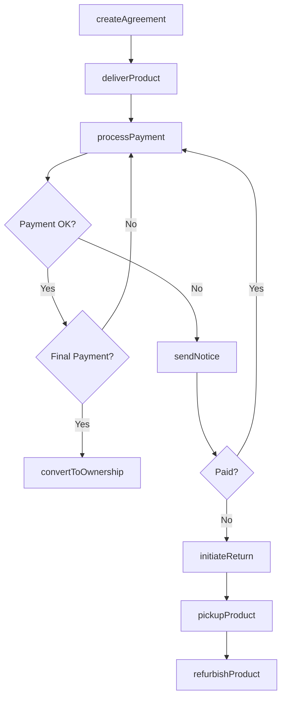
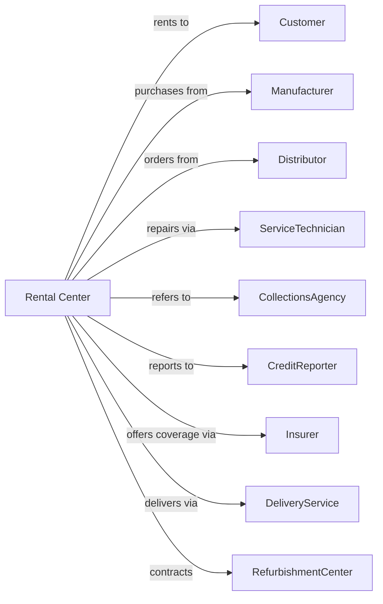

# Consumer Electronics and Appliances Rental

> Business-as-Code definition for consumer electronics and appliance rental operations. Models the complete rental lifecycle from agreement through return or purchase.

## Overview

Consumer electronics and appliance rental centers provide rent-to-own and rental agreements for televisions, computers, furniture, and major appliances. This definition exposes actions for agreement origination, payment processing, service calls, and ownership transfer, with events enabling automated workflow triggers throughout the rental lifecycle.

## Actors

| Actor | Description |
|-------|-------------|
| Customer | Individual renting electronics or appliances |
| Manufacturer | Supplies rental inventory |
| Distributor | Wholesaler providing product |
| ServiceTechnician | Repairs and services equipment |
| CollectionsAgency | Pursues delinquent accounts |
| CreditReporter | Receives payment history data |
| Insurer | Provides product protection plans |
| DeliveryService | Transports items to customers |
| RefurbishmentCenter | Restores returned merchandise |

## Roles

| Role | Description |
|------|-------------|
| StoreManager | Oversees retail location operations |
| SalesAssociate | Processes rentals and payments |
| AccountSpecialist | Manages customer accounts and collections |
| ServiceCoordinator | Schedules repairs and service calls |
| InventoryManager | Manages product stock and ordering |
| DeliveryInstaller | Delivers, sets up, and demonstrates rented equipment in homes |

## Entities

| Entity | Description |
|--------|-------------|
| RentalAgreement | Contract for product rental |
| Product | Television, appliance, or electronics item |
| Payment | Weekly or monthly rental payment |
| Inventory | Stock of rental merchandise |
| ServiceTicket | Repair or maintenance request |
| Delivery | Scheduled product delivery or pickup |
| Buyout | Early purchase option price |
| ProtectionPlan | Optional damage and theft coverage |
| Account | Customer rental account |
| Return | Returned rental merchandise |

## Actions

| Action | Description |
|--------|-------------|
| createAgreement | Originate new rental contract |
| deliverProduct | Schedule and complete product delivery |
| processPayment | Collect rental payment |
| calculateBuyout | Determine early purchase price |
| convertToOwnership | Transfer ownership after final payment |
| scheduleService | Arrange repair or service call |
| performService | Complete repair on rental item |
| skipPayment | Defer payment to future date |
| initiateReturn | Begin return process for rental |
| pickupProduct | Retrieve returned merchandise |
| refurbishProduct | Restore returned item for re-rental |
| renewAgreement | Extend rental term |
| sendNotice | Communicate payment reminder or late notice |
| writeOffAccount | Close uncollectable account |

## Events

| Event | Description |
|-------|-------------|
| agreementCreated | New rental contract signed |
| productDelivered | Merchandise delivered to customer |
| paymentReceived | Rental payment processed |
| paymentMissed | Payment not received by due date |
| paymentSkipped | Customer deferred payment |
| serviceScheduled | Repair appointment set |
| serviceCompleted | Repair finished |
| returnInitiated | Customer requested return |
| productPickedUp | Merchandise retrieved from customer |
| ownershipTransferred | Customer completed payments and owns item |
| buyoutCompleted | Early purchase processed |
| accountWrittenOff | Account closed as uncollectable |

## Searches

| Search | Description |
|--------|-------------|
| getActiveAgreements | List current rental contracts |
| findDelinquentAccounts | List accounts with missed payments |
| getPaymentSchedule | View upcoming payments for customer |
| getInventoryStatus | Check product availability by type |
| getServiceQueue | List pending repair requests |
| findReturns | List products pending pickup |
| getOwnershipPipeline | Track accounts nearing payoff |

## Workflow



## Actor Relationships



## Usage

### Calling Actions

```typescript
import { rentElectronics } from '@headlessly/rent-electronics'

const rental = rentElectronics()

// List current rental contracts
const getActiveAgreementsResult = await rental.getActiveAgreements({ status: 'active' })

// List accounts with missed payments
const findDelinquentAccountsResult = await rental.findDelinquentAccounts({ status: 'active' })

// Create a new rental agreement
const agreement = await rental.createAgreement({
  customerId: 'cust-12345',
  products: [
    { sku: 'TV-65-4K', monthlyRate: 89.99 },
    { sku: 'SOUND-BAR-500', monthlyRate: 29.99 }
  ],
  termMonths: 24,
  paymentFrequency: 'biweekly',
  protectionPlan: true
})

// Schedule delivery
await rental.deliverProduct({
  agreementId: agreement.id,
  deliveryDate: '2024-03-05',
  timeWindow: 'afternoon',
  setupRequired: true
})

// Calculate buyout after 6 months
const buyout = await rental.calculateBuyout({
  agreementId: agreement.id,
  asOfDate: '2024-09-01'
})
```

### Event-Driven Automation

```typescript
// Auto-send reminder before payment due
rental.agreementCreated(async ({ agreementId, paymentSchedule }) => {
  for (const payment of paymentSchedule) {
    scheduleTask(subDays(payment.dueDate, 3), async () => {
      await rental.sendNotice({
        agreementId,
        noticeType: 'paymentReminder',
        amount: payment.amount,
        dueDate: payment.dueDate
      })
    })
  }
})

// Auto-initiate return after multiple missed payments
rental.paymentMissed(async ({ agreementId, consecutiveMissed }) => {
  if (consecutiveMissed >= 3) {
    await rental.sendNotice({
      agreementId,
      noticeType: 'finalDemand',
      deadline: addDays(new Date(), 7)
    })

    scheduleTask(addDays(new Date(), 7), async () => {
      const stillDelinquent = await isDelinquent(agreementId)
      if (stillDelinquent) {
        await rental.initiateReturn({ agreementId })
      }
    })
  }
})
```
