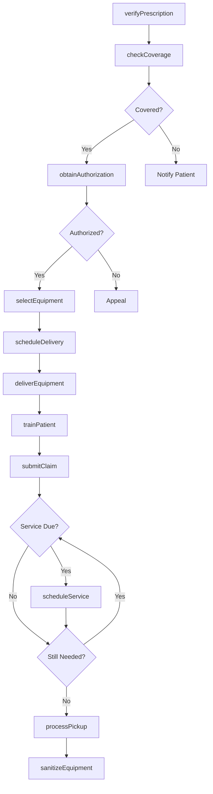
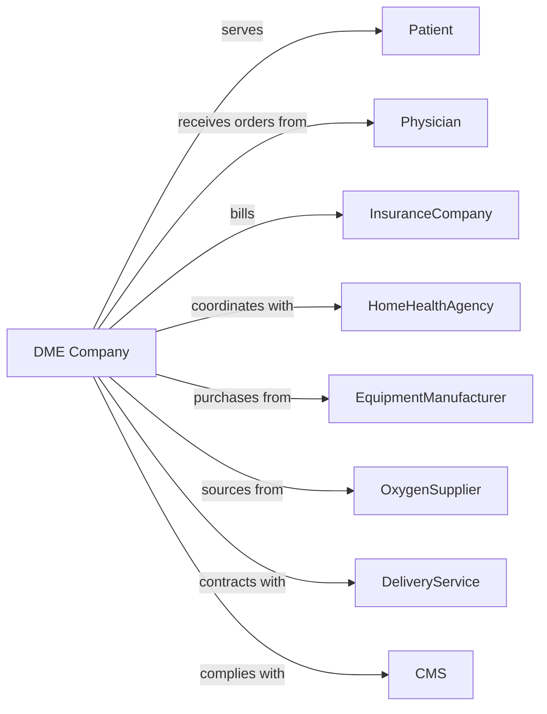

# Home Health Equipment Rental

> Business-as-Code definition for home health equipment rental operations. Models the complete rental lifecycle from prescription through equipment return.

## Overview

Home health equipment rental companies provide durable medical equipment including wheelchairs, hospital beds, oxygen systems, and mobility aids to patients for home use. This definition exposes actions for insurance billing, equipment delivery, maintenance, and patient training, with events enabling automated workflow triggers throughout the medical equipment rental lifecycle.

## Actors

| Actor | Description |
|-------|-------------|
| Patient | Individual needing medical equipment |
| Physician | Prescribes equipment for patient care |
| InsuranceCompany | Medicare, Medicaid, or private payer |
| HomeHealthAgency | Coordinates patient home care |
| OxygenSupplier | Provides medical gas and equipment |
| EquipmentManufacturer | Supplies durable medical equipment |
| DeliveryService | Transports equipment to patients |
| BiomedicialTechnician | Services and repairs equipment |
| CMS | Centers for Medicare and Medicaid Services |

## Roles

| Role | Description |
|------|-------------|
| DMESpecialist | Evaluates patient needs and selects equipment |
| BillingCoordinator | Handles insurance claims and authorizations |
| DeliveryTechnician | Delivers and sets up equipment |
| ServiceTechnician | Maintains and repairs equipment |
| RespiratoryCareSpecialist | Manages oxygen and respiratory equipment |

## Entities

| Entity | Description |
|--------|-------------|
| Equipment | Wheelchair, bed, oxygen system, or mobility aid |
| Prescription | Physician order for equipment |
| Rental | Active equipment rental agreement |
| Authorization | Insurance pre-approval for rental |
| Claim | Insurance billing submission |
| Delivery | Equipment delivery and setup appointment |
| Maintenance | Scheduled equipment service |
| Training | Patient education on equipment use |
| CMN | Certificate of Medical Necessity |
| Patient | Individual receiving equipment |

## Actions

| Action | Description |
|--------|-------------|
| verifyPrescription | Confirm physician order for equipment |
| checkCoverage | Verify insurance benefits and eligibility |
| obtainAuthorization | Request prior approval from payer |
| selectEquipment | Choose appropriate equipment for patient |
| scheduleDelivery | Arrange equipment delivery appointment |
| deliverEquipment | Transport and set up equipment |
| trainPatient | Educate patient on equipment use |
| submitClaim | Bill insurance for equipment rental |
| scheduleService | Arrange maintenance appointment |
| performService | Complete equipment maintenance |
| replaceEquipment | Swap failed equipment for patient |
| processPickup | Retrieve equipment when no longer needed |
| sanitizeEquipment | Clean and sterilize returned equipment |
| documentCompliance | Record required certifications |

## Events

| Event | Description |
|-------|-------------|
| prescriptionReceived | Physician order received |
| coverageVerified | Insurance eligibility confirmed |
| authorizationObtained | Prior approval granted |
| equipmentSelected | Appropriate device chosen |
| deliveryScheduled | Delivery appointment set |
| equipmentDelivered | Equipment set up at patient home |
| patientTrained | Education completed |
| claimSubmitted | Insurance bill sent |
| claimPaid | Insurance payment received |
| claimDenied | Insurance rejected claim |
| serviceScheduled | Maintenance appointment set |
| serviceCompleted | Maintenance performed |
| equipmentReturned | Device retrieved from patient |
| equipmentSanitized | Device cleaned for reuse |

## Searches

| Search | Description |
|--------|-------------|
| getPatientEquipment | List active rentals for patient |
| findAvailableEquipment | Search inventory by type and size |
| getPendingAuthorizations | List requests awaiting approval |
| getDeliverySchedule | View upcoming delivery appointments |
| getServiceDue | Find equipment needing maintenance |
| getClaimsStatus | Track submitted insurance claims |
| getExpiringRentals | List rentals approaching end date |

## Workflow



## Actor Relationships



## Usage

### Calling Actions

```typescript
import { rentMedicalEquipment } from '@headlessly/rent-medical-equipment'

const dme = rentMedicalEquipment()

// Process a new prescription
const order = await dme.verifyPrescription({
  patientId: 'patient-12345',
  physicianNPI: '1234567890',
  equipmentType: 'hospitalBed',
  diagnosisCodes: ['M54.5', 'Z99.3'],
  medicalNecessity: 'Patient requires semi-electric bed for positioning'
})

// Obtain insurance authorization
const auth = await dme.obtainAuthorization({
  orderId: order.id,
  payerId: 'medicare-partb',
  requestedMonths: 13,
  cmnDocument: 'cmn-hospital-bed-v2'
})

// Schedule delivery and setup
await dme.scheduleDelivery({
  orderId: order.id,
  preferredDate: '2024-03-05',
  timeWindow: 'morning',
  setupRequired: true,
  trainingRequired: true
})
```

### Event-Driven Automation

```typescript
// Auto-submit claim after delivery confirmed
dme.equipmentDelivered(async ({ orderId, patientId, equipmentId }) => {
  await dme.submitClaim({
    orderId,
    serviceDate: new Date(),
    hcpcsCodes: getEquipmentCodes(equipmentId),
    modifiers: ['RR'] // Rental
  })
})

// Auto-schedule service based on equipment requirements
dme.equipmentDelivered(async ({ equipmentId, equipmentType }) => {
  const serviceInterval = getServiceInterval(equipmentType)

  scheduleTask(addMonths(new Date(), serviceInterval), async () => {
    await dme.scheduleService({
      equipmentId,
      serviceType: 'preventiveMaintenance',
      priority: 'routine'
    })
  })
})
```
