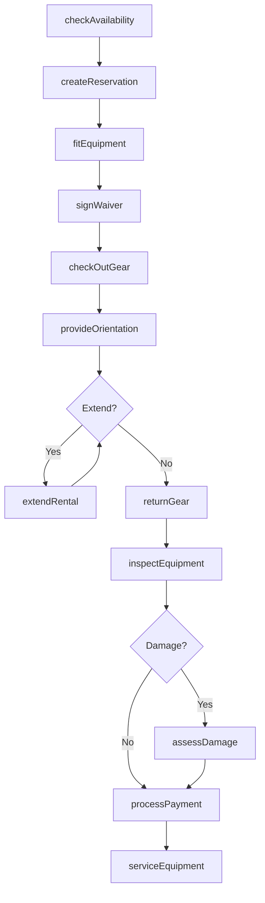
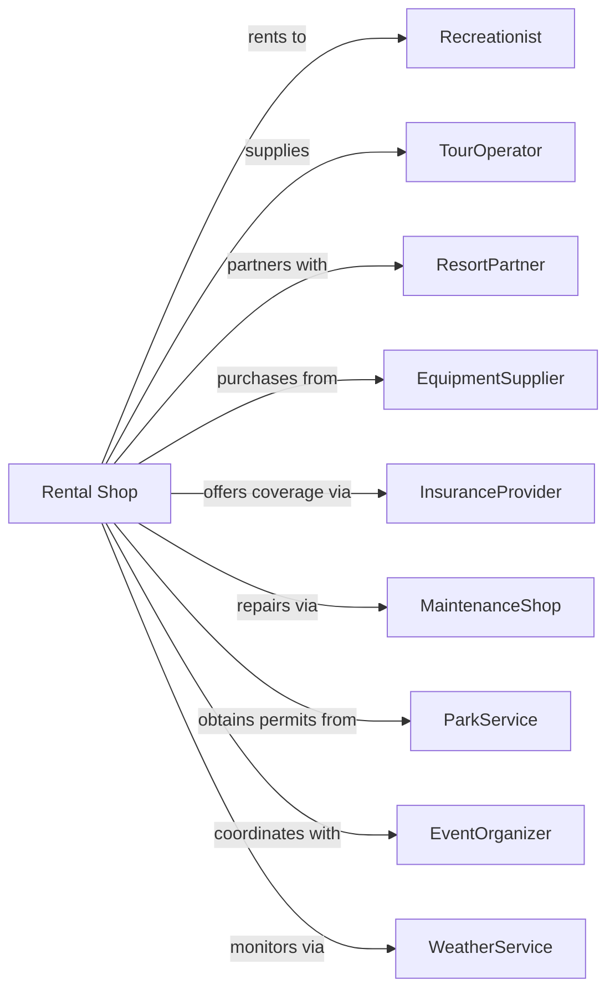

# Recreational Goods Rental

> Business-as-Code definition for recreational goods rental operations. Models the complete rental lifecycle from reservation through equipment return.

## Overview

Recreational goods rental companies provide bicycles, skis, kayaks, surfboards, camping gear, and other sporting equipment for temporary use. This definition exposes actions for equipment reservation, safety orientation, damage assessment, and seasonal inventory management, with events enabling automated workflow triggers throughout the recreational rental lifecycle.

## Actors

| Actor | Description |
|-------|-------------|
| Recreationist | Individual renting sports or outdoor equipment |
| TourOperator | Business renting gear for guided trips |
| ResortPartner | Hotel or resort referring guests |
| EquipmentSupplier | Provides recreational inventory |
| InsuranceProvider | Offers damage waiver coverage |
| MaintenanceShop | Repairs and services equipment |
| ParkService | Manages recreation area permits |
| EventOrganizer | Coordinates group rentals for events |
| WeatherService | Provides conditions for activity planning |

## Roles

| Role | Description |
|------|-------------|
| ShopManager | Oversees rental shop operations |
| RentalAgent | Processes reservations and checkouts |
| FittingSpecialist | Sizes equipment for customers |
| MaintenanceTech | Services and repairs gear |
| SafetyInstructor | Provides equipment orientation |

## Entities

| Entity | Description |
|--------|-------------|
| Equipment | Bike, ski, kayak, or other rental item |
| Reservation | Booking for equipment rental |
| Rental | Active equipment use agreement |
| Damage | Equipment damage or loss |
| WaiverForm | Liability release document |
| DamageWaiver | Optional damage protection coverage |
| Fitting | Equipment sizing and adjustment |
| Helmet | Required safety equipment |
| Season | Time period affecting inventory and rates |
| Package | Bundled equipment rental deal |

## Actions

| Action | Description |
|--------|-------------|
| checkAvailability | Query equipment for date and quantity |
| createReservation | Book equipment for future use |
| fitEquipment | Size and adjust gear for customer |
| signWaiver | Execute liability release |
| checkOutGear | Process equipment handoff |
| provideOrientation | Instruct on safe equipment use |
| extendRental | Add time to active rental |
| returnGear | Process equipment return |
| inspectEquipment | Check for damage or wear |
| assessDamage | Price repair or replacement cost |
| processPayment | Charge rental and damage fees |
| serviceEquipment | Perform maintenance or repair |
| adjustInventory | Manage seasonal stock levels |
| packageRental | Create bundled equipment deal |

## Events

| Event | Description |
|-------|-------------|
| reservationCreated | Equipment booked for date |
| reservationCanceled | Booking canceled |
| equipmentFitted | Gear sized for customer |
| waiverSigned | Liability release executed |
| rentalStarted | Equipment checked out |
| orientationCompleted | Safety instruction provided |
| rentalExtended | Additional time added |
| equipmentReturned | Gear returned to shop |
| damageFound | Issue discovered during inspection |
| damageCharged | Customer billed for damage |
| equipmentServiced | Maintenance completed |
| seasonChanged | Inventory adjusted for season |
| paymentProcessed | Rental charges collected |

## Searches

| Search | Description |
|--------|-------------|
| findAvailableGear | Search equipment by type and date |
| getReservations | List bookings by date or customer |
| getRentalHistory | Retrieve past rentals for customer |
| getDamageQueue | List items needing repair |
| getServiceSchedule | View equipment due for maintenance |
| getSeasonalInventory | Check stock by activity season |
| getRevenueByCategory | Analyze rental revenue by equipment type |

## Workflow



## Actor Relationships



## Usage

### Calling Actions

```typescript
import { rentGear } from '@headlessly/rent-gear'

const shop = rentGear()

// Search equipment by type and date
const availableGear = await shop.findAvailableGear({ type: 'skiPackage', date: '2024-12-20' })

// List bookings by date or customer
const reservations = await shop.getReservations({ date: '2024-12-20' })

// Check availability for ski equipment
const available = await shop.checkAvailability({
  equipmentType: 'skiPackage',
  date: '2024-12-20',
  days: 5,
  quantity: 4,
  skillLevel: 'intermediate'
})

// Create a family reservation
const reservation = await shop.createReservation({
  customerId: 'cust-12345',
  items: [
    { type: 'skiPackage', size: 'adult-L', quantity: 2 },
    { type: 'skiPackage', size: 'child-M', quantity: 2 },
    { type: 'helmet', size: 'mixed', quantity: 4 }
  ],
  startDate: '2024-12-20',
  endDate: '2024-12-25',
  damageWaiver: true
})

// Check out equipment
await shop.checkOutGear({
  reservationId: reservation.id,
  waiverSigned: true,
  orientationProvided: true
})
```

### Event-Driven Automation

```typescript
// Auto-service equipment after high-use rental
shop.equipmentReturned(async ({ equipmentId, rentalDays }) => {
  if (rentalDays >= 7) {
    await shop.serviceEquipment({
      equipmentId,
      serviceType: 'postRentalInspection',
      priority: 'high'
    })
  }
})

// Auto-adjust inventory for season change
shop.seasonChanged(async ({ newSeason, location }) => {
  const seasonalStock = getSeasonalRequirements(newSeason, location)

  await shop.adjustInventory({
    location,
    targetLevels: seasonalStock,
    transferFromStorage: true
  })
})
```
